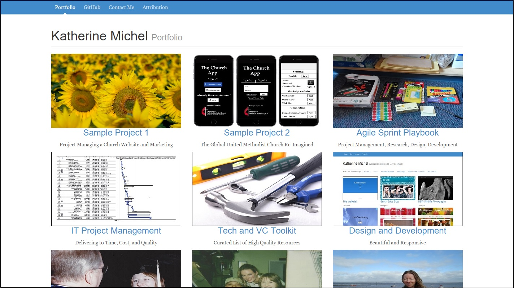

[http://katherinemichel.github.io](http://katherinemichel.github.io)
=========================

My Jekyll Portfolio:  
Beautiful, Responsive, GitHub Powered Web Development  
http://katherinemichel.github.io

## My Work and Links

Working on- project management, research, design, development
* [Agile Sprint Playbook](https://github.com/KatherineMichel/agile-sprint-playbook)
* [Swift Sprint](https://github.com/KatherineMichel/swift-sprint)
* [DjangoCon Case Study](https://github.com/KatherineMichel/djangocon-case-study)
* [My Programming Cheat Sheets](https://github.com/KatherineMichel/my-programming-cheat-sheets)
* [My Django Project Starter Template (Currently Deprecated)](https://github.com/KatherineMichel/django-template)

ASP.NET
* [ASP.NET Templates and Notes](https://github.com/KatherineMichel/aspdotnet-templates-and-notes)

My dev environment and commands
* [My Dev Environment and Commands](https://github.com/KatherineMichel/my-dev-environment-and-commands)

Useful resources
* [Tech and Venture Capital Toolkit](https://github.com/KatherineMichel/tech-and-venture-capital-toolkit)

Work, links, and personal goals
* [Personal Goals](https://github.com/KatherineMichel/personal-goals)

Individual projects/sprints
* [Church Website and Marketing on a Budget](https://github.com/KatherineMichel/church-website-and-marketing-on-a-budget)
* [The Global United Methodist Church Reimagined](https://www.gitbook.com/book/katherinemichel/the-global-united-methodist-church-reimagined/)

