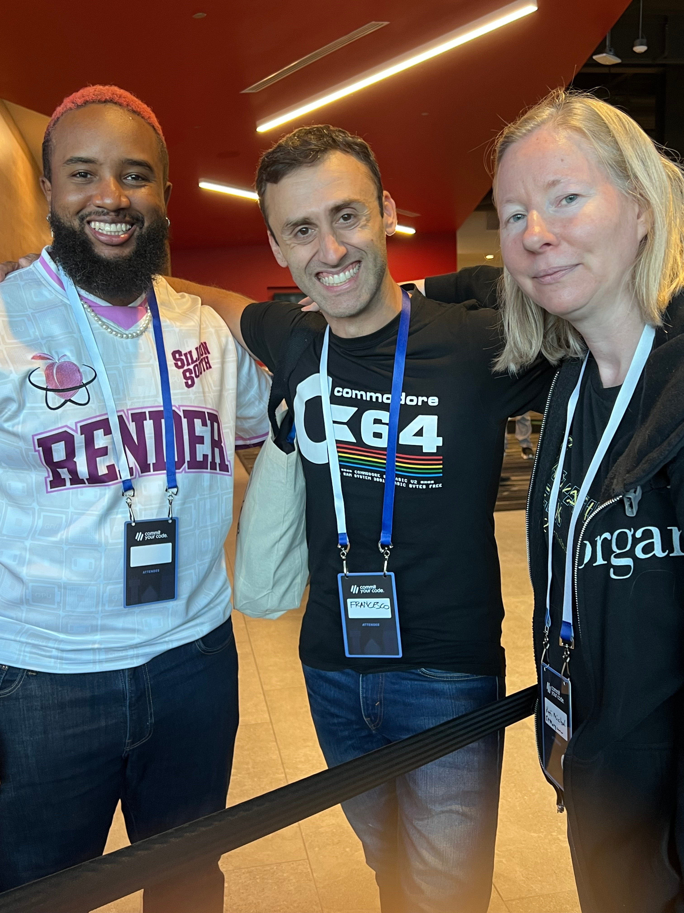
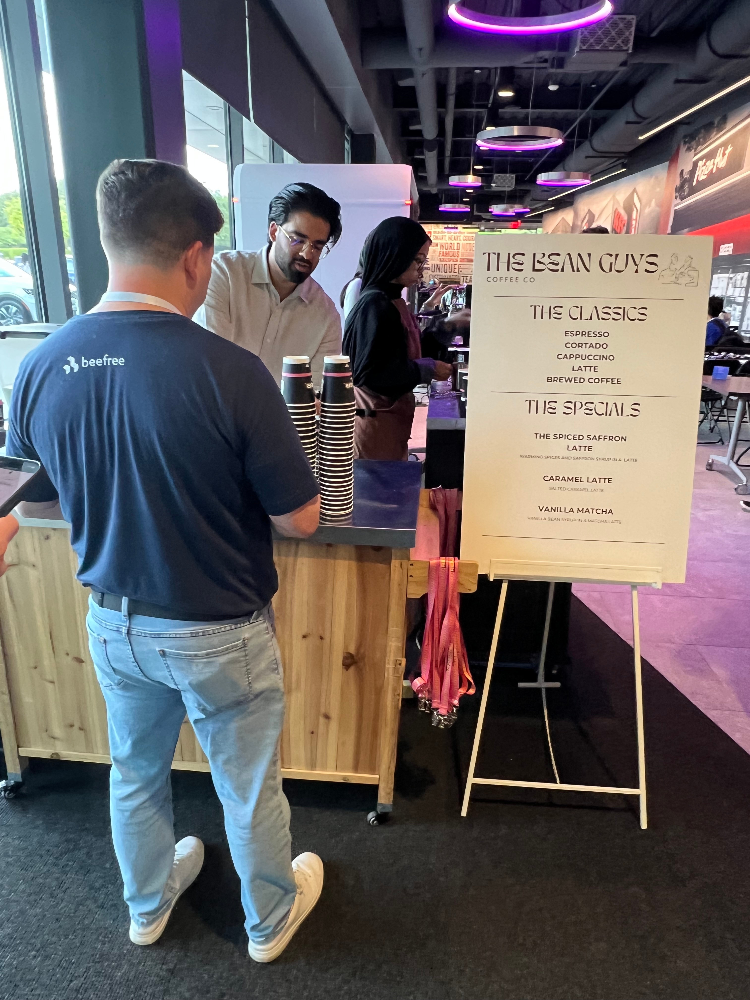
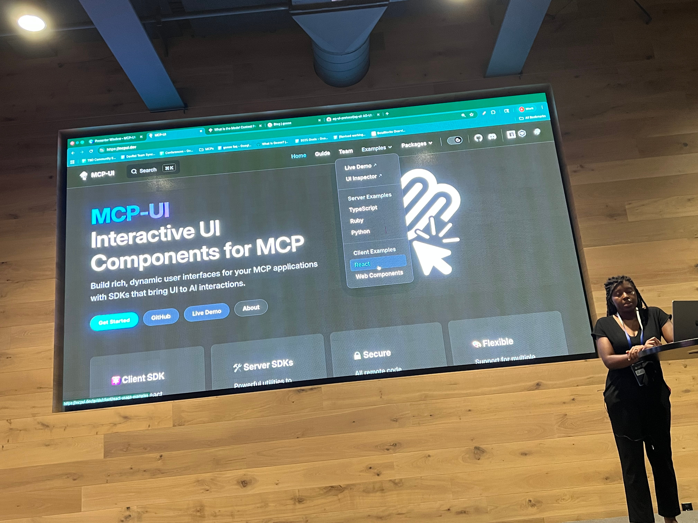

# Commit Your Code 2025 Recap

## Intro

Disclaimer: the content of this post is a reflection of my career journey and not specific to my work at JPMorganChase.

After having a lot of FOMO last year, I was able to spend some time this week at the Commit Your Code 2025 conference. 

I couldn't pass up the opportunity to meet a few "famous" techies who I knew would be in attendance and catch some talks from a [packed agenda](https://www.commityourcode.com/agenda). 

## Thursday

The conference got off to a great start when I was greeted by conference founder Danny Thompson at the registration desk. 

I have been following Danny on social media for years. He went from [frying chicken at a gas station to working as a developer at Google](https://learntocodewith.me/podcast/from-frying-chicken-to-working-at-google-danny-thompson/). I admire his authenticity and the support he gives to developers trying to get their own careers off the ground. 

Upon joining the coffee line, I serendipitously grabbed a photo with Justin E. Samuels, founder of the extremely popular [RenderATL](https://www.renderatl.com/) conference, and prolific conference speaker Francesco Ciulla.  

Danny Thompson during his keynote. 

Copies of Danny's new book [Developers Guide to AI](https://nostarch.com/developers-guide-to-AI) (co-written with Jacob Orshalick and Jerry Mannel Reghunadh) quickly sold out and all the proceeds went to charity. 

After the keynotes, Eric Weibust gave me the tip that Java talks by Josh Long and Dan Vega were not-to-be-missed. 

Hallway track. The place was buzzing. 

Josh Long preparing for his masterful Dogumentary live-code

## Friday

Delicious coffee from The Bean Guys. I had a caramel latte for the second day in a row. Nice way to start the day. 

Rizell Scarlett talking about MCP-UI

I have been a fan of Rizell Scarlett for quite some time. It was so good to meet her in person. When I told her I want to experiment with MCP, she told me, "You've got this." :) 

I knew of Bas Steins from his [This Week in Python blog posts](https://bas.codes/). Because there was not a Python track at this conference, I assumed the speaker was a different Bas. When I realized it was the same Bas, I hurried to the talk and met him afterward to show my appreciation! Here he is giving a plug for his tool Stelvio. 

Mark brought the energy and tips for how to navigate the age of AI. It was a full house. He was one of the most dynamic speakers I have ever seen! 

I finished the day with a great conversation with Francesco Ciulla who shared with me some nuggets of wisdom from his career. 

A lot of empathy and generosity in this room... Quincy Larson (freeCodeCamp), Danny Thompson (Dallas Software Developers Cohort Program), Leon Noel (100Devs) closing out the conference. 

Thanks to the support of Yum! Brands International and conference attendees, $24k and counting will be donated to charity. 

## In Closing

I went away from the conference feeling inspired to try some new things. I also saw some incredible public speakers. 

The replays are available on the [Dallas Software Developer YouTube](https://www.youtube.com/@DallasSoftwareDevelopers). Enjoy! 
