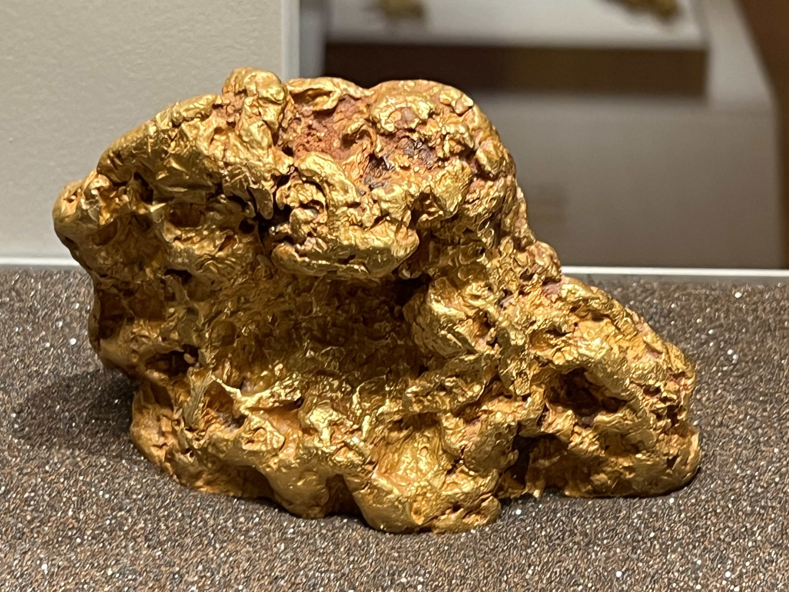
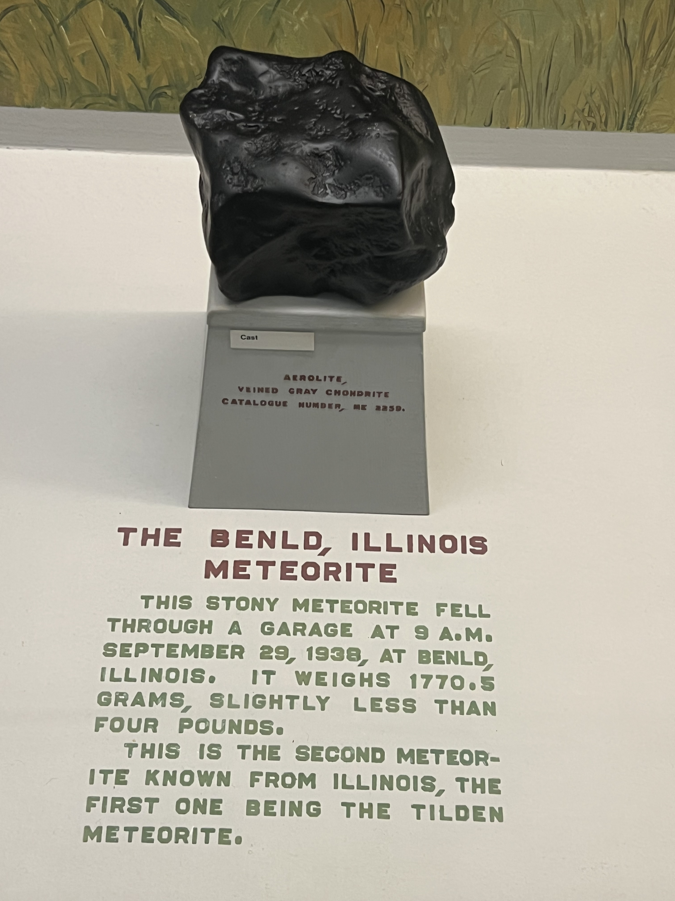
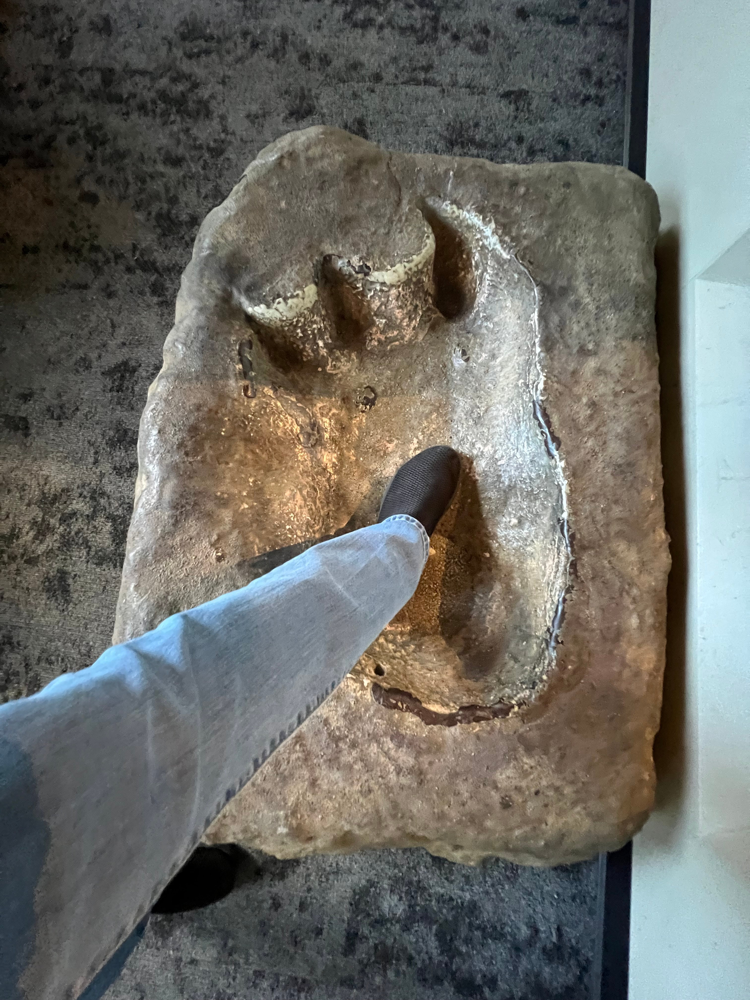

# DjangoCon US 2023 Recap

Table of Contents
-----------------

- [Intro](#intro)
- [Pre-conference Activities](#pre-conference-activities)
- [Monday](#monday)
    - [Kojo Idressa and Keanya Phelps Kick Off the Conference](#kojo-idressa-and-keanya-phelps-kick-off-the-conference)
- [Tuesday](#tuesday)
    - [Speaker and Organizer Dinner](#speaker-and-organizer-dinner)
- [Wednesday](#wednesday)
    - [Conference Conclusion](#conference-conclusion)
- [Sight Seeing and More Food](#sight-seeing-and-more-food)
- [In Closing](#in-closing)

## Intro

Disclaimer: the content of this post is a reflection of my career journey and not specific to my work at JPMorganChase.

<!--
https://2025.djangocon.us/schedule/
-->

🔝 [**back to top**](#table-of-contents)

## Pre-conference Activities

### The View from Above

### The Field Museum

<!--
https://www.fieldmuseum.org/
-->

<!--
https://www.fieldmuseum.org/exhibition/meet-the-chicago-archaeopteryx
-->

### Shaw's Crab House Lunch Special

<!--
https://www.shawscrabhouse.com/events/3-course-lunch-2/
-->

### The Art Institute of Chicago

<!--
https://www.artic.edu/
-->

<!--
Cameron famously said
Ferris Bueller Tour
https://www.artic.edu/my-museum-tour/5178
-->

### My Incredible Room

<!--
https://www.hyatt.com/thompson-hotels/chith-thompson-chicago
-->

### Pre-conference Social

<!--
https://www.tinytapp.com/
https://www.chicago.gov/city/en/sites/chicagoriverwalk/home.html.html
-->

🔝 [**back to top**](#table-of-contents)

## Monday

### Pre-conference

<!--
https://ophchicagoland.com/original-pancake-house-gold-coast/
Conspicuously located directly across from the hotel
-->

### Orientation

### Opening Remarks (Monday)

<!--
### Kojo Idressa and Keanya Phelps Kick Off the Conference

-->

### Keynote: Lateral Thinking with Weathered Technology: How The Nintendo Philosophy Applies to Modern Web Development

### Community Update: Django Events Foundation North America

### Django for AI: Deploying Machine Learning Models with Django

### Django's GeneratedField by example

### Deploy Django: GitOps & Kubernetes Made Easy

### How to Enjoy Debugging in Production

### Extras

<!--
Monday- during conference

https://www.oreilly.com/library/view/python-distilled/9780134173399/
-->

### Lincoln Loop Social Event

<!--
https://freehandhotels.com/chicago/broken-shaker/
-->

## Tuesday

### Opening Remarks (Tuesday)

### Keynote: All The Ways To Use Django

### Community Update: Python Software Foundation

### Winemaking with Mutable Event Sourcing in Django

### Beyond Rate Limiting: Building an Active Learning Defense System in Django

### Hidden Dangers Of AI In Developer Workflows: Navigating Security Risks with Human Insight

### Cutting latency in half: What actually worked—and what didn’t

### Django as a Database Documentation Tool: The Hidden Power of Model Comments

## Extras

<!--
Tuesday was a day of firsts: first-time eating gelato, first-time taking an ice-cream selfie with Mariatta, and first-time playing foosball. 
-->

### Speaker and Organizer Dinner

<!--
https://www.carnivalechicago.com/
Menu
Story time!
-->

### Amorino

<!--
Video
https://www.amorino.com/ww
Vanilla (Bourbon from Madagascar)
https://www.amorino.com/ww/product/vanilla-bourbon-from-madagascar
Amorino Chocolate
https://www.amorino.com/ww/product/amorino-chocolate

Documentary
-->

### Six Feet Up Social Event

<!--
Punch Bowl Social
https://punchbowlsocial.com/location/chicago
https://sixfeetup.com/
-->

## Wednesday

### Pre-conference

<!--
Wednesday was deep-dive day. 
-->

### Opening Remarks (Wednesday)

### Keynote: Django Reimagined For The Age of AI

<!--
https://2025.djangocon.us/talks/keynote-wednesday/
-->

### High Performance Django at Ten: Old Tricks & New Picks

<!--
https://2025.djangocon.us/talks/high-performance-django-at-ten-old-tricks-new-picks/
-->

### Panel Discussion: Two Decades of Django: The Past, Present and Future

<!--
https://2025.djangocon.us/talks/panel-discussion-details/
-->

### What a Decade!

<!--
https://2025.djangocon.us/talks/what-a-decade/
-->

### Extras

### Conference Conclusion

🔝 [**back to top**](#table-of-contents)

## Post-Conference

### Wendella Chicago Architecture Boat Tour

### Giordano's

<!--
Different types of pizza
-->

## In Closing

<!--
Worked on website
DjangoCon US will be in Chicago again next year. 
-->

🔝 [**back to top**](#table-of-contents)

## More Sight Seeing!

### More of The View From Above

### More from The Field Museum

### More from The Art Institute of Chicago

🔝 [**back to top**](#table-of-contents)
