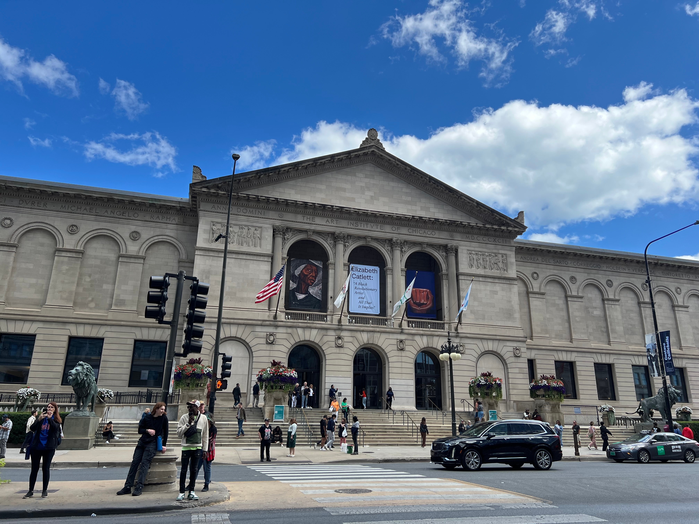
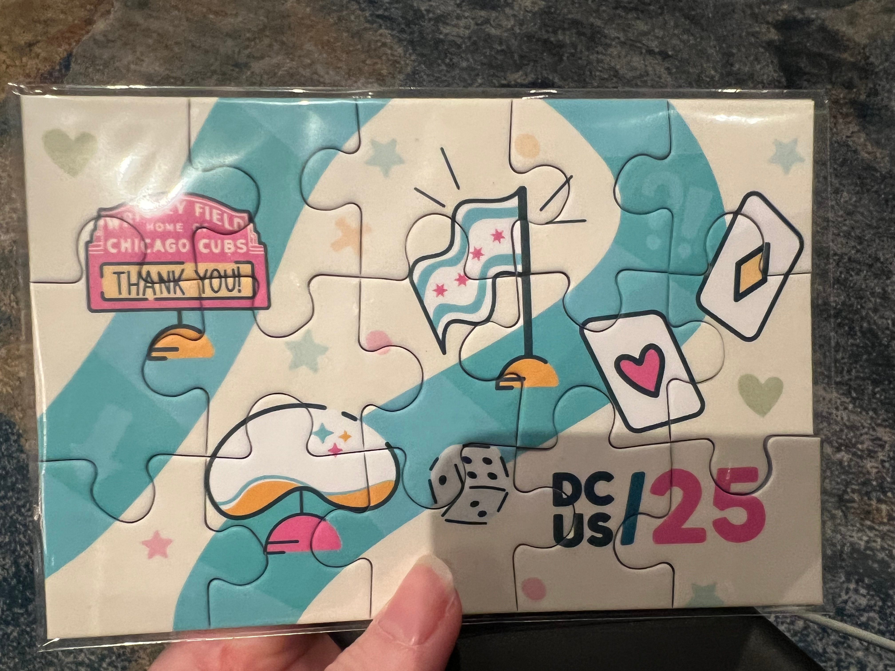
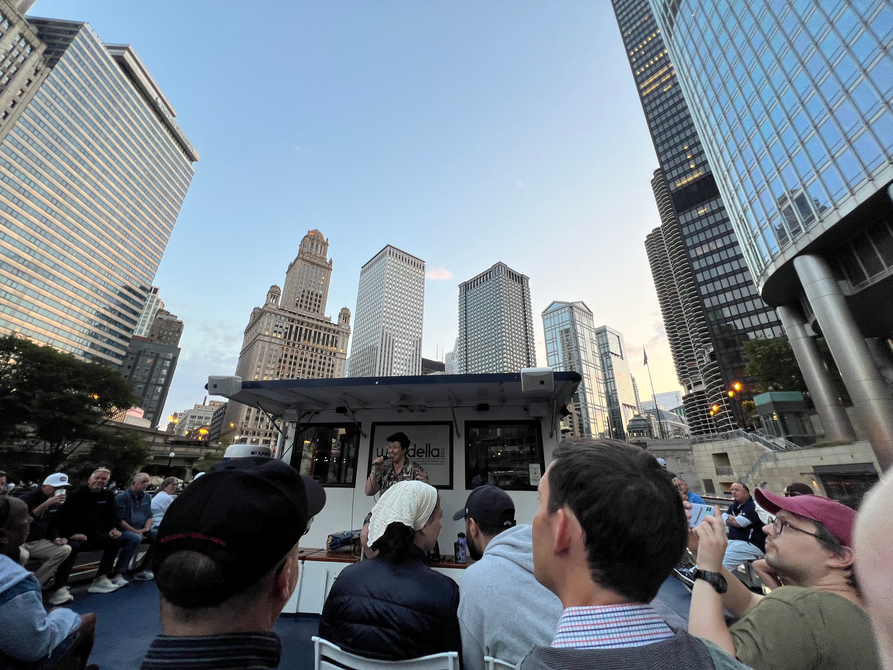

# DjangoCon US 2025 Recap

Table of Contents
-----------------

- [Intro](#intro)
- [Pre-conference Activities](#pre-conference-activities)
- [Monday](#monday)
    - [Kojo Idressa and Keanya Phelps Kick Off the Conference](#kojo-idressa-and-keanya-phelps-kick-off-the-conference)
- [Tuesday](#tuesday)
    - [Speaker and Organizer Dinner](#speaker-and-organizer-dinner)
- [Wednesday](#wednesday)
    - [Conference Conclusion](#conference-conclusion)
- [Sight Seeing and More Food](#sight-seeing-and-more-food)
- [In Closing](#in-closing)

## Intro

Disclaimer: the content of this post is a reflection of my career journey and not specific to my work at JPMorganChase.

DjangoCon US took place in Chicago, Illinois from September 8-12. It was a stellar experience. 

Throughout the week, I couldn't help but think of the 1986 movie Ferris Bueller's Day Off, widely considered to be a "love letter to Chicago" by director John Hughes and one of my favorite movies. After a day of adventures across Chicago, Cameron famously tells Ferris that [he doesn't think he has seen anything good](https://youtu.be/o0iVd8b5QyA?si=wxTvTEL98johebOB). 

I am happy to report that I saw everything good!

🔝 [**back to top**](#table-of-contents)

## Pre-conference Activities

### The View from Above

While making my flight reservation, I googled for advice about the best side of the plane to be on for a great view when arriving in Chicago. As we approached, I feared that I had chosen the wrong side, but I hadn't! The downtown appeared to my left, then the pilot circled around above Lake Michigan, and I got another view from the other side. 

Downtown Chicago

### The Field Museum

Thanks to my employer's generous financial support of Chicago area museums, I was able to enjoy some sightseeing perks, starting with the incredible [Field Museum](https://www.fieldmuseum.org/). The museum owns over 30 million items that serve as a comprehensive record of life on Earth. Among these are unique and rare fossils, plants, insects, taxidermy animals, gems, meteorites, and cultural objects.

Unearthed in Argentina, [Máximo Titanosaur](https://www.fieldmuseum.org/exhibition/maximo-titanosaur) (Patagotitan Mayorum), the largest animal to have ever walked the earth that we know of, lived 101.6 million years ago. He or she was estimated to have weighed 70 tons, spanned 122 feet long, and is 28 feet tall at the head. Say cheese! 

The infamous [Tsavo Lions](https://www.fieldmuseum.org/blog/tsavo-lions) are two of the most high profile items in the collection. In 1898, they went on a man-eating spree, terrorizing railway construction workers in Kenya for nine months, until they were shot dead. They were the subject of the 1996 movie The Ghost and the Darkness, starring Val Kilmer.

[Megalodon](https://www.fieldmuseum.org/blog/four-fossil-sharks-are-cooler-megalodon), the largest shark to ever live, preyed on whales and went extinct when oceans worldwide got colder. This jaw and teeth (replica cast) was dated 23-3.6 million years ago. 

Among the museum's holdings is one of the most impressive [ancient Egypt collections](https://www.fieldmuseum.org/exhibition/inside-ancient-egypt) in the world, including a three story replica of an ancient Egyptian tomb that contains two authentic burial chambers that date to 2400 B.C., 23 human and 30 animal mummies, artifacts from everyday life and mummification rituals. 

### Shaw's Crab House Lunch Special

While researching Chicago, I came across many recommendations for Shaw's Crab House, a beloved, 40-year-old Chicago institution. I took a break from sightseeing to enjoy their reasonably-priced [gourmet 3-course lunch](https://www.shawscrabhouse.com/events/3-course-lunch-2/) special. The food was delicious, and the ambience left me feeling like I was a character in a movie. 

Shrimp cocktail

Pan-seared Alaskan cod

Mini chocolate cake

[View from the Bar Video](https://youtu.be/YxGYLfhE22w)

### The Art Institute of Chicago

After lunch, I spent the afternoon at the [Art Institute of Chicago](https://www.artic.edu/). The Art Intitute is one of the world's great art museums, renowned for its collection of Impressionist and Post-Impressionist art.  

Having looked through the museum's collection ahead of time and noted my favorites, I saw many great works. For fun, I also took the [Be Like Ferris Tour](https://www.artic.edu/my-museum-tour/5178), featuring art works seen in Ferris Bueller's Day Off when [Ferris, Cameron, and Sloane visit the museum](https://youtu.be/vBBOMLURSGA?si=3OLtiWJt2C2vB8jj). 

The front of The Art Institute of Chicago

[America Windows](https://www.artic.edu/artworks/109439/america-windows) by Marc Chagall

[Nighthawks](https://www.artic.edu/artworks/111628/nighthawks) by Edward Hopper

[A Sunday on La Grande Jatte](https://www.artic.edu/artworks/27992/a-sunday-on-la-grande-jatte-1884) by Georges Seurat

[Gallery 211](https://www.artic.edu/galleries/2147483626/gallery-211), one of my favorite rooms

The [Thorne Minature Rooms](https://www.artic.edu/highlights/12/thorne-miniature-rooms) in the basement are also a must see. 

### My Incredible Room

After sightseeing, I checked into my hotel. 

I was fortunate to stay at the 4-star [Thompson Chicago by Hyatt](https://www.hyatt.com/thompson-hotels/chith-thompson-chicago), perfectly situated in the fun [Gold Coast Neighborhood](https://en.wikipedia.org/wiki/Gold_Coast_Historic_District_(Chicago)) along the Magnificent Mile, filled with historic architecture, luxury shops, and in close proximity to the Oak Street Beach. 

I could get used to this... 

Stunning city view

### Pre-conference Social

On Sunday night, I decided to go to an informal pre-conference social at [Tiny Tapp](https://www.tinytapp.com/) organized by Jon Gould of [Foxley Talent](https://foxleytalent.com/). I made some new friends and was rewarded with this nighttime view of the buildings overlooking the Chicago River and [Riverwalk](https://en.wikipedia.org/wiki/Chicago_Riverwalk). 

What a view!

🔝 [**back to top**](#table-of-contents)

## Monday

### Pre-conference

I couldn't resist getting breakfast at the [Original Pancake House](https://ophchicagoland.com/original-pancake-house-gold-coast/), conspicuously located directly across from my hotel. The strawberry crepes were divine, and the coffee was perfectly strong. 

Ready for an adventure

Taking the Red Line south

Enjoying the view along the Chicago River on the way to the nearby venue

### Orientation

### Opening Remarks (Monday)

<!--
https://2025.djangocon.us/schedule/
-->

<!--
### Kojo Idressa and Keanya Phelps Kick Off the Conference

Stacey's talk

Conference Chair
Caktus
-->

### Keynote: Lateral Thinking with Weathered Technology: How The Nintendo Philosophy Applies to Modern Web Development

<!--
https://www.linkedin.com/feed/update/urn:li:activity:7372092845651873792/
https://github.com/bigskysoftware/htmx/blob/master/CHANGELOG.md#207---2025-09-08
https://github.com/adamchainz/django-htmx
-->

### Community Update: Django Events Foundation North America

DEFNA President Peter Grandstaff gave the update. 

What drives DEFNA Board Members? The people. 

People get involved, grow, expand, make the world better by helping others. Consider how you are reinvesting in the community. It's up to us. 

DjangoCon US 2026 needs:
* Organizers- anyone can help (email hello@defna.org)
* Sponsors- helps lower ticket prices, which have recently increased

DEFNA has put out a [Call for Venue Proposals](https://www.defna.org/announcements/2025/9/10/djangocon-us-call-for-venue-proposal-2027/) for DjangoCon US 2027-28. The deadline is January 15, 2026. If you have questions, feel free to talk to Peter Grandstaff or Keanya Phelps, both of whom have had their proposal accepted. 

Sprints are a way to contribute back to Django through code, docs, community. Lilian of Djangonaut Space talked about how to get started. 

Useful to me notes:
* Check out Sara Boyce's [Vulture Method](https://www.youtube.com/shorts/D6QHet5U82U). 

### Django for AI: Deploying Machine Learning Models with Django

<!--
https://wsvincent.com/django-for-ai-djangocon/
-->

### Django's GeneratedField by Example

<!--
Django 5.0
https://docs.djangoproject.com/en/5.2/releases/5.0/
https://www.paulox.net/2025/09/08/djangocon-us-2025/
Paolo

https://www.paulox.net/2023/11/07/database-generated-columns-part-1-django-and-sqlite/
https://www.paulox.net/2023/11/24/database-generated-columns-part-2-django-and-postgresql/
https://www.paulox.net/2023/12/11/database-generated-columns-part-3-geodjango-and-postgis/
-->

The Django performance and optimization docs are a great resource. 

Typically, computing at a lower level is faster than computing at a higher level. 

<!--
Generated db fields, computed from other fields
All db backends support

Bring back to Django something he learned from Zope
Generated Columns feature already existed (slide)
No need for trigger or pattern code
References- see slide

Paolo made a small code PoC. 

Django dev mailing list
Sent email proposing idea with reference
Issue #31300 that already existed and was stale
Jpnauta PR #16417
https://github.com/django/django/pull/16417

LilyAcorn
#16860
https://github.com/django/django/pull/16860

There is only one example in the docs. 

Examples:
-->

### Deploy Django: GitOps & Kubernetes Made Easy

<!--
https://github.com/sixfeetup/2025_PyOhio_DeployDjango
https://sixfeetup.github.io/2025_PyOhio_DeployDjango/#/deploy-django-gitops-kubernetes-made-easy

https://github.com/sixfeetup/djangocon10
https://github.com/sixfeetup/djangocon10/tree/main/docs
https://github.com/sixfeetup/djangocon10/blob/main/docs/project-overview.md
https://github.com/sixfeetup/djangocon10/blob/main/docs/architecture.md
-->

### How to Enjoy Debugging in Production

### Bonus

Chicagoan David Beazley is a well-known author and teacher in the Python community who offers [advanced programming courses](https://www.dabeaz.com/). I first met Dave at PyGotham 2019 after his keynote and was excited to reconnect. I scored a signed copy of his book [Python Distilled](https://www.oreilly.com/library/view/python-distilled/9780134173399/)! 

Me and my sweet friends Afi and Velda. They surprised me with gifts to show their appreciation for me. I felt so special! Afi did a great job managing program and giving opening remarks and Velda serving on the DEFNA Board and moderating the Two Decades of Django panel. (photo credit: Dawn Wages)

Gifts from Afi and Velda: beautiful flowers, Harrods spiced salted caramel shortbread, a British keychain, a postcard with handritten messages

### Lincoln Loop Social Event

After the conference, I headed over to the [Broken Shaker Bar](https://freehandhotels.com/chicago/broken-shaker/) for a [Lincoln Loop](https://lincolnloop.com/) Social. 

The bar area before the room soon reached full-capacity. 

## Tuesday

### Opening Remarks (Tuesday)

Peter Grandstaff gave the opening remarks. 

Questions: 
* Who has had fun in Chicago? 
* Who has learned something? 
* How many have been helped by someone we met at DjangoCon US?

Perhaps referencing Carson's talk, Peter identified Django as a weathered, seasoned tool that has withstood the test of time over 20 years. We are its guardian. 

Peter asked us to connect deeply and openly. 

It's not just about us, but about bringing lessons and successes, and growing good in a sometimes troubled world. 

Let's sustain Django and make the world a better place. 

### Keynote: All The Ways To Use Django

<!--
https://drive.google.com/file/d/1y-lwJZyiANhGvBl7WZAkz0jBx0fW-xPp/view
-->

### Community Update: Python Software Foundation

Outgoing PSF Chair Dawn Wages gave the update. 

Three priorities:
* The deadline to vote in the 2025 Board Election was approaching. If you want to vote next year, become a member: spend 5 hours/month on average investing in the community or pay (sliding scale is available)
* [The PSF Grants program was temporarily paused](https://www.python.org/psf/grants/) after hitting the funding cap, which was a shock to the community
* The PSF will have a fundraiser soon

What qualifies for the 5 hours? Among other things: 
* Running a local meetup
* Contributing to open source
* Taking part in Djangonaut Space, Wagtail
* Being a DjangoCon US organizer
* Becoming a member of a [PSF Working Group](https://www.python.org/psf/workgroups/) or [DSF Working Group](https://github.com/django/dsf-working-groups) (see Dawn's [blog post](https://dawnwages.info/bajoran-engineer/2023/06/07/python-software-foundation-working-groups-work-groups/), too)

Outside of voting, why care? Take a look at the [PSF Annual Impact Report](https://www.python.org/psf/annual-report/2024/). 

The Executive Director Deb Nicholson is the CEO of the PSF. The PSF Chair is the highest person who represents the community. Healthy friction is normal. The chair values consensus, finding a path forward. 

What lessons can the PSF take away from the DSF and vice versa?

Django is good at DEI, consistent community support, healthy conversations with the community about feature additions. 

Professionalism is a goal for the DSF, but difficult to reach. Python has been able to professionalize the organization, hire more people, take some burden off volunteers, but that also puts up a wall for volunteers to understand what is going on. 

How much can we afford and what are the responsibilities? OS leaders can help shepherd the DSF into the next chapters. 

PyCon US is the main source of funding for the PSF, but we are trying to move away from that. DEFNA manages DjangoCon US. 

How to get involved at a local level? Find a [PuG (Python User Group) on meetup.com](https://www.meetup.com/pro/python-software-foundation-meetups/). Show up, ask questions, volunteer to pick up the pizza, get to know what the org does. 

### Winemaking with Mutable Event Sourcing in Django

<!--
https://github.com/innovint/djangocon-2025-mutable-event-sourcing
-->

### Beyond Rate Limiting: Building an Active Learning Defense System in Django

<!--
https://github.com/aayushgauba/aiwaf
-->

### Hidden Dangers Of AI In Developer Workflows: Navigating Security Risks with Human Insight

<!--
https://docs.google.com/presentation/d/1tzdzDd7Pmh-wdyfJhTgQyl6bFe-4JXpf5ISVpcIwVfc/edit
-->

### Cutting latency in half: What actually worked—and what didn’t

### Django as a Database Documentation Tool: The Hidden Power of Model Comments

## Bonus

Jeff, Marlene, me, Paolo. Marlene did a fascinating closing keynote Django Reimagined For The Age of AI. 

Django turned 20 this year. To commemorate the occasion, conference attendees were treated to delicious raspberry cake! 

In case you missed it, I recently wrote down my thoughts in a [Happy 20th Birthday Django post](https://katherinemichel.github.io/blog/personal/happy-20th-birthday-django.html). 

### Speaker and Organizer Dinner

The speaker and organizer dinner was at the jaw-dropping [Carnivale](https://www.carnivalechicago.com/) restaurant. 

Carnivale bar

Carnivale dining room

Chipotle lime salad, pollo en pipian, carnitas, vegan paella, arroz verde, guacamole

A highlight of the evening was sharing stories at our table of our close encounters with tech royalty! 

### Amorino

After dinner, a group of us walked to nearby [Amorino](https://www.amorino.com/ww) for delicious gelato. 

Ice cream flash mob (photo credit: Mariatta)

This was my first time trying gelato, and I loved it. I had half [Vanilla (bourbon from Madagascar)](https://www.amorino.com/ww/product/vanilla-bourbon-from-madagascar), half [Amorino chocolate](https://www.amorino.com/ww/product/amorino-chocolate). 

I also crossed an item off my bucket list: taking an ice cream selfie with Mariatta. 

Mariatta and me! Mariatta's gelato was flower-shaped. (photo credit: Mariatta)

Mariatta was the first woman CPython Core Developer. She was featured in the new [Python documentary](https://youtu.be/GfH4QL4VqJ0?si=doJ39S2O_Tuc6Gau). Her impact is appreciated, and her voice clearly resonates with the community. 

130 likes, 16 reposts on LinkedIn alone as of the writing of this

Mariatta also gave a talk at the conference [Reverse engineering the QR code generator and URL forwarder service](https://2025.djangocon.us/talks/reverse-engineering-the-qr-code-generator-and-url-forwarder-service/). 

[Ice cream flash mob video](https://youtu.be/IGVAT4hLc9I) (video credit: Mariatta)

### Six Feet Up Social Event

Some of us further ventured to the nearby [Six Feet Up](https://sixfeetup.com/) Arcade Night at [Punch Bowl Social](https://punchbowlsocial.com/location/chicago). 

Continuing the trend of firsts, I played foosball for the first time!

## Wednesday

### Pre-conference

I knew Wednesday morning would likely be my last chance to make the short walk from my hotel to Oak Street Beach. I couldn't resist getting up early to do so. It was surprisingly beach-like, despite bordering Lake Michigan. I enjoyed a quiet walk down the coast and watched nearby beach-goers play vollyball and cold-plunge. 

Mild waves rolling in

### Opening Remarks (Wednesday)

In addition to housekeeping, Afi reminded us to seize the day and make new friends. 

### Keynote: Django Reimagined For The Age of AI

<!--
https://2025.djangocon.us/talks/keynote-wednesday/
https://github.com/marlenezw/djangocon-25-keynote
-->

### Community Update: Django Software Foundation

DSF President Thibaud Colas, DSF Treasurer Jacob Kaplan-Moss, DSF Board Member Paolo Melchiorre, and Django 6.x Steering Council Member Frank Wiles gave the update. 

News
* New Django Fellow Jacob Walls
* New DSF Working Groups: social media, events
* Proposed DSF Working Groups: DEI, AI
* DSF Board elections are coming up later this fall

[Django 6.0](https://docs.djangoproject.com/en/dev/releases/6.0/) freeze and sprints- what will land:
* [django-csp](https://django-csp.readthedocs.io/en/latest/) into core
* Template partials (important to HTMX fans)
* Async tasks framework

Based on an idea Paolo documented in his blog post [My Django active developers Sprints proposal](https://www.paulox.net/2022/10/26/my-django-active-developers-sprints-proposal/), Carlton Gibson and Paolo have begun to organize a twice a year Django development sprint called Django on the Med in Palafrugell, Spain and Pescara, Italy. The first one will taken place October 7-9, 2025, in Palafrugell Spain. If all goes well, they hope to organize them around the world. See the [Django on the Med](https://djangomed.eu/) website for info about their serious goals and how to attend. 

On the subject of convincing your employer to let you attend, Paolo suggested sharing Łukasz Langa's recent blog post [Sprints are the best part of a conference](https://pyfound.blogspot.com/2025/09/sprints-are-best-part-of-conference.html). "You're getting for free what you wouldn't be able to buy if you tried."

Jacob Kaplan-Moss gave a budget update, referencing his [DjangoCon US 2024 talk](https://2024.djangocon.us/talks/if-we-had-1000000-what-could-the-dsf-do-with-4x-its-budget/). Typically, the DSF has an $18,000 surplus. This year will be a loss. The DSF has decided to make some bets. For example, the fellow role has become increasingly unsustainable. The DSF will need the help of the community to make these bets permanent. Consider supporting the DSF. 

If you have helped the Django community in some way, you may be eligible to become a DSF Individual Member. You can be nominated or self-nominate. 

### High Performance Django at Ten: Old Tricks & New Picks

<!--
https://2025.djangocon.us/talks/high-performance-django-at-ten-old-tricks-new-picks/
-->

### Panel Discussion: Two Decades of Django: The Past, Present and Future

<!--
https://2025.djangocon.us/talks/panel-discussion-details/
-->

<!--
https://2025.djangocon.us/talks/free-threaded-django/
-->

### What a Decade!

<!--
https://2025.djangocon.us/talks/what-a-decade/
-->

Tim told the audience, you are my people, people trying to be a better version of themselves everyday and make the world a better place. 

Tim is a Principal Engineer at Wharton Research Data Services who loves ice cream. 

Once upon a time, Wharton was a Coldfusion and Microsoft SQL Server Shop. In 2013, technical debt was mounting. Wharton needed to find something new. 

Wharton created the Development Technology Assessment Process (DevTAP), a series of 200 questions to score that would be used to identify a new technology. The process was designed to be iterative so that decisions could be revisited and re-assessed. 

Wharton chose Python/Django as the new framework, but the only community question had been: How active is the tool on Stack Overflow? 

They got lucky that the community was morally and ethically aligned with them. 

This community walks the walk when it comes to DEI.

Tim was blown away that Russell Keith-Magee opened up to the community about his [personal battles with depression](https://pyvideo.org/djangocon-us-2015/i-am-a-doctor-tw-by-russell-keith-magee.html). If someone as accomplished as Russell could be vulnerable, so can we. We all have a deep-rooted fear that we won't be accepted. 

Tim shared his personal journey with alcoholism. 

Tim had brought Han Dynasty food to PyCon 2015 in Montreal as a bribe to host DjangoCon US in Philly. 

Tim's alcoholism was progressing. He had intended to go a full month without drinking, but never had. 

Frank Wiles bought him his last drink ever. 

Jacob Kaplan-Moss gave a [keynote](https://www.youtube.com/watch?v=hIJdFxYlEKE) in which he quoted Lynn Root that we'd know when diversity efforts have been successful when we see a whole bunch of average women programmers. The talk has become a part of an amazing confluence of events that changed Tim's life forever. 

He had no idea it was his first day sober. Returning home, he found his family there to stage an intervention. He accepted the help that was being offered. 

He had to be open that he was being intentional to no longer drink. Tim was assured that recovery is part of DjangoCon US diversity initatives and welcome. Steps were taken to de-emphasize alcohol, and local recovery groups were added to the conference website. 

Tim was going to focus on tech in his talk, but that changed on Friday when he found out his co-worker Lindsay Rees has passed away. 

He does not believe he would be alive if not for the support he has gotten. 

The community is willing to have difficult conversations and help. "You matter. You are valued."

### Bonus

Continuing a tradition, Jon of [Foxley Talent](https://foxleytalent.com/) and I took a photo together! 

Led by Ngazetungue Muheue, Tim Schilling, and others, Black Python Devs was able to match last year's DjangoCon US fundraising by accepting donations for a giveaway of DjangoCon Africa art made in Tanzania. The funds are used to help organize and support community events in the Black Python Devs communities. 

Black Python Devs Founder [Jay Miller celebrated this](https://www.linkedin.com/feed/update/urn:li:activity:7372095328008966144/) as a important milestone in organizational continuity as leaders step down. Jay addressed subjects including exhaustion and a desire for change last year in his blog post [How Long Should We Be in Charge](https://kjaymiller.com/blog/how-long-should-we-be-in-charge.html).  

If you want to make a donation to Black Python Devs, you can at their [support page](https://blackpythondevs.com/support). 

### Conference Conclusion

<!--

-->

Thank you to everyone who made the conference unforgettable. 

DjangoCon US 2026 will take place in Chicago from September 14-18. I am super-excited to go back! 

Continue scrolling for more post-conference fun and sightseeing. 

🔝 [**back to top**](#table-of-contents)

## Post-Conference

### Wendella Chicago Architecture Boat Tour

I'd heard many great things about Chicago architecture boat cruises and considered taking one on Sunday, but decided it would be one thing too many. When I heard that a group of attendees would be taking one Wednesday evening, I had to join. It surpassed my expections, and I'd love to go again sometime.  

Our [Wendella](https://wendellaboats.com/) boat (photo credit: Tobias McNulty)

Our guide, Jai. When we started out, it was daylight, by the end, it was night. Best of both worlds. 

### Giordano's

After the boat trip, several of us stopped to eat at Navy Pier Giordano's. 

Earlier in the week, I'd had a [Lou Malnati's](https://www.loumalnatis.com/) deep-dish, Chicago Classic with sausage, mozzarella, and tomato sauce on a Buttercrust™. The pizza was tasty, but it was surprisingly watery, and the crust was difficult to cut. [Giordano's](https://giordanos.com/) pizza sauce was a bit too sweet for me. I am Goldilocks. Maybe next visit, I will find my perfect deep-dish pizza. 

I had delicious fettuccini alfredo instead. 

Hopping on a Wednesday night!

My fettuccini alfredo really hit the spot!

Deep-dish, spinach pizza

Me, Jacob, Tim, Mariatta

## More Sight Seeing!

### More of The View From Above

A view of Downtown Chicago from the south

### More from The Field Museum

A 97.5 carat Imperial Topaz Pendant, the largest owned by any museum in the world

An Esquel Meteorite containing chrysolites that originated from Argentina

An exhibit about a nearly four pound meteorite that fell through a garage in Bendl, Illinois at 9 a.m. September 29, 1938. 

An [Archaeopteryx](https://www.fieldmuseum.org/exhibition/meet-the-chicago-archaeopteryx), the earliest known dinosaur that qualifies as a bird. All birds are dinosaurs. Birds are the only group of dinosaurs that survived the mass extinction 66 million years ago. 

A replica of a Coelacanth. Once thought to be extinct, the first one was caught off the coast of Africa in 1938. They have been swimming unchanged for over 400 million years, even before dinosaurs. 

Chinese masks from late 19th–early 20th century AD

An Alaskan brown bear diorama, one of many dioramas in the museum showing animals in their native habits. Although I have mixed feelings about taxidermy, there are some truly stunning scenes in there. 

Part of the ticketed exhibit [After the Age of Dinosaurs](https://www.fieldmuseum.org/exhibition/after-the-age-of-dinosaurs), when the asteroid that caused the mass extinction of dinosaurs 66 million years ago hit the earth, this fish died 2,000 miles away when a violent earthquake caused it to be buried in sediment. 

### More from The Art Institute of Chicago

[American Gothic](https://www.artic.edu/artworks/6565/american-gothic) by Grant Wood

[Self-portrait](https://www.artic.edu/artworks/80607/self-portrait) by Vincent van Gogh

[A Sunday on La Grande Jatte](https://www.artic.edu/artworks/27992/a-sunday-on-la-grande-jatte-1884) by Georges Seurat

[The Old Guitarist](https://www.artic.edu/artworks/28067/the-old-guitarist) by Pablo Picasso

[Improvisation No. 30 (Cannons)](https://www.artic.edu/artworks/8991/improvisation-no-30-cannons) by Vasily Kandinsky

[Mr. Pointy](https://www.artic.edu/artworks/229379/mr-pointy) by Takashi Murakami

🔝 [**back to top**](#table-of-contents)
