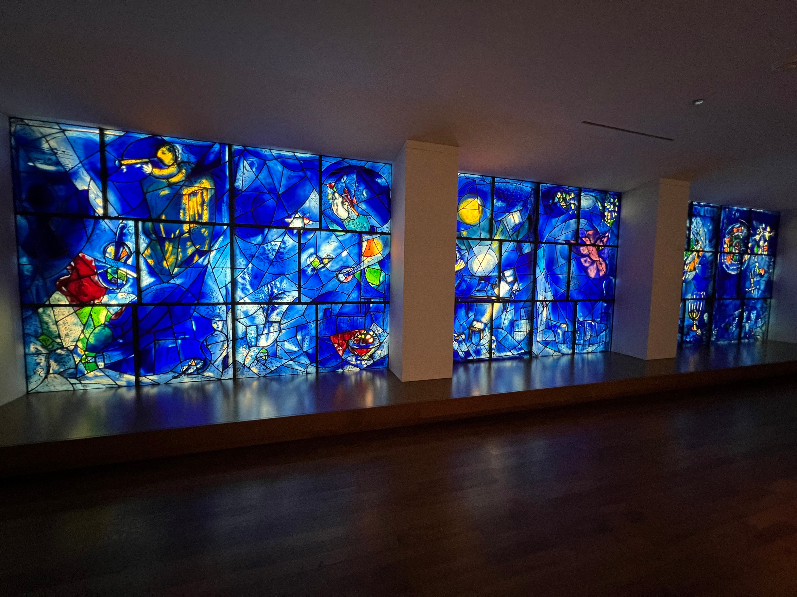
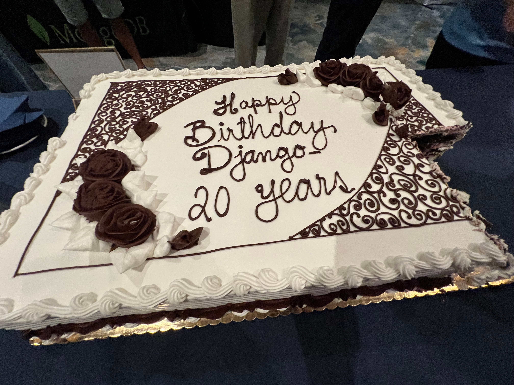
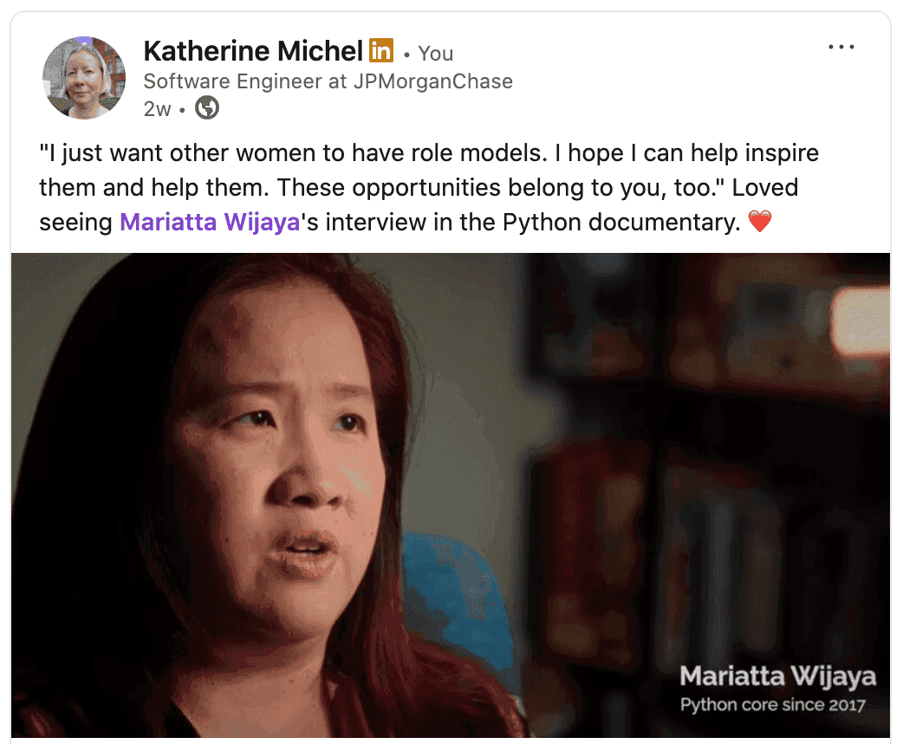
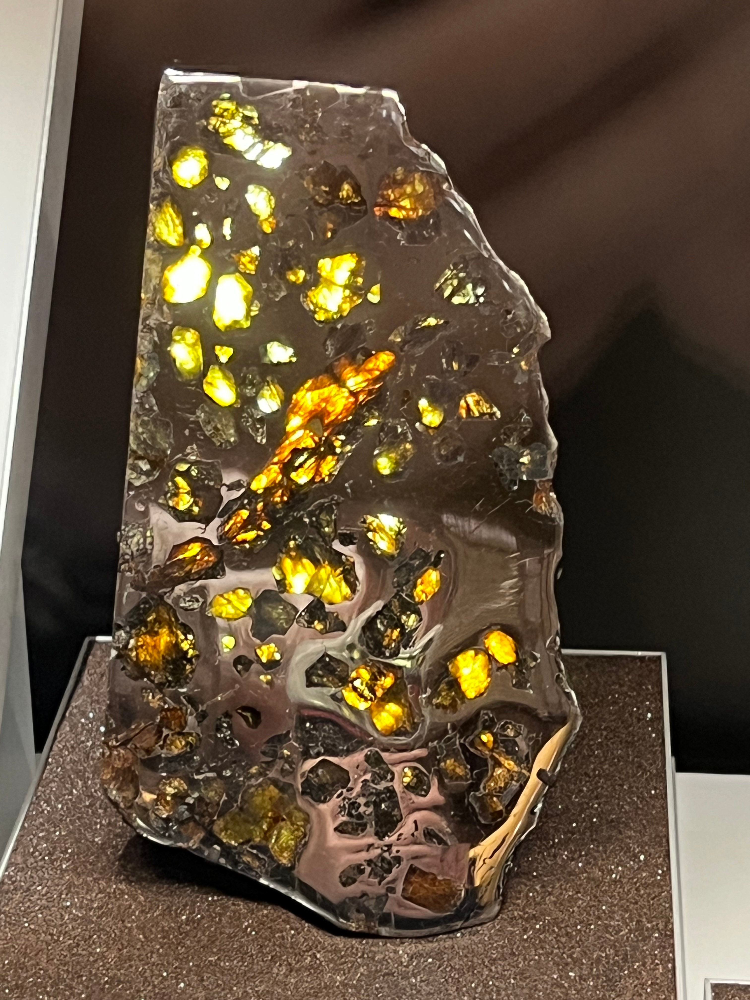
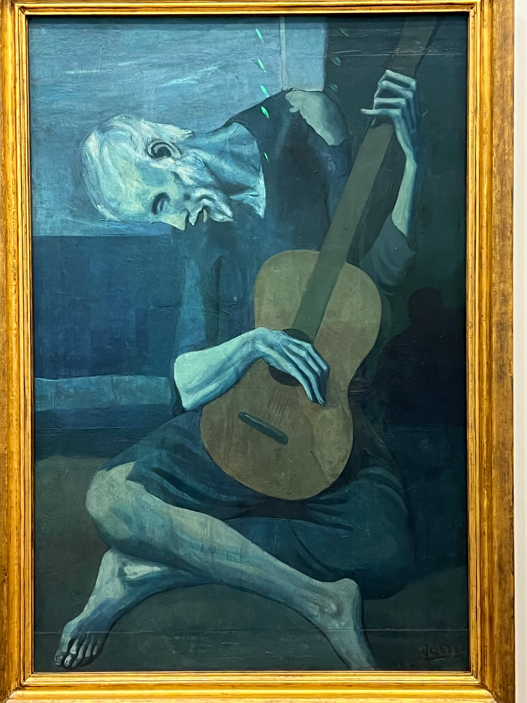

# DjangoCon US 2025 Recap

Table of Contents
-----------------

- [Intro](#intro)
- [Pre-conference Activities](#pre-conference-activities)
- [Monday](#monday)
    - [Kojo Idressa and Keanya Phelps Kick Off the Conference](#kojo-idressa-and-keanya-phelps-kick-off-the-conference)
- [Tuesday](#tuesday)
    - [Speaker and Organizer Dinner](#speaker-and-organizer-dinner)
- [Wednesday](#wednesday)
    - [Conference Conclusion](#conference-conclusion)
- [Sight Seeing and More Food](#sight-seeing-and-more-food)
- [In Closing](#in-closing)

## Intro

Disclaimer: the content of this post is a reflection of my career journey and not specific to my work at JPMorganChase.

DjangoCon US took place in Chicago, Illinois from September 8-12. It was a stellar experience. 

In Ferris Bueller's Day Off, one of my favorite movies, after a day of adventures across Chicago, Cameron famously tells Ferris that [he doesn't think he's seen anything good](https://youtu.be/o0iVd8b5QyA?si=wxTvTEL98johebOB). 

I am happy to report that I saw everything good!

🔝 [**back to top**](#table-of-contents)

## Pre-conference Activities

### The View from Above

While making my flight reservation, I googled for advice about the best side of the plane to be on for a great view when arriving in Chicago. As we approached, I feared that I had chosen the wrong side, but I hadn't! The downtown appeared to my left, then the pilot circled around above Lake Michigan, and I got another view from the other side. 

Downtown Chicago

### The Field Museum

Thanks to my employer's generous financial support of Chicago area museums, I was able to enjoy some sightseeing perks, starting with the incredible [Field Museum](https://www.fieldmuseum.org/). 

Unearthed in Argentina, [Máximo Titanosaur](https://www.fieldmuseum.org/exhibition/maximo-titanosaur) (Patagotitan Mayorum), the largest animal to have ever walked the earth that we know of, lived 101.6 million years ago. He or she was estimated to have weighed 70 tons, spanned 122 feet long, and is 28 feet tall at the head. Say cheese! 

The infamous [Tsavo Lions](https://www.fieldmuseum.org/blog/tsavo-lions) are two of the most high profile items in the collection. In 1898, they went on a man-eating spree, terrorizing railway construction workers in Kenya for nine months, until they were shot dead. They were the subject of the 1996 movie The Ghost and the Darkness, starring Val Kilmer.

[Megalodon](https://www.fieldmuseum.org/blog/four-fossil-sharks-are-cooler-megalodon), the largest shark to ever live, preyed on whales and went extinct when oceans worldwide got colder. This jaw and teeth (replica cast) was dated 23-3.6 million years ago. 

Among the museum's holdings is one of the most impressive [ancient Egypt collections](https://www.fieldmuseum.org/exhibition/inside-ancient-egypt) in the world, including a three story replica of an ancient Egyptian tomb that contains two authentic burial chambers that date to 2400 B.C., 23 human and 30 animal mummies, artifacts from everyday life and mummification rituals. 

### Shaw's Crab House Lunch Special

While researching Chicago, I came across many recommendations for Shaw's Crab House, a beloved, 40-year-old Chicago institution. I took a break from sightseeing to enjoy their reasonably-priced [gourmet 3-course lunch](https://www.shawscrabhouse.com/events/3-course-lunch-2/) special. The food was delicious, and the ambience left me feeling like I was a character in a movie. 

Shrimp cocktail

Pan-seared Alaskan cod

Mini chocolate cake

[View from the Bar Video](https://youtu.be/YxGYLfhE22w)

### The Art Institute of Chicago

After lunch, I spent the afternoon at the [Art Institute of Chicago](https://www.artic.edu/). The Art Intitute is one of the world's great art museums, renowned for its collection of Impressionist and Post-Impressionist art.  

Having looked through the museum's collection ahead of time and noted my favorites, I saw many great works. For fun, I also took the [Be Like Ferris Tour](https://www.artic.edu/my-museum-tour/5178), featuring art works seen in Ferris Bueller's Day Off when [Ferris, Cameron, and Sloane visit the museum](https://youtu.be/vBBOMLURSGA?si=3OLtiWJt2C2vB8jj). 

The front of The Art Institute of Chicago

[America Windows](https://www.artic.edu/artworks/109439/america-windows) by Marc Chagall

[Nighthawks](https://www.artic.edu/artworks/111628/nighthawks) by Edward Hopper

[A Sunday on La Grande Jatte](https://www.artic.edu/artworks/27992/a-sunday-on-la-grande-jatte-1884) by Georges Seurat

[Gallery 211](https://www.artic.edu/galleries/2147483626/gallery-211), one of my favorite rooms

The [Thorne Minature Rooms](https://www.artic.edu/highlights/12/thorne-miniature-rooms) in the basement are also a must see. 

### My Incredible Room

After sightseeing, I checked into my hotel. 

I was fortunate to stay at the 4-star [Thompson Chicago by Hyatt](https://www.hyatt.com/thompson-hotels/chith-thompson-chicago), perfectly situated in the fun [Gold Coast Neighborhood](https://en.wikipedia.org/wiki/Gold_Coast_Historic_District_(Chicago)) along the Magnificent Mile, filled with historic architecture, luxury shops, and in close proximity to the Oak Street Beach. 

I could get used to this... 

Stunning city view

### Pre-conference Social

On Sunday night, I decided to go to an informal pre-conference social at [Tiny Tapp](https://www.tinytapp.com/) organized by Jon Gould of [Foxley Talent](https://foxleytalent.com/). I was rewarded with this nighttime view of the buildings overlooking the Chicago River and [Riverwalk](https://en.wikipedia.org/wiki/Chicago_Riverwalk). 

What a view!

🔝 [**back to top**](#table-of-contents)

## Monday

### Pre-conference

I couldn't resist getting breakfast at the [Original Pancake House](https://ophchicagoland.com/original-pancake-house-gold-coast/), conspicuously located directly across from the hotel. The strawberry crepes were divine, and the coffee was perfectly strong. 

Ready for an adventure

Taking the Red Line south

Enjoying the view along the Chicago River on the way to the nearby venue

### Orientation

### Opening Remarks (Monday)

<!--
https://2025.djangocon.us/schedule/
-->

<!--
### Kojo Idressa and Keanya Phelps Kick Off the Conference

Stacey's talk
-->

### Keynote: Lateral Thinking with Weathered Technology: How The Nintendo Philosophy Applies to Modern Web Development

### Community Update: Django Events Foundation North America

### Django for AI: Deploying Machine Learning Models with Django

### Django's GeneratedField by example

### Deploy Django: GitOps & Kubernetes Made Easy

### How to Enjoy Debugging in Production

### Extras

Chicagoan David Beazley is a well-known author and teacher in the Python community who offers [advanced programming courses](https://www.dabeaz.com/). I first met Dave at PyGotham 2019 after his keynote and was excited to reconnect. I scored a signed copy of his book [Python Distilled](https://www.oreilly.com/library/view/python-distilled/9780134173399/)! 

Me and my sweet friends Afi and Velda. They surprised me with gifts to show their appreciation for me. I felt so special! Afi did a great job managing program and giving opening remarks and Velda serving on the DEFNA Board and moderating the Two Decades of Django panel. 

Gifts from Afi and Velda: beautiful flowers, Harrods spiced salted caramel shortbread, a British keychain, a postcard with handritten messages

### Lincoln Loop Social Event

After the conference, I headed over to the [Broken Shaker Bar](https://freehandhotels.com/chicago/broken-shaker/) for a [Lincoln Loop](https://lincolnloop.com/) Social. 

The bar area before the room soon reached full-capacity. 

## Tuesday

### Opening Remarks (Tuesday)

### Keynote: All The Ways To Use Django

### Community Update: Python Software Foundation

### Winemaking with Mutable Event Sourcing in Django

### Beyond Rate Limiting: Building an Active Learning Defense System in Django

### Hidden Dangers Of AI In Developer Workflows: Navigating Security Risks with Human Insight

### Cutting latency in half: What actually worked—and what didn’t

### Django as a Database Documentation Tool: The Hidden Power of Model Comments

## Extras

Jeff, Marlene, me, Paolo. Marlene did a fascinating closing keynote Django Reimagined For The Age of AI. 

Django turned 20 this year. To commemorate the occasion, conference attendees were treated to delicious raspberry cake! 

In case you missed it, I recently wrote down my thoughts in a [Happy 20th Birthday Django post](https://katherinemichel.github.io/blog/personal/happy-20th-birthday-django.html). 

### Speaker and Organizer Dinner

The speaker and organizer dinner was at the jaw-dropping [Carnivale](https://www.carnivalechicago.com/) restaurant. 

Carnivale bar

Carnivale dining room

Chipotle lime salad, pollo en pipian, carnitas, vegan paella, arroz verde, guacamole

A highlight of the evening was sharing stories of our close encounters with tech royalty! 

### Amorino

After dinner, a group of us walked to nearby [Amorino](https://www.amorino.com/ww) for delicious gelato. 

Ice cream flash mob (photo credit: Mariatta)

This was my first time trying gelato, and I loved it. I had half [Vanilla (bourbon from Madagascar)](https://www.amorino.com/ww/product/vanilla-bourbon-from-madagascar), half [Amorino chocolate](https://www.amorino.com/ww/product/amorino-chocolate). 

I also crossed an item off my bucket list: taking an ice cream selfie with Mariatta. 

Mariatta and me! Mariatta's gelato was flower-shaped. (photo credit: Mariatta)

Mariatta was the first woman CPython Core Developer. She was featured in the new [Python documentary](https://youtu.be/GfH4QL4VqJ0?si=doJ39S2O_Tuc6Gau). Her impact is appreciated, and her voice clearly resonates with the community. 

130 likes, 16 reposts as of the writing of this

[Ice cream flash mob video](https://youtu.be/IGVAT4hLc9I) (video credit: Mariatta)

### Six Feet Up Social Event

Some of us further ventured to the nearby [Six Feet Up](https://sixfeetup.com/) Arcade Night at [Punch Bowl Social](https://punchbowlsocial.com/location/chicago). 

Continuing the trend of firsts, I played foosball for the first time!

## Wednesday

### Pre-conference

I knew Wednesday morning would likely be my last chance to make the short walk from my hotel to Oak Street Beach. I couldn't resist getting up early to do so. It was surprisingly beach-like, despite bordering Lake Michigan. I enjoyed a quiet walk down the coast and watched nearby beach-goers play vollyball and cold-plunge. 

Mild waves rolling in

### Deep-Dive Day

### Opening Remarks (Wednesday)

### Keynote: Django Reimagined For The Age of AI

<!--
https://2025.djangocon.us/talks/keynote-wednesday/
-->

### High Performance Django at Ten: Old Tricks & New Picks

<!--
https://2025.djangocon.us/talks/high-performance-django-at-ten-old-tricks-new-picks/
-->

### Panel Discussion: Two Decades of Django: The Past, Present and Future

<!--
https://2025.djangocon.us/talks/panel-discussion-details/
-->

### What a Decade!

<!--
https://2025.djangocon.us/talks/what-a-decade/
-->

### Extras

### Conference Conclusion

🔝 [**back to top**](#table-of-contents)

## Post-Conference

### Wendella Chicago Architecture Boat Tour

I'd heard many great things about Chicago architecture boat cruises and considered taking one on Sunday, but decided it would be one thing too many. When I heard that a group of attendees would be taking one Wednesday evening, I had to join. It surpassed my expections, and I'd love to go again sometime.  

Our [Wendella](https://wendellaboats.com/) boat (photo credit: Tobias McNulty)

Our guide, Jai. When we started out, it was daylight, by the end, it was night. Best of both worlds. 

### Giordano's

After the boat trip, several of us stopped to eat at Navy Pier Giordano's. 

Earlier in the week, I'd had a [Lou Malnati's](https://www.loumalnatis.com/) deep-dish, Chicago Classic with sausage, mozzarella, and tomato sauce on a Buttercrust™. The pizza was tasty, but it was surprisingly watery, and the crust was difficult to cut. [Giordano's](https://giordanos.com/) pizza sauce was a bit too sweet for me. I had delicious fettuccini alfredo instead. 

Hopping on a Wednesday night!

My fettuccini alfredo really hit the spot!

Deep-dish, spinach pizza

Me, Jacob, Tim, Mariatta

## In Closing

<!--
Worked on website
DjangoCon US will be in Chicago again next year. 
-->

🔝 [**back to top**](#table-of-contents)

## More Sight Seeing!

### More of The View From Above

### More from The Field Museum

<!--

-->

<!--
https://www.fieldmuseum.org/exhibition/meet-the-chicago-archaeopteryx
-->

### More from The Art Institute of Chicago

[American Gothic](https://www.artic.edu/artworks/6565/american-gothic) by Grand Wood

[Self-portrait](https://www.artic.edu/artworks/80607/self-portrait) by Vincent van Gogh

[A Sunday on La Grande Jatte](https://www.artic.edu/artworks/27992/a-sunday-on-la-grande-jatte-1884) by Georges Seurat

[The Old Guitarist](https://www.artic.edu/artworks/28067/the-old-guitarist) by Pablo Picasso

[Improvisation No. 30 (Cannons)](https://www.artic.edu/artworks/8991/improvisation-no-30-cannons) by Vasily Kandinsky

[Mr. Pointy](https://www.artic.edu/artworks/229379/mr-pointy) by Takashi Murakami

🔝 [**back to top**](#table-of-contents)
