# DjangoCon US 2026 Recap

Table of Contents
-----------------

- [Intro](#intro)
- [Monday](#monday)
    - [Orientation](#orientation)
    - [Monday Opening Remarks](#monday-opening-remarks)
    - [Keynote: Boldly Go, Building Worlds: Is there Room for me on the Bridge?](#keynote-boldly-go-building-worlds-is-there-room-for-me-on-the-bridge)
    - [Good Conduct: How Django Modernized Its Code of Conduct](#good-conduct-how-django-modernized-its-code-of-conduct)
    - [Pragmatic AI: How to gain trust with user-centered AI adoption](#pragmatic-ai-how-to-gain-trust-with-user-centered-ai-adoption)
    - [Monday Lightning Talks](#monday-lightning-talks)
    - [Search-as-you-type for 54 Million Names: PostgreSQL + Django for Fuzzy Name Matching at Scale](#search-as-you-type-for-54-million-names-postgresql--django-for-fuzzy-name-matching-at-scale)
    - [Using Django to deliver public transit benefits securely and privately](#)
- [Tuesday](#tuesday)
    - [Tuesday Opening Remarks](#tuesday-opening-remarks)
    - [Keynote: Emails from my Grandad](#keynote-)
    - [Batteries vs. Speed: The Django/FastAPI Debate](#)
    - [The Testing Pyramid in Practice for Django](#)
    - [Tuesday Lightning Talks](#tuesday-lightning-talks)
    - [50 shades of green - One contribution to the Django world](#)
    - [What's New in Postgres 18 & 19](#)
    - [Keeping Pace with Django: Evolving Through 15 years of Updates](#)
- [Wednesday](#wednesday)
    - [Wednesday Opening Remarks](#wednesday-opening-remarks)
    - [Keynote: Django 6: The Most Exciting Release Ever](#keynote-)
    - [Auto-prefetching with model field fetch modes in Django 6.1](#)      
    - [Wednesday Lightning Talks](#wednesday-lightning-talks)
    - [Modern Django Deployments in 2026](#)
    - [The Django UUID Story](#)
    - [Snippets](#snippets)
    - [Closing Remarks](#closing-remarks)

Disclaimer: the content of this post is a reflection of my career journey and not specific to my work at JPMorganChase.

## Intro

DjangoCon US 2026 took place in Chicago, Illinois from August 24-28. I attended online. 

This year, I paid more attention to the lightning talks (I usually take an early lunch) and also included some of the rich info discussed during the Q&A after talks.  

These notes are specific to my interests and leave out info that might be of interest to you. I highly recommend watching the talks yourself when they are posted on YouTube!

🔝 [**back to top**](#table-of-contents)

## Monday

### Orientation

by Kojo Idrissa

Set your priorities. Why are YOU here? Direct your time and energy properly. 

🔝 [**back to top**](#table-of-contents)

### Monday Opening Remarks

by Keanya Phelps

"This community is extremely giving and considerate, respectful. I used to say 'they' as far as Django and DjangoCon, but now I say 'we.'"

DjangoCon US 2027 will take place in Riverside, California from September 13-17. 

🔝 [**back to top**](#table-of-contents)

### Keynote: Boldly Go, Building Worlds: Is there Room for me on the Bridge?

by Dawn Wages

Dawn is calling all of us to dream with her. 

"You all, the Django Community, saw me from a nervous and quiet and unsure person hiding in the back of a conference room to raising my hand and even calling myself a leader." 

Dawn spent a long time not being scared. 

I appreciate that Dawn revealed the influences that instilled within her grit, tenacity, and a love for technology, heavily influenced by her parents:
* An HBO series called Happily Ever After and Twilight Zone (also one of my favorites)
* Watching Star Trek Next Generation with her father
* Her parents teaching her about the first Black woman astronaut and taking her to space museums
* Her mom keeping copies of Ebony Magazine with beautiful Black women on the covers, creating the voice she would hear about Black women in the future ("she intentionally wrote the script")
* Her dad dancing with Funkadelic and Stevie Wonder

Afrofuturism: "There are Black people in the future- an interdisciplinary vision intersecting with imagination, technology, Black culture, liberation and mysticism" (inspired by Ytasha L. Womack's [Afrofuturism: The World of Black Sci-Fi and Fantasy Culture](https://www.amazon.com/dp/1613747969?lv=shuf&channelId=500&plpRedirect=mhFallback))

For those who have not seen themselves in the future through science fiction and speculative fiction, it is necessary to say and visualize that there are Black people in the future. 

Dawn and some friends created [An Anti-Racist Ethical Source License for Open Source Projects](https://attheroot.dev/). She would love to make new iterations. 

Seminal works for Dawn

Star Trek pushed boundaries. 

Afrofuturism "provides a lens on how I've learned to dream."

How to be a builder:
* Do the work in public
* Make room for people who don't have a seat at the table
* Stay accountable to your crew

Lessons Learned:
* Dawn was always who she needed to be and did not need to change to be worthy of any opportunity she reached for
* She stays ready so she doesn't have to get ready when opportunity knocks (example: filling in as last minute speaker at important conference)
* Sometimes opportunity knocked, and she wasn't ready, but she tried her best anyway
* You also don't have to "build the world." (Dawn contends with strong Black woman trope)
* "You are allowed to be exhausted without giving up. Sometimes surviving is progress."
* She is always asking for more. Don't ask, am I good enough? For a Black woman this creates difficult, high friction conversations, direct feedback frequently. It's exhausting. It's easier to have a conversation when you are not on your back foot.
* Rejection is the risk of authenticity. 

"Being the first or only is lonely." But, Dawn would take being "rounded, complex, unique, strong over easy access any day," because it's made her who she is today.  

Your experience matters. You belong here. Is there room for me? Yes, Dawn is making room. 

Thank you for being vulnerable, Dawn. 

🔝 [**back to top**](#table-of-contents)

### Good Conduct: How Django Modernized Its Code of Conduct

by Dan Ryan

A long-time Django user, Dan volunteered to serve on the Code of Conduct Committee. He eventually became the chair and helped to modernize the Code of Conduct.

"This was my first contribution to Django. Code isn't the only way in." 

Why now? "We kept running into issues where people were being jerks. And there was no language that said, 'you can't be a jerk.'" 

Contributor Convenant, adopted by over 100 organizations, including some of the biggest players, has lineage back to the original Django Code of Conduct, which borrowed from the PyCon 2013 Code of Conduct and Ada Initiative. 

Pipeline: Ada Initiative -> PyCon 2013 -> Original Django Code of Conduct -> Contributor Covenant 3 -> PSF, OpenJS, Mozilla, Microsoft

This talk was about the people management side. Dan published a blog post about the technical side: [The Block and Tackle of Django's Code of Conduct Working Group](https://www.djangoproject.com/weblog/2026/aug/24/coc-block-tackle/). 

AI-generated content: "Own your contributions, review them before you post, apply your own expertise- misuse of AI-generated content is a Code of Conduct violation."  

Issues brought up during Q&A:
* The possibility of a significant amount of Django code being written by AI and its ownership then being in question is a real concern.
* The CoC Working Group spent the most time on the weapons policy. They didn't want to be US-centric. They gave guidance to events. Events implement their own policy.
* "Assume good intent" is a weaponed phrase. You should not assume any intent. Look at impact. 

References:
* [Talk Slides](https://django-coc-2026.dryan.com/#slide-1)
* [Django adopts a Code of Conduct (2013)](https://www.djangoproject.com/weblog/2013/jul/31/django-adopts-code-of-conduct/)
* [BeeWare Community Code of Conduct](https://beeware.org/community/code-of-conduct/)
* [Contributor Covenant](https://www.contributor-covenant.org/)
* [Code of Conduct Sources](https://github.com/django/code-of-conduct/blob/main/sources.md)

<!--
"Coming home has been fun." Dan led the frontend team for the Obama 2012 Campaign. 
https://www.python.org/psf/records/board/minutes/2025-03-12/
https://github.com/psf/policies/pull/35
https://pyfound.blogspot.com/2019/09/the-python-software-foundation-has_24.html
https://github.com/django/code-of-conduct/pull/91
https://github.com/django/code-of-conduct/pull/97
-->

🔝 [**back to top**](#table-of-contents)

### Pragmatic AI: How to gain trust with user-centered AI adoption

by Meagan Voss

Wagtail serves a lot of people beyond Torchbox and its clients. 

A small team with a healthy skepticism of AI hype, the Wagtail team has adopted a balanced AI policy that respects users' autonomy and choice. Wagtail users are responding through PyPI downloads and shoutouts. 

Wagtail's AI Guiding Principles:
* No AI dependency in Wagtail core (not forcing AI on anyone)
* Responsible approach to AI (example: model with lower environmental impact)
* Model and provider agnostic (not picking a horse in this race)
* Only the right AI (want evidence of benefit)
* Human in the loop (human is in control)

[Wagtail AI package](https://wagtail.org/wagtail-ai/):
* Multiple vendor options
* User decides how much AI to use and where
* User control over prompts and tokens
* Focus on common, repeatable tasks on content publishing

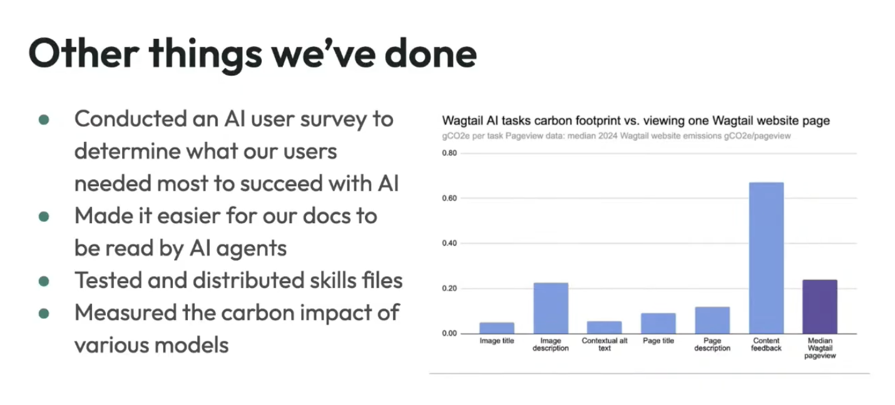
Other things they've done

Other steps for Wagtail and AI: [product strategy](https://wagtail.org/product-strategy/):
* Next major release includes a fully supported write API
* Continue our sustainability and quality research
* Pursue agent-ready publishing
* Create agent skills to improve DX experience

Issues brought up during Q&A:
* What was involved in making docs easier for AI to read? Made sure content was in Markdown and added copy options on user guide
* Wagtail has added a write API and Thibaud is experimenting with a docs builder. Despite the beauty of Wagtail, CMSes are going to become "clearinghouses and sources of truth" for AI. Wagtail is laying the foundation for whatever direction things go. 

References:
* [AI in the CMS: steering the ecosystem](https://wagtail.org/blog/ai-in-the-cms-steering-the-ecosystem/)
* Open weight models are catching up, [Epoch Capabilities Index](https://epoch.ai/benchmarks?view=graph&tab=eci)
* [Wagtail Documentation](https://docs.wagtail.org/en/stable/) (for developers)
* [Wagtail User Guide](https://guide.wagtail.org/en/) (for regular users/editors)
* [Wagtail Space 2026](https://wagtail.org/wagtail-space-2026/)

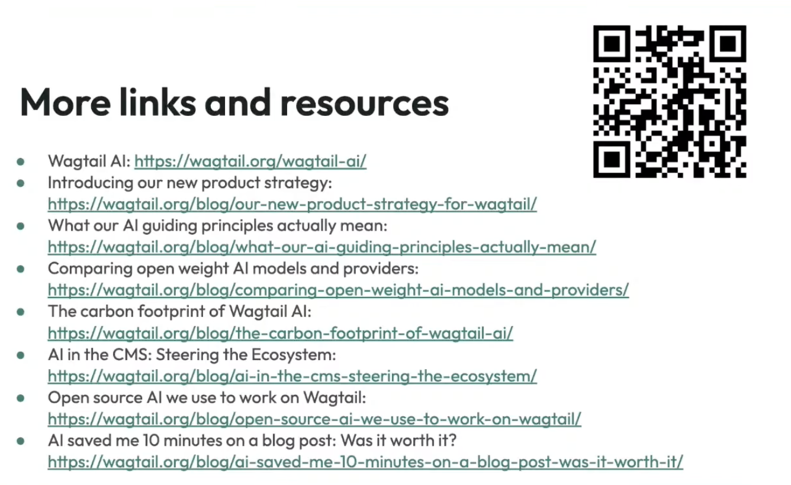
More links and resources

🔝 [**back to top**](#table-of-contents)

### Monday Lightning Talks

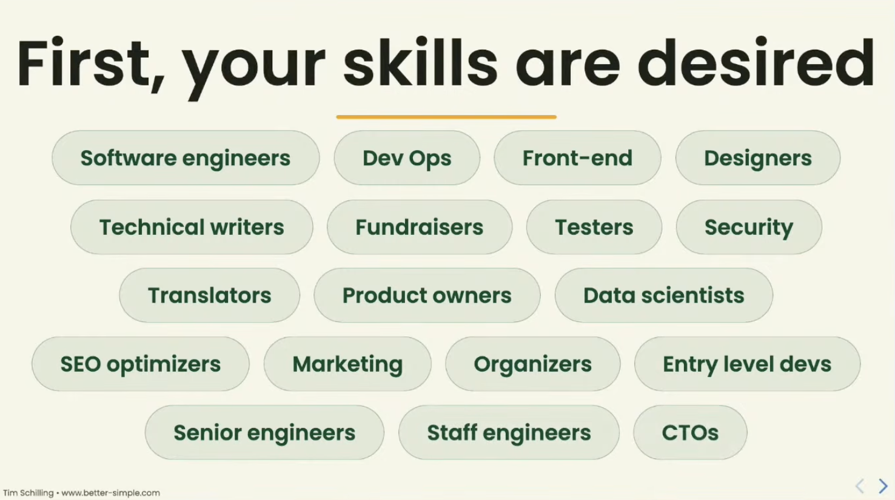
Tim Schilling: I want to convince you to contribute to Django

Topics of interest to me:
* Marc Gibbons: [django-absurd](https://github.com/lincolnloop/django-absurd) based on [django-absurd](https://github.com/earendil-works/absurd)
* Jim Anderson: normalize talking about imposter syndrome
* Jon Gould: [Tech Hiring Has a Fraud Problem](https://foxleytalent.com/blog/fake-candidates-tech-hiring/)
* Eric Holscher: 16 years ago, Read the Docs was created in the same basement as Django in Lawrence, Kansas. Ethical ads made Read the Docs sustainable. The DSF is at similar inflection point of hiring an executive director and working toward sustainability.
* Jeanette O'Brien: From Figma to Django. "Premature structure is its own trap- just like no structure at all."
* Eric Sherman: Chicago reversed the flow of the Chicago River and raised the city 14 feet in the air, [Raising of Chicago Wikipedia article](https://en.wikipedia.org/wiki/Raising_of_Chicago)

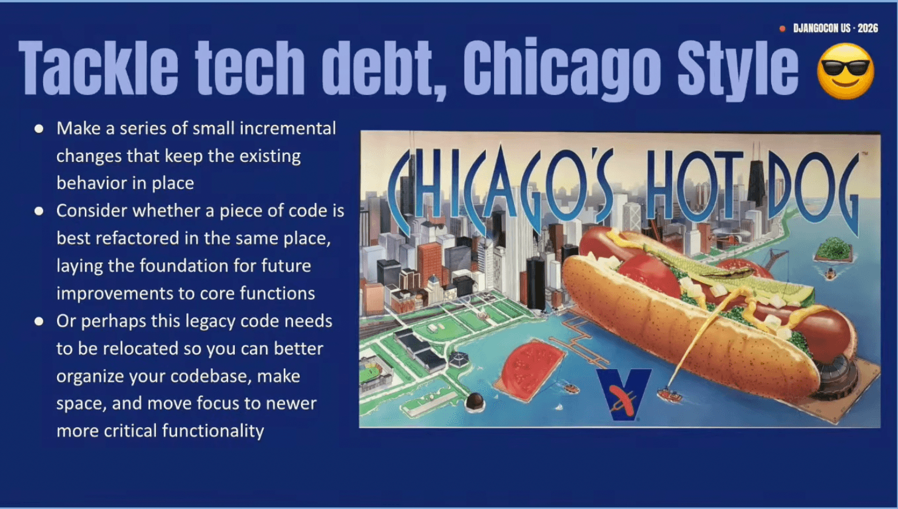
Eric Sherman: Tackle tech debt, Chicago-style

🔝 [**back to top**](#table-of-contents)

### Search-as-you-type for 54 Million Names: PostgreSQL + Django for Fuzzy Name Matching at Scale

Summary

References:
* [Demo](https://fuzzy-demo.caktus-built.com/)
* [GitHub Repo](https://github.com/caktus/talk-fuzzy-name-search)
* [Fuzzy String Matching in Django and PostgreSQL](https://www.caktusgroup.com/blog/2026/08/21/fuzzy-string-matching-django-postgresql/)
* [Falsehoods Programmers Believe About Names](https://www.kalzumeus.com/2010/06/17/falsehoods-programmers-believe-about-names/)
* [Fuzzy Name Matching in Postgres](https://www.crunchydata.com/blog/fuzzy-name-matching-in-postgresql)
* [PostreSQL fuzzystrmatch](https://www.postgresql.org/docs/18/fuzzystrmatch.html)
* [PostreSQL Soundex](https://www.postgresql.org/docs/18/fuzzystrmatch.html#FUZZYSTRMATCH-SOUNDEX)
* [PostreSQL Daitch Mokotoff](https://www.postgresql.org/docs/18/fuzzystrmatch.html#FUZZYSTRMATCH-DAITCH-MOKOTOFF)
* [PostreSQL Levenshtein Distance](https://www.postgresql.org/docs/18/fuzzystrmatch.html#FUZZYSTRMATCH-LEVENSHTEIN)
* [Django Trigram Matching](https://docs.djangoproject.com/en/6.1/ref/contrib/postgres/search/#trigram-similarity)
* [PostreSQL B-Tree Index](https://www.postgresql.org/docs/current/btree.html)

<!--
https://en.wikipedia.org/wiki/Levenshtein_distance
b-tree index for case insensitive prefix matching
https://en.wikipedia.org/wiki/B-tree#Index_performance
https://github.com/moj-analytical-services/splink
-->

🔝 [**back to top**](#table-of-contents)

### Using Django to deliver public transit benefits securely and privately

<!--
https://docs.calitp.org/benefits/
https://github.com/cal-itp/benefits
-->

🔝 [**back to top**](#table-of-contents)

## Tuesday

### Tuesday Opening Remarks

by Peter Grandstaff

Organizing DjangoCon US is a huge endeavor. "Getting involved in organizing and running this conference has been a hugely enriching factor in my life. My life is so much bigger and better, because of the work I've done here." If you want to get involved, talk to an organizer, talk to Peter. Get in touch. 

DjangoCon US 2027 ticket prices are the lowest they will be at extra early bird. 

"Hey, we don't do that here." 

Get the word out about the conference. We want everyone who would want to be at DjangoCon US to know about it. 

🔝 [**back to top**](#table-of-contents)

### Keynote: Emails from my Grandad

by Sarah Boyce

Sarah's talk is through a lens of contributing to open source projects. 

Who we do code review?
* Code works
* Code fits project itself (conforms to coding style, etc.)
* Knowledge-exchange is distributed to contributors and wider community and maintainable (fix issues, extend without asking original author)

[Thanks for the Feedback: The Science and Art of Receiving Feedback Well](https://www.amazon.com/dp/0670014664)

Psychological triggers:
* Truth: you believe the feedback is wrong (be open, curious: others might come to same conclusion, it's worth engaging, honest mistake?) 
* Relationship: affected by who is giving review (a person you don't like, a person you don't know, an intimidating person, etc.)
* Identity: the feedback feels bigger than what it actually is (rather than see it as one small piece of work among all of your work, you begin to have self-doubt as if it reflects heavily upon who you are as a developer)

Advice:
* Mergers also make mistakes. You should feel confident and capable of questioning their feedback, just like anyone else. 
* Growth mindset
* This is just the first draft, don't worry too much about mistakes. Respond, fix problems, engage. End result is what matters. 

Hidden agenda: get more reviews for Django PRs. PRs in the Django review queue sometimes take months to get reviewed. This is becoming worse in the rise of AI. 

What worse than receiving a review is receiving no review at all. A review is someone investing in your work. Human attention is limited commodity. Sarah believes most people would prefer to receive a clumsy, imperfect review over no review at all. The collaboration is the joy. 

Django needs you to do code review. 

Issues brought up during Q&A:
* PR authors tend to get more attention than reviewers (co-author is an idea, but messy)
* it took Paolo months to have the courage to open a PR. Language was a barrier. Sarah believes pair programming can help.
* In-person sprints are good place for pairing. [Django on the Med](https://djangomed.eu/) shout-out.
* Due to release timeline, be strategic about when asking for help, to include features
* How to avoid triggering PR author: be polite, be empathetic, clear is still kind
* You can tell when a person is upset and handle it

🔝 [**back to top**](#table-of-contents)

### Batteries vs. Speed: The Django/FastAPI Debate

by Calvin Hendryx-Parker and Frank Wiles

No wrong answers. Tradeoffs. 

Django + Django Ninja versus Fast API

<!--
Most people still use DRF

https://github.com/sixfeetup/2026_DjangoCon_BatteriesVsSpeed

https://github.com/dj-bolt/django-bolt
-->

🔝 [**back to top**](#table-of-contents)

### The Testing Pyramid in Practice for Django

by Monica Oyugi

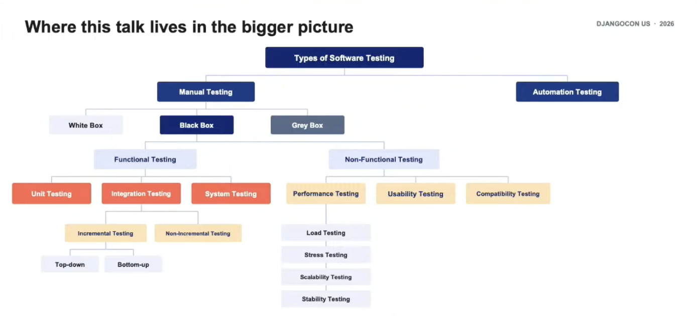

🔝 [**back to top**](#table-of-contents)

### Tuesday Lightning Talks

🔝 [**back to top**](#table-of-contents)

### 50 shades of green - One contribution to the Django world

by Sarah Abderemane

🔝 [**back to top**](#table-of-contents)

### What's New in Postgres 18 & 19

by Elizabeth Christensen

🔝 [**back to top**](#table-of-contents)

### Keeping Pace with Django: Evolving Through 15 years of Updates

by Eduardo Felipe Castegnaro

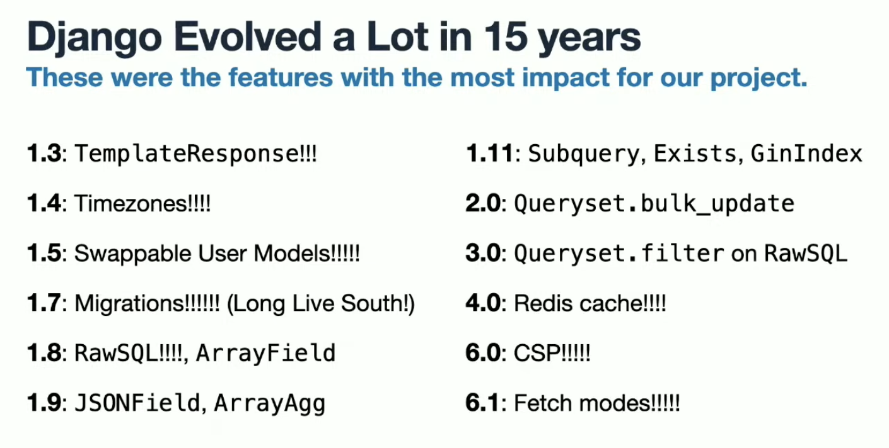

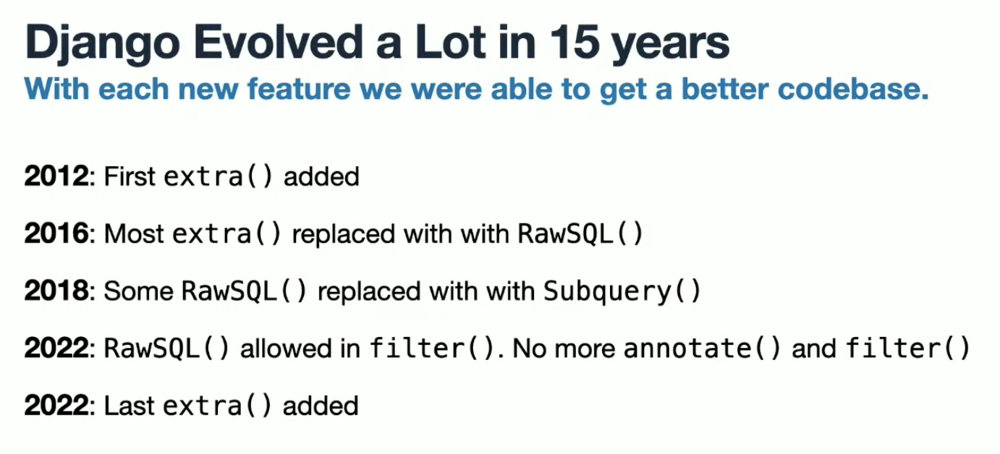

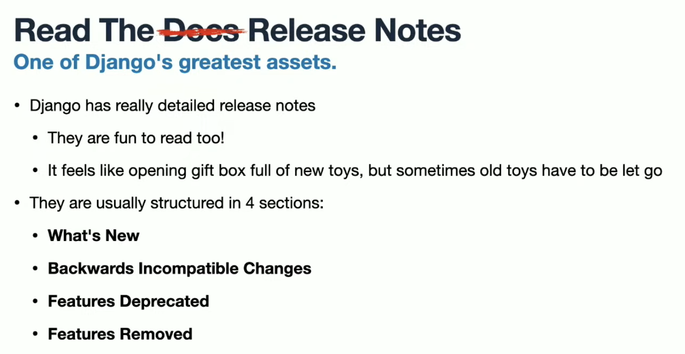

🔝 [**back to top**](#table-of-contents)

## Wednesday

### Wednesday Opening Remarks

by Drew Winstel

Inspired by Django Under the Hood, Day 3 is deep-dive day. 

If you want to help organize DjangoCon US next year, email hello@djangocon.us. DjangoCon US has a lot of jobs. Let them what you are interested in. 

🔝 [**back to top**](#table-of-contents)

### Keynote: Django 6: The Most Exciting Release Ever

by Karen Tracey

Django has been around for 21 years of releases. Nearly 20 years ago, Karen started using Django for a hobby project, before Django 1.0 release. She had some issues and almost immediately created a report and was invited to create a patch. She started to help develop Django and became a Django Core Developer. 

Although Karen highlights four big things, there are "little gems throughout the release notes." Read the full notes, including Miscellaneous (this is the second reference of the conference to the importance of this section). There might be functionality that would appeal to your project or address a pain point. 

These are in the order of Karen's increasing level of excitement. 

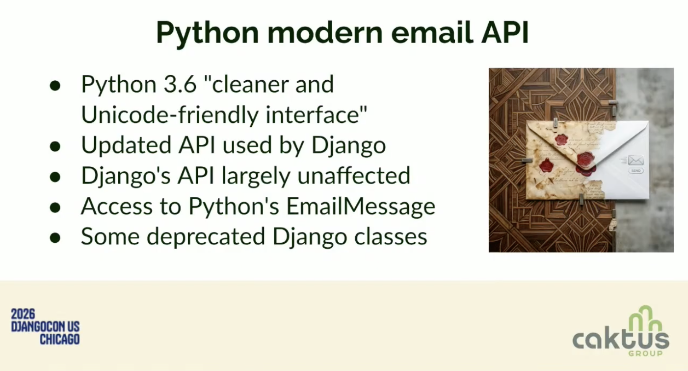
Karen feels that this feature reflects Django's health, because it indicates that Django is picking up Python's new features. 

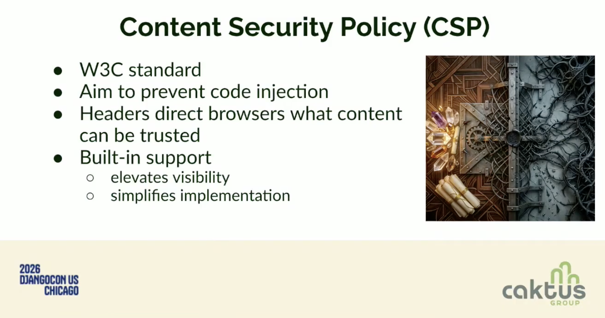
Karen thinks it's "excellent that Django has incorporated that into the base," because it makes it visible to Django developers that they need to decide and implement a CSP. 

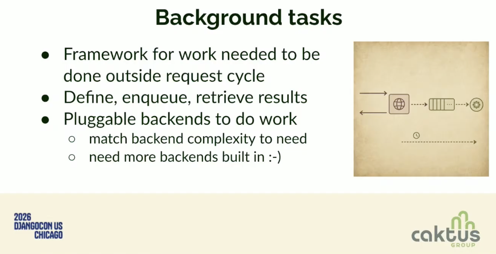
Karen points out that Celery is often more complexity than is necessary. She's happy that standardization for enqueuing and execution is happening. She would like to see at least one production-ready backend be included in Django 4.0. 

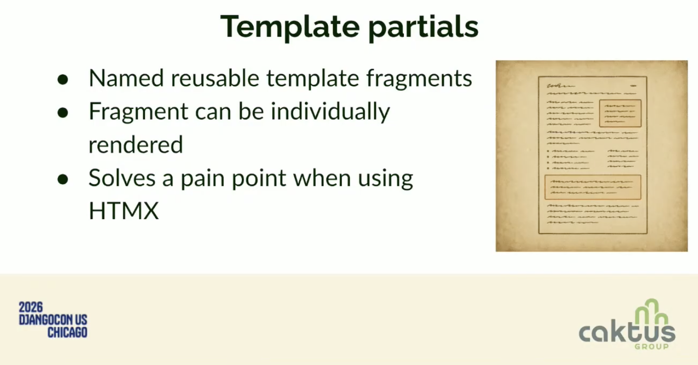
Template partials is the feature Karen is most excited about. 

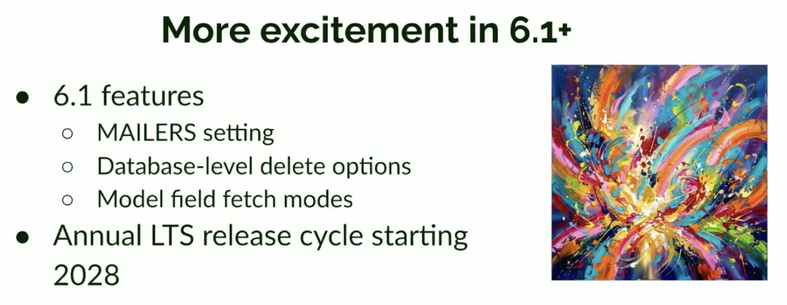

Django has a [new features repo](https://github.com/django/new-features) for proposing new features

🔝 [**back to top**](#table-of-contents)

### Auto-prefetching with model field fetch modes in Django 6.1

by Jacob Walls

🔝 [**back to top**](#table-of-contents)

### Wednesday Lightning Talks

🔝 [**back to top**](#table-of-contents)

### Modern Django Deployments in 2026

by Will Vincent

"90% of Django deployments are the same." Will wants to prove that using his mental model. He did not talk about tooling. He wanted to talk about the things that don't change. 

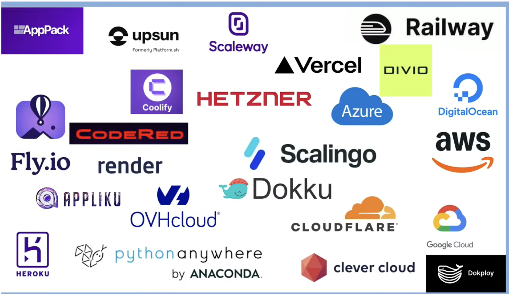
Shortlist of providers

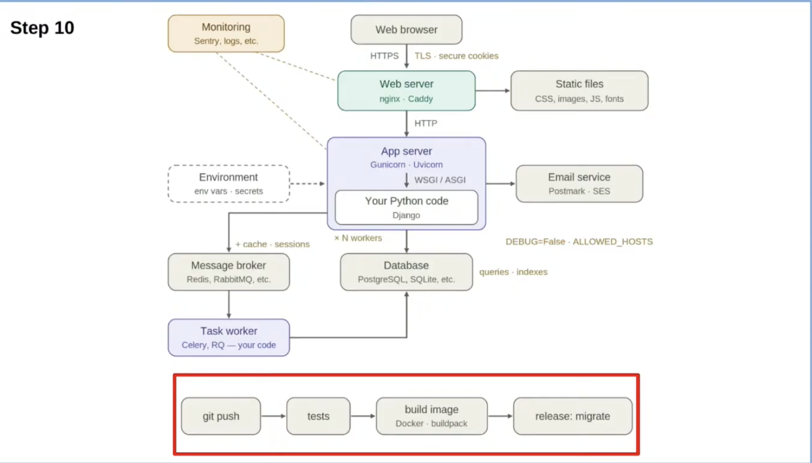
Deployment architecture

Notes
* Now we have WSGI/ASGI (based on Django Channels)
* Django supports five databases out of the box: Postgres, SQLite, MySQL, Oracle DB, MongoDB
* [psycopg driver](https://www.psycopg.org/) is needed for Postgres
* Tools: Docker, White Noise, Nginx, CDN, Redis, RabbitMQ, Celery, RQ
* collect static command, media is uploaded by users, so can't trust it. Have to put it somewhere else.
* auth: how to do password reset, email, passkey, sms ("a mistake here in production will get you in the news in a way you don't want to be."
* In prod, with public internet, everything is a threat
* https is not enough, because it does not protect session cookies
* Once a page is loaded we cannot trust it to not run someone's script. CSP middleware addresses this. 
* TLS, secure cookies, debug setting, allowed hosts
* Hardening doesn't make anything faster
* Background workers (in prod milliseconds matter), message brokers, tasks
* Performance: caching ("two copies of truth, and we have to know when to throw away the stale one"), n workers, indices, model fetch modes
* When people say Django is slow (sometimes Fast API is faster), it's not Django/Python. It's the database
* Resist the urge to prematurely optimize (wait for real traffic to determine which pages are slow, don't sprinkle indices like candy ahead of time)
* Locally, you will get an error message. In prod, use monitoring, Sentry, logs. 

Issues brought up during Q&A:
* Will would love to see some "magic" added such as a flag or other mechanism to "flip a switch" to go from local mode to prod mode to deploy to a platform as a service or app pack. A lightweight way to deploy could help newcomers and those "afraid of Django."
* Will is considering open sourcing his own deployment checklist (yes, please). Django also has a [deployment checklist](https://docs.djangoproject.com/en/6.1/howto/deployment/checklist/). Will suggests to start by running the Django management command 'manage.py deploy --check' to assess your deployment readiness. Will suggested also to ask AI for a deployment checklist. 
* When is Django Cloud deploy as a service coming out? (for context, Fast API has Fast API Cloud).
* Will does not use AI for deployment, but he has heard people say they are doing infra, terraform, kubernetes, etc. and it works well. It is really saving time and doing it well?

Remember when: 
* [cdi](https://docs.python.org/3/library/cgi.html) and [mod_python](https://en.wikipedia.org/wiki/Mod_python)
* Multiple settings.py files
* Jacob Kaplan-Moss talk "[Assets in Django Without Losing Your Hair](https://www.youtube.com/watch?v=E613X3RBegI)" 

<!--
Email service is another api key
mailers dictionary (Django 6.1)
emails_wild deprecated in Django 7.1

Q&A
Calvin/Frank- bias to people with money, big sites, go to Amazon
Will most excited about Qubity, pass service on VPS
-->

🔝 [**back to top**](#table-of-contents)

### The Django UUID Story

by Paolo Melchiorre

🔝 [**back to top**](#table-of-contents)

### Snippets

by various

🔝 [**back to top**](#table-of-contents)

### Closing Remarks

by Keanya Phelps

Keanya, thank you for chairing two unforgettable conferences! 

🔝 [**back to top**](#table-of-contents)

<!--
### Polyglot Persistence with Django: When One Database Isn't Enough

by Abigail Afi Gbadago

🔝 [**back to top**](#table-of-contents)

### Wishlist granted: HTMX without betraying your Django views

    - [Wishlist granted: HTMX without betraying your Django views](#)

by Natalia

https://github.com/nessita/djangocon2026/tree/main/wishlists

🔝 [**back to top**](#table-of-contents)
-->

<!--
The power of Miscellaneous section
Using multiple databases
Background tasks demo-ed

GeoDjango at City Scale: Spatial Data for Urban Systems
Presented by
Drishti Jain

Search-as-you-type for 54 Million Names: PostgreSQL + Django for Fuzzy Name Matching at Scale
Presented by
Tobias McNulty
Gerald Carlton

Using Django to deliver public transit benefits securely and privately
Presented by
Scott Cranfill

Taming Your Templates: Component-Based Frontends in Django
Presented by
Kasey Kelly

Teach Django Tasks to speak Celery: Building a Celery backend for Django Tasks
Presented by
Matías Bordese

Agents All the Way Down: How AI Coding Agents Changed How I Write Django
Presented by
Josh Thomas

Scientists Meet Django: Building Bridges Between Research and Software
Presented by
Barkha Jain

Tuesday

Batteries vs. Speed: The Django/FastAPI Debate
Presented by
Calvin Hendryx-Parker
Frank Wiles

The Testing Pyramid in Practice for Django
Presented by
Monica Oyugi

One URL to Rule Them All: Dynamic Landing Pages in Wagtail
Presented by
Chrissy Wainwright

Audience level:All
Lightning Talks (Tuesday)
Presented by
Andrew Mshar

Who Goes There? Actively Detecting Intruders With Cyber Deception Tools
Presented by
Dwayne McDaniel

Polyglot Persistence with Django: When One Database Isn't Enough
Presented by
Abigail Afi Gbadago

50 shades of green - One contribution to the Django world
Presented by
Sarah Abderemane

What's New in Postgres 18 & 19
Presented by
Elizabeth Christensen

Keeping Pace with Django: Evolving Through 15 years of Updates
Presented by
Eduardo Felipe Castegnaro

Audience level:All
Keynote: Django 6: The Most Exciting Release Ever
Presented by
Karen Tracey

Scaling Django: Mastering Database Routers with AWS Aurora
Presented by
Leonardo Batista

Auto-prefetching with model field fetch modes in Django 6.1
Presented by
Jacob Walls

Enter the Ecosystem: Contributing to Django Open Source Projects
Presented by
Andrew Selzer

Audience level:All
Lightning Talks (Wednesday)
Presented by
Andrew Mshar

Wishlist granted: HTMX without betraying your Django views
Presented by
Natalia

Modern Django Deployments in 2026
Presented by
Will Vincent

The Django UUID Story
Presented by
Paolo Melchiorre

But did you know the browser already does that?
Presented by
James Stuckey Weber

DSF Membership Open Space
Join the Django Software Foundation board and members for a quick overview and Q&A about foundation.

What is an Open Space?

Learn to Contribute to Django
Presented by
Sarah Boyce
Jacob Walls

Django New Features Review
Presented by
Frank Wiles
-->
