 
# PyCon US 2026 Recap

Table of Contents
-----------------

- [Intro](#intro)
- [Thursday](#thursday)
    - [Sightseeing](#sightseeing)
    - [Packaging and Typing Summits](#packaging-and-typing-summits)
    - [Opening Reception](#opening-reception)
        - [Red Hat](#red-hat)
        - [AWS and Valkey](#aws-and-valkey)
- [Friday](#friday)
    - [Welcome](#welcome)
    - [Friday Sponsor Talks](#friday-sponsor-talks)
        - [Nvidia](#nvidia)
        - [Meta](#meta)
    - [PSF Welcome](#psf-welcome)
    - [The Art of Extending Python with Other Languages](#the-art-of-extending-python-with-other-languages)
    - [PEP 750 - T-strings: safer and smarter string processing](#pep-750---t-strings-safer-and-smarter-string-processing)      
    - [Catch Up With Guido](#catch-up-with-guido)
    - [Catch Up With Anthony](#catch-up-with-anthony)
- [Saturday](#saturday)
    - [D&I Panel](#d-&-i-panel)
    - [Saturday Sponsor Talks](#saturday-sponsor-talks)
        - [Anthropic](#anthropic)
        - [Hudson River Trading](#hudson-river-trading)          
    - [Rust for CPython](#rust-for-cpython)
    - [Post-Incident Runtime SBOM Generation from Python Memory](#post-incident-runtime-sbom-generation-from-python-memory)
    - [PSF Members Luncheon](#psf-members-luncheon)
    - [Simon Willison Lightning Talk](#simon-willison-lightning-talk)
    - [Ned Batchelder Lightning Talk](#ned-batchelder-lightning-talk)
    - [PyLadies Auction](#pyladies-auction)
- [Sunday](#sunday)
    - [Marina and Beach](#marina-and-beach)
    - [Sunday Sponsor Talks](#sunday-sponsor-talks)
        - [Google](#google)
        - [Fastly](#fastly)  
    - [Python Software Foundation Security Engineers Update](#python-software-foundation-security-engineers-update)
    - [Chatting With Emma](#chatting-with-emma)
    - [PyLadies Lunch](#pyladies-lunch)
    - [Learning Computer Science with Python and Music(21)](#learning-computer-science-with-python-and-music21)        
    - [Why you, as a Python developer, should learn Rust](#why-you-as-a-python-developer-should-learn-rust)
    - [Lazy imports and the art of interpreter procrastination](#lazy-imports-and-the-art-of-interpreter-procrastination)
    - [Paolo and Mark](#paolo-and-mark)
    - [Steering Council Panel](#steering-council-panel)
    - [Python Software Foundation Update](#python-software-foundation-update)
    - [Closing](#closing)
    - [Black Python Devs Leadership Summit](#black-python-devs-leadership-summit)
    - [Ice Cream Selfie](#ice-cream-selfie)
    - [RevSys After Party](#revsys-after-party)
    - [L'Opera](#lopera)
- [More Connections Made](#more-connections-made)
- [Swag](#swag)
- [Monday](#monday)
    - [Engine Failure](#engine-failure)
    - [PyCon Lives On](#pycon-lives-on)
- [Until Next Time](#until-next-time)

## Intro

Disclaimer: the content of this post is a reflection of my career journey and not specific to my work at JPMorgan Chase & Co.

[PyCon US 2026](https://us.pycon.org/2026/) took place in Long Beach, California from May 13-19. 

Security and AI were at the forefront with new dedicated tracks, in addition to the latest Python 3.15 features and community building.

There were several outstanding keynotes. I highly recommend watching them when the replays become available. 

Writing this recap is an opportunity for me to record and reflect. My goal is to compound my knowledge from year-to-year by going deeper into the technical aspects of the language and making more connections within the community.

🔝 [**back to top**](#table-of-contents)

## Thursday

### Sightseeing

I spent Thursday sightseeing. I decided to ride the 121 bus along the beach to [Belmont Shore](https://en.wikipedia.org/wiki/Belmont_Shore,_Long_Beach,_California), explore the area, then eat at [Nick's on Second](https://nicksrestaurants.com/nicks/on-2nd/). 

When I attended PyCon US 2024, I started a tradition. I googled "best restaurant in Pittsburgh" and ate there. It was a wonderful restaurant called [Fig & Ash](https://figandashpgh.com/). Now, I do this at every host city. 

Nick's was at or near the top of every list I saw and had rave reviews. I was hoping to eat some excellent fresh seafood, and Nick's filets fish in-house daily. 

The view from the Belmont Pier... Thursday was an overcast day, but the beaches were quiet and meditative. 

I walked over to [Naples Island](https://en.wikipedia.org/wiki/Naples,_Long_Beach) to see what it was about. 

A view of boats in the Alamitos Bay while walking across the 2nd Street Bridge

On Naples Island, I discovered something I'd never seen before, luxury houses with small passages between them leading to boats docked along the Alamitos Bay. A homeowner assured me it was okay to walk down this charming passage. 

A gangway leading down to a semi-private dock. 

Nick's was a short walk from Naples Island. This Chilean Sea Bass was absolutely delicious! It was exactly what I was hoping for. 

After Nick's, I was able to make it to the [Queen Mary](https://www.queenmary.com/) in time for the 1:15 pm Glory Days Tour. Launched in 1934 to carry mail between England and the US, the Queen Mary was an engineering masterpiece. It represented a golden era of ocean travel defined by Art Deco luxury, celebrity passengers, and record-breaking speed. 

Although the Queen Mary was larger, faster, and more sophisticated, members of my tour marveled that this was likely the closest we'd ever be to walking the deck of the Titanic. It was an eerie feeling at times. 

A fantastic view of the Los Angeles River and Long Beach Shoreline Marina from a deck on the Queen Mary

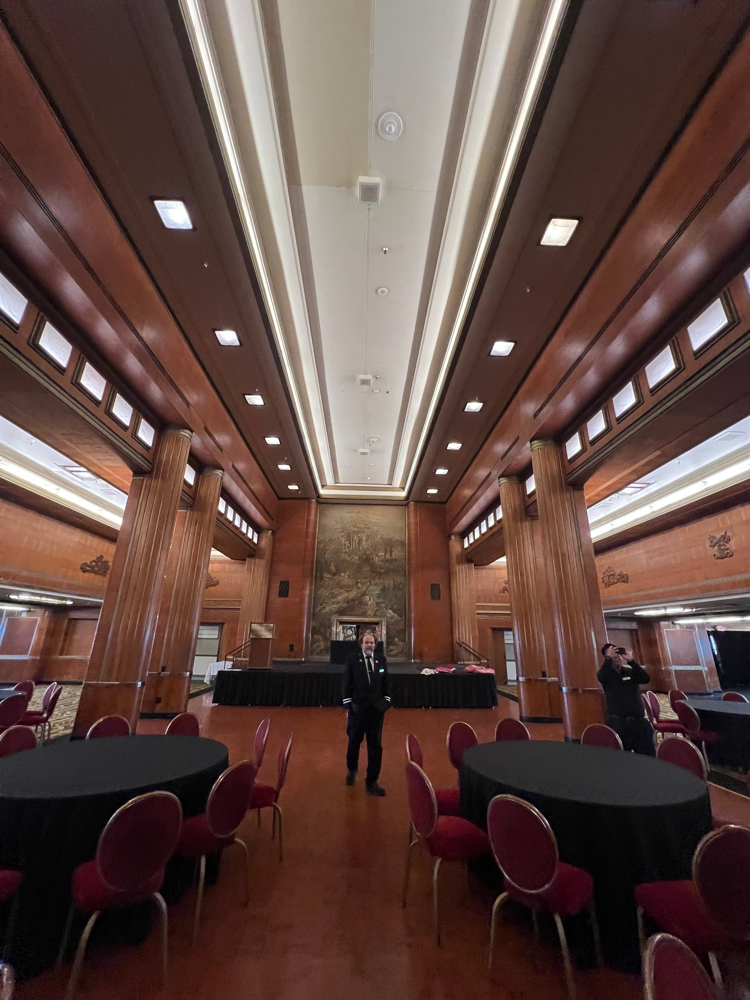
Formerly the First Class Dining Salon, now the Grand Salon. Many of the Queen Mary's floors, stairs, walls, ceilings, artworks are original. It is one of the largest and most pristine Art Deco collections in the world. Our tour guide absolutely loves his job on the Queen Mary. 

One of many beautiful artworks on the ship and a 1930s version of GPS. A boat in the center of the artwork could be moved to inform the passengers of the ship's progress. 

🔝 [**back to top**](#table-of-contents)

### Packaging and Typing Summits

Thank you to Bernát Gábor for writing up recaps of the Packaging and Typing Summits that happened before the main conference. I am excited to learn more:
* [Packaging Summit Recap](https://bernat.tech/posts/pycon-us-2026-packaging-summit-recap/)
* [Typing Summit Recap](https://bernat.tech/posts/pycon-us-2026-typing-summit-recap/)

🔝 [**back to top**](#table-of-contents)

### Opening Reception

The Opening Reception took place in the Expo Hall. 

#### Red Hat

Working in infrastructure, I was keen to visit the Red Hat Booth.  

I chatted with Sam Doran, principal software engineer, Ansible Core Team Member, and Ansible Docs Co-author to get some recommended learning resources "straight from the horse's mouth": 
* [Ansible for DevOps](https://www.ansiblefordevops.com/)
* [Ansible Docs](https://docs.ansible.com/)
* [Linux for Dummies](https://www.amazon.com/Linux-Dummies-9th-Richard-Blum/dp/0470467010)
* [RHEL Lightspeed](https://docs.redhat.com/en/documentation/red_hat_enterprise_linux/10/html/interacting_with_the_command-line_assistant_powered_by_rhel_lightspeed/introducing-rhel-lightspeed-for-rhel-systems): a CLI connected to an AI chat-bot built on [Block's Goose](https://github.com/aaif-goose/goose) to provide answers from Red Hat's knowledge base
* Red Hat Certified Specialist (RHCS)
* [Red Hat Enterprise Linux Diagnostics and Troubleshooting](https://www.redhat.com/en/services/training/rh342-red-hat-enterprise-linux-diagnostics-and-troubleshooting) course
  
<!---
https://github.com/rhel-lightspeed
https://goose-docs.ai/
-->

Sam also shared with me his preferred, alternative explanation of idempotency: desired state (it runs if it needs to make changes, but doesn't if it doesn't need to make changes)

#### AWS and Valkey

Working in a database and caching space, Valkey is near-and-dear to my heart. At the AWS Booth, I had the chance to connect with Jen Madriaga who works closely with Valkey Team. AWS has played a major role in the creation of Valkey and its donation to the Linux Foundation. 

🔝 [**back to top**](#table-of-contents)

## Friday

### Welcome

Conference Chair Elaine Wong gave the conference welcome. 

PyCon US 2026 fun facts: 
* New dedicated AI and Security tracks
* First-time Spanish keynote
* PyLadies turns 15
* Python turns 35
* Over 1000 proposals submitted to the CfP
* Python 3.15.0 is in beta, and it's the most colorful Python yet

🔝 [**back to top**](#table-of-contents)

### Friday Sponsor Talks

#### Nvidia

Recent major initiatives:
* Cuda Python 1.0
* Pythonic APIs for Cuda
* Packaging: creating a packaging console, working on wheel variance, teaching packaging how to know about modern hardware
* Contributions to CPython, free-threaded Python
* Rust into CPython

#### Meta

This is Meta's 10th year of sponsoring the PSF. 

Recent major initiatives:
* Helped land lazy imports in CPython
* Developed Life Guard, an open source project to help teams adopt lazy imports more safely
* Tested free-threaded Python internally and demonstrated approximately 30% savings in real product use case
* Contributing to work on unified PyTorch native stack for AI development
* Developed TritorX, writing GPU Kernels directly in Python

### PSF Welcome

PSF Executive Director Deb Nicholson gave the PSF Welcome.

You are a part of the Python community if you:
* Volunteer
* Contribute patches, bug reports, libraries
* Donate to the PSF
* Get your company to donate
* Help others learn Python
* Make newcomers feel welcome

A good way to identify a lightning talk subject: "tell me something that's interesting to you"

🔝 [**back to top**](#table-of-contents)

### The Art of Extending Python with Other Languages

by Cristián Maureira-Fredes

Cristián believes Python extensions are important, but many people are afraid of them. He wants to help people trust themselves and give it a try. 

Python adjacent tools written in other languages: 
* PyTorch: C++
* DuckDB: C++
* Pydantic Core: Rust
* UV: Rust (1.7% Python)
  
Why should we use other languages? Two of multiple reasons: 
* "Python is slow"
* Compiled languages are faster than interpreted ones (C, Rust extensions are faster than Python implementations)

This talk focused on the CPython implementation of Python and referred to the CPython docs: [Extending Python with C or C++](https://docs.python.org/3/extending/extending.html). 

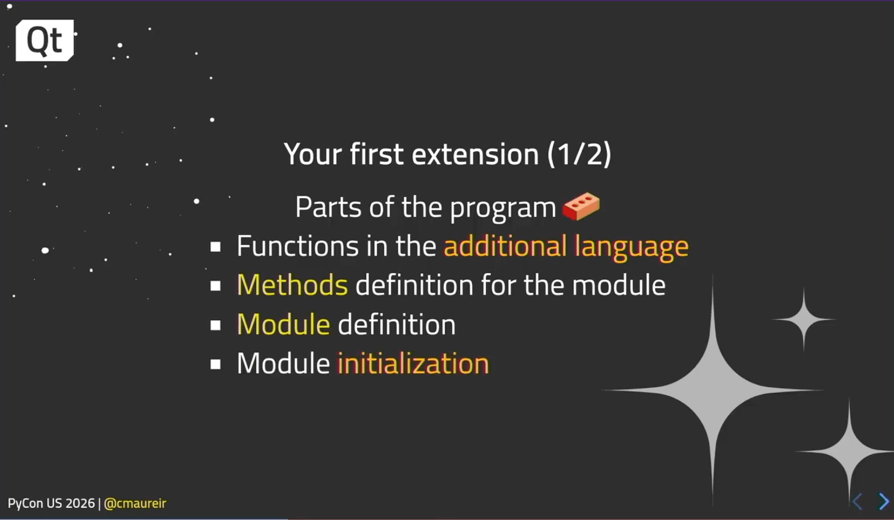
Parts of the program

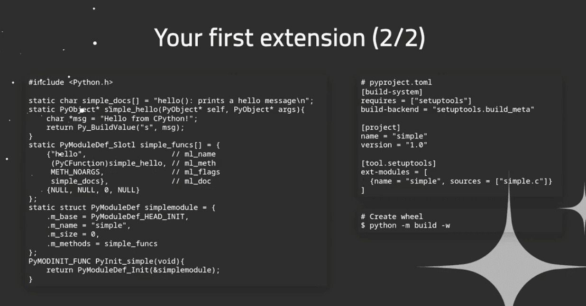
Your first CPython extension... boilerplate code example from docs with small modification

Cristián gave examples for other programming languages: C++, Rust, Zig. 

Binding Generators: will "grab your code" and put it into a Python module. 

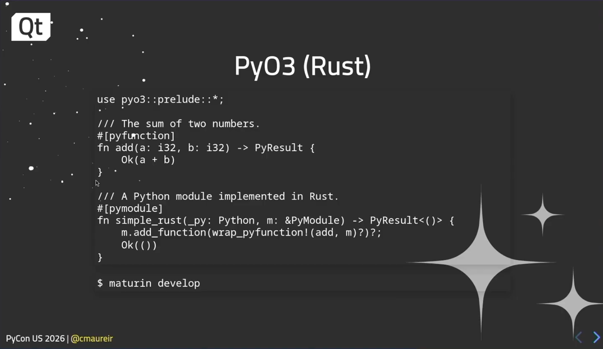
[PyO3](https://pyo3.rs/v0.29.0/): a "simple, fantastic" binding generator for Rust to Python

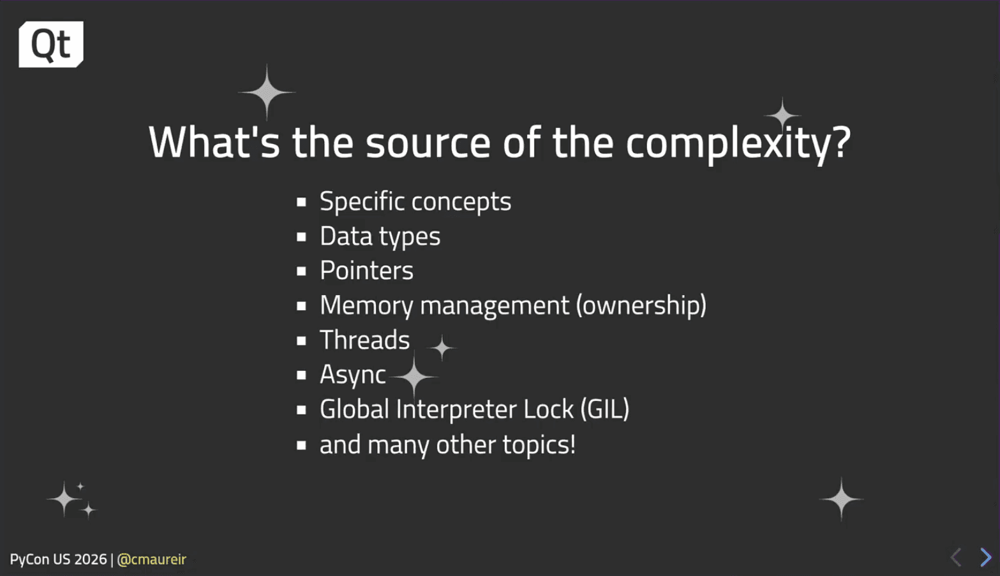
The source of complexity: understanding the equivalent concepts across languages

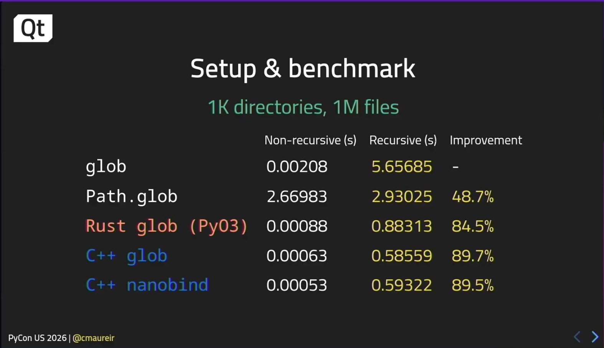
As an alterntive to Python's glob module, Cristián wrote his own fastglob module in C++. An 89.7% performance improvement was achieved. 

"Why we are not using C++ instead of Rust, besides safety" is a mystery to him. 

Extensions are not the solution to everything, but extending Python with other languages motivates discussion and keeps the community active. 

Python implementation alternatives to CPython mentioned in the talk: PyPy, Jython, Pyston, Cinder, CircuitPython, Pyjion, Qt for Python/PySide, GraalPython, RustPython, MicroPython, Mojo

<!--
Mojo, Codon
https://www.qt.io/development/qt-framework/qt-bridges
-->

🔝 [**back to top**](#table-of-contents)

### PEP 750 - T-strings: safer and smarter string processing

by Vinícius Gubiani Ferreira

t-strings were accepted in [PEP 750](https://peps.python.org/pep-0750/) and implemented in Python 3.14. 

f-strings and t-strings look the same. 

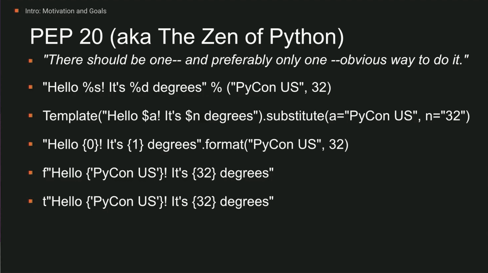
More than one way to format a string in Python... 

Only t-strings offer:
* Security
* Transformation
* Customization

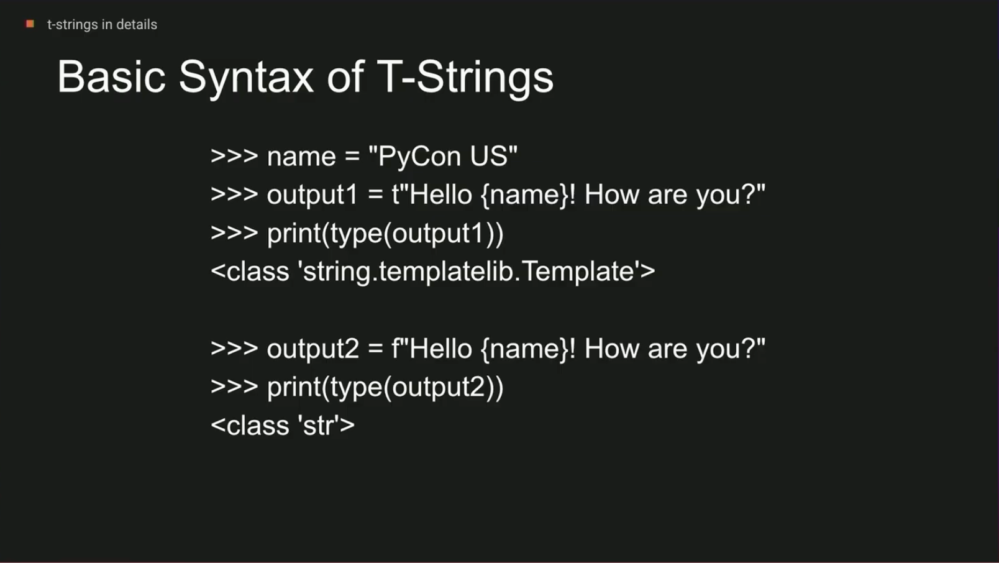
A t-string gives you an object, not a string. You can process the object how you wish. 

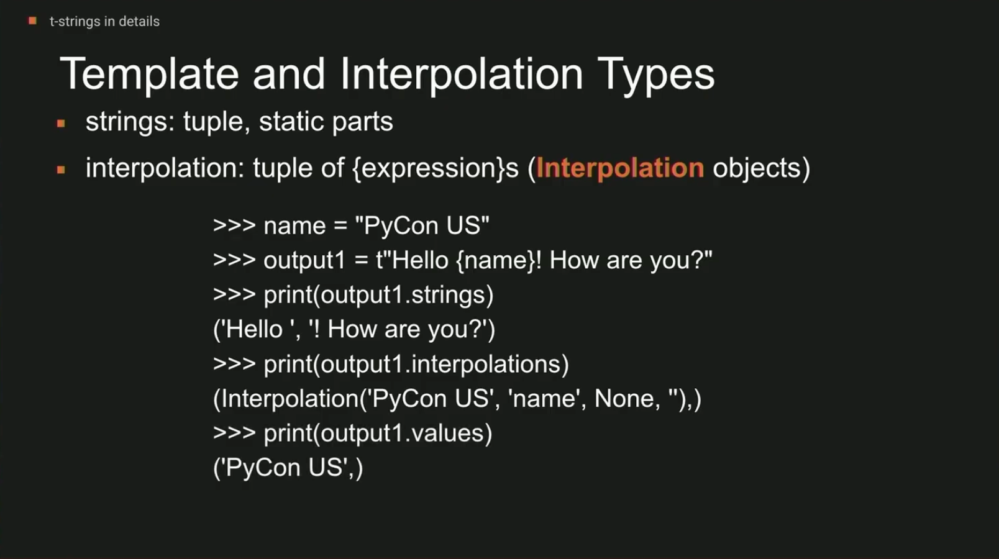
A t-string has attributes that can be accessed through dot notation. 

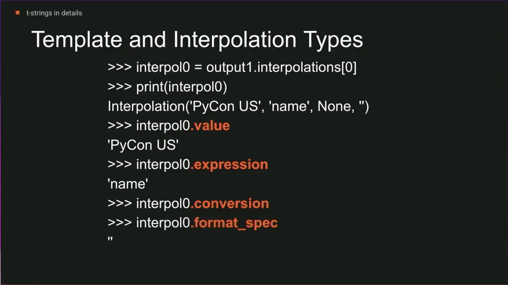

Dot notation
* .interpolations is the metadata object
* .string is the static parts as a tuple
* .value is the evaluated result
* .expression is the variable inside of {}
* .conversion is a string representation choice (!r or !s for repr() or str())
* .format_spec is a formatting spec (example: decimal places)
  
<!--
None- special parameters that allow you to do transformation and formatting
.values
-->

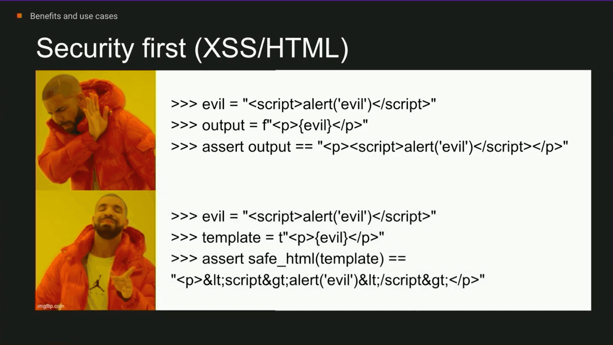
Avoid cross-site scripting by using a t-string and html.escape() under the hood

XSS/HTML data sanitizing libraries:
* tstring-html
* ludic
* pyhtml-enhanced
* tdom

SQL Injection data sanitizing libraries:
* sql-string
* t-sql
* psycopg 3 template string queries (pip install psycopg[binary])

Less obvious use cases for t-strings:
* Break large Jinja templates into smaller t-strings
* Logging with human readable and JSON output

Things you should know:
* No automatic string output: you need to convert the t-string to a string yourself
* Performance: you are trading speed for security (extra checks, allocating/deallocating memory)
* Complexity/UX: new concept to learn (mentioned legacy template)
* Partial standardization: t-strings offer new functionality, but no specific inplementation is enforced

t-string PEPs on the horizon
* [PEP 787 – Safer subprocess usage using t-strings](https://peps.python.org/pep-0787/)
* [PEP 822 – Dedented Multiline String (d-string)](https://peps.python.org/pep-0822/)

More resources
* [Python 3.14's new T-Strings: what's the big deal?](https://www.youtube.com/watch?v=tVhiar5LSQQ)
* [Real Python: Python t-strings](https://realpython.com/python-t-strings/)
* [t-strings Help](https://t-strings.help/)
* [Awesome t-strings](https://github.com/t-strings/awesome-t-strings)

🔝 [**back to top**](#table-of-contents)

### Catch Up With Guido

After the first keynote, I had the chance to chat with Guido van Rossum  about life and work for a few minutes. I’ve had the chance to spend time with him at four conferences now. It's always a pleasure. He attends some sessions, and I enjoy hearing him give his opinion. You always know where things stand, which I can appreciate. I am grateful for Python and the support Guido has provided for underrepresented groups. 

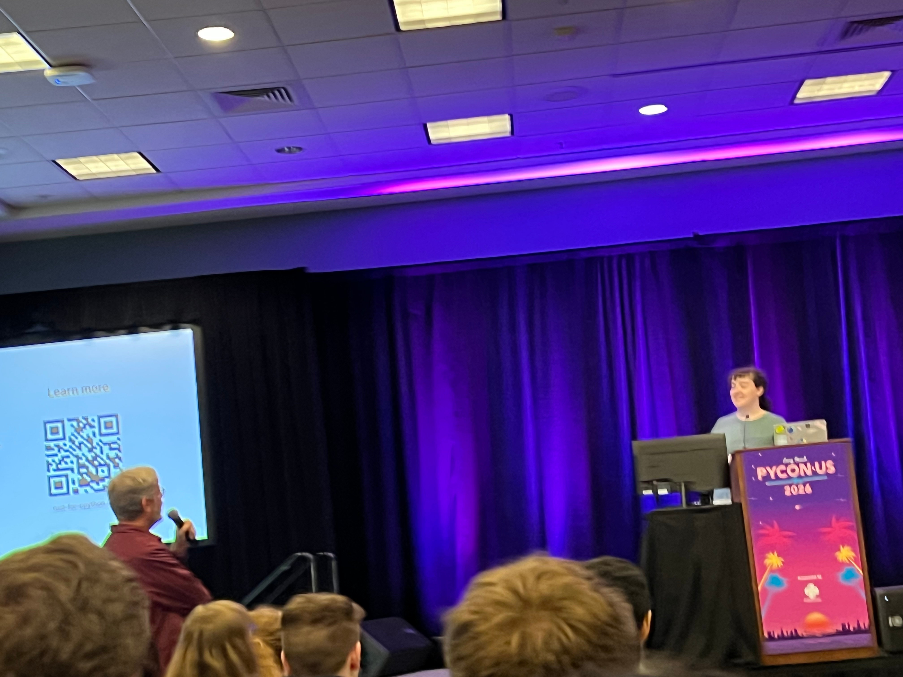
Guido putting Emma Smith on the spot about the speed of Rust at her talk "[Rust for CPython](https://us.pycon.org/2026/schedule/presentation/1/)" on Saturday

🔝 [**back to top**](#table-of-contents)

### Catch Up With Anthony

When I attended GitHub Universe in 2019, I randomly sat at a table with two strangers who turned out to be Anthony Sottile and Sarah Drasner. I connected with them afterward and learned that they are both outstanding teachers. 

Anthony has a popular Twitch Stream called [Anthony Writes Code](https://www.twitch.tv/anthonywritescode). 

I was getting coffee and heard someone say my name. It was Anthony! I was so happy to see him in person again after so many years. 

Anthony told me I've come so far over the years, and he is so proud of me. It meant the world to me! 

Me and Anthony, reunited again :) 

<!--
https://www.amazon.com/gp/product/B086W1YQG9/ref=kinw_myk_ro_title
-->

🔝 [**back to top**](#table-of-contents)
 
## Saturday

### D&I Panel

Panel Members: Débora Azevedo, Alla Barbalat, Georgi Ker, Theresa Seyram Agbenyegah (Stancy), Abhijeet Mote

"As you can see, the D&I Workgroup is comprised of a lot of people from around the world, including Iran and Reuben from Tel Aviv. For us, there's no war. We communicate every month, and Reuben talks to Ali to check if everyone is okay. And that's something... that's very important for us." 

D&I Workgroup's 3 initiatives: 
* Concentrate on outreach to communities (D&I/community)
* How to setup a local Python community (community)
* Collecting survey feedback from the Python Community

### Saturday Sponsor Talks

#### Anthropic

Recent major initiatives:
* Entered a two-year, $1.5 million PSF sponsorship (not just security or infrastructure- community outreach, developer-in-residence, everything PSF does)
* Let's do what it takes to support PSF
* Anthropic provides a Claude for Open Source Program- you don't have to fit the criteria on the form
* Anthropic handed out free Claude Max for a month vouchers

🔝 [**back to top**](#table-of-contents)

#### Hudson River Trading

Hudson River Trading is PSF's newest Visionary Sponsor. 

At a time of uncertainty, Hudson River Trading is ramping up. 

🔝 [**back to top**](#table-of-contents)

### Rust for CPython

by Emma Smith

CPython has over a million lines of C code. 

Benefits of C:
* Performance: "decimal module 12-80x faster with C backend vs Python"
* Portability: ported to over 80 different platforms
* Compatibility: can easily interfact with OS APIs

C has the possibility of undefined behavior: "an error in code, which may or may not be caught, either at compile time or runtime." 

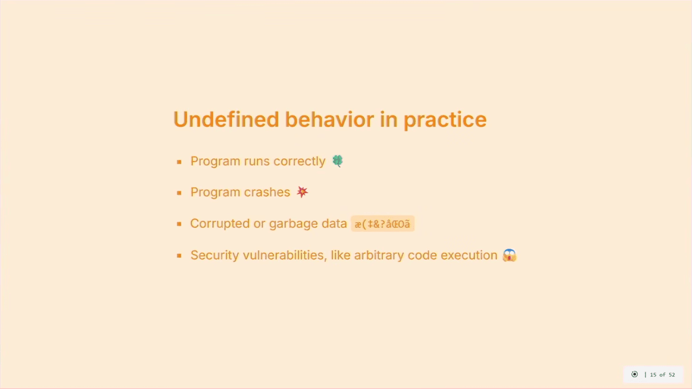
Undefined behavior in practice

Examples of undefined behavior
* Spatial memory errors (buffer overflows)
* Temporal memory errors (use after free)
* Data races

"There is no reliable way to determine if a large [C] codebase contains undefined behavior." Chris Lattner (creator of clang) 

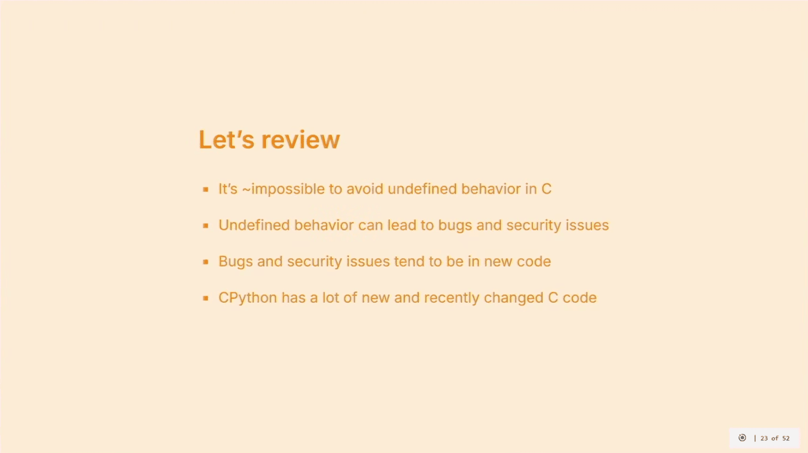

You can mitigate, but not prevent undefined behavior:
* Increase code review- a bottleneck
* Fuzzing- [OSS-Fuzz](https://github.com/google/oss-fuzz)
* Sanitizers- ASAN, TSAN, UBSAN in CI (address sanitizer, thread sanitizer, undefined behavior sanitizer, etc.)
* Analyze code with LLMs

All of these are currently being done and increase maintainer workload at a time when maintainers are already being stretched thin. 

Rust Programming Language is very effective for preventing undefined behavior. 

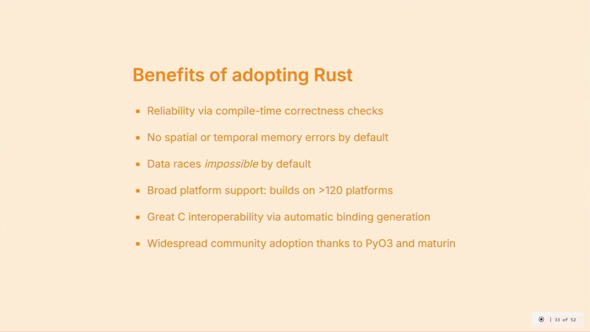
Benefits of adopting Rust... 

"The increased reliability in Rust largely comes from compile time correctness check. You can express things in Rust to check that your program will be correct ahead of time." 

"Data races are impossible... with the adoption of free-threading, multiple threads executing Python code means that data races more likely to occur." 

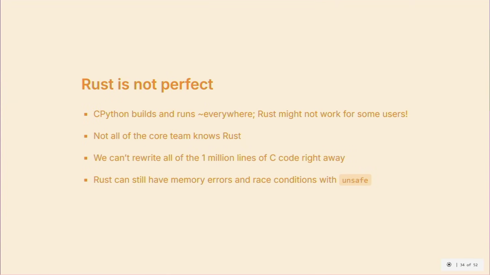
Rust is not perfect. 

Rust isolates to unsafe mode features that could potentially create undefined behavior. [The Rustonomicon](https://doc.rust-lang.org/nomicon/) is a book about unsafe mode. 

"Our historical data for C and C++ shows a density of closer to 1,000 memory safety vulnerabilities per MLOC. Our Rust code is currently tracking at a density orders of magnitude lower: a more than 1000x reduction." [Android Team blog post](https://blog.google/security/rust-in-android-move-fast-fix-things/) comparing C, C++, and Rust

Emma: "If you told me, 'hey if you write things in this language, you'll see a 1000x reduction in vulnerabilities,' I'd say, 'sign me up!'"

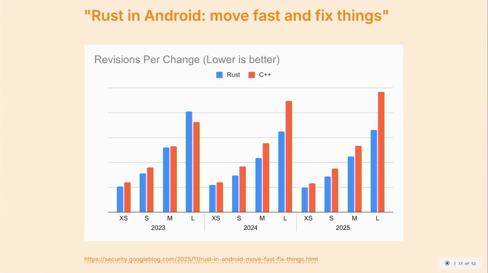
Rust was designed to be safe, has been deployed safely, and engineers are more productive with it. Emma credits compile time checks as creating confidence in code. For large changes especially, significantly fewer revisions. 

A Rust for CPython proposal for Python 3.16 is up for debate by the Steering Council. 
* Rust will be experimental
* Rust code will have a C fall-back (otherwise, if you do not have Rust installed or available on your platform, you won't be able to run the module)

For reference: [Rust experiment in Linux kernel](https://lore.kernel.org/lkml/20251213000042.23072-1-ojeda@kernel.org/) that became permanent. 

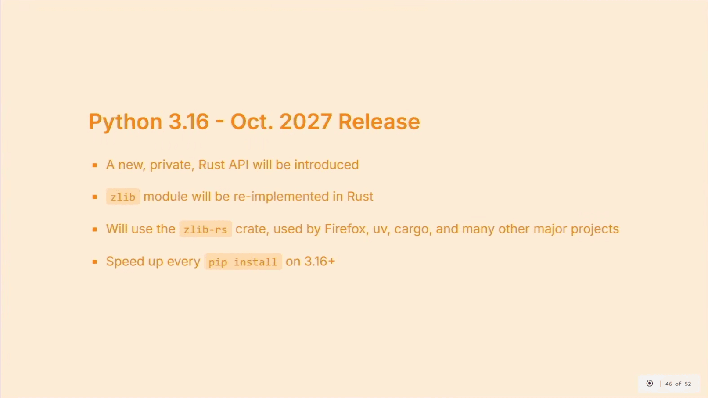

Goals beyond Python 3.16
* Gather feedback from CPython distributors
* Fix/mitigate platform issues
* Introduce Rust in more places, especially those that deal with untrusted input
* Stabilize an official Rust API (a replacement or used with PyO3- users could write extensions in Rust with same APIs used for Python)

Controversial take: "Making Rust required to build CPython would be great."
* Is this feasible?
* Would it prevent people from building Python?

[Rust for CPython website](https://rust-for-cpython.com/)

<!--
port zlib

Mojo- 
Community project rust py rust python, was much slower than cpython

https://doc.rust-lang.org/nomicon/what-unsafe-does.html
One of more dangerous things- de-reference a raw pointer

PEPs 703, 734, 744
https://peps.python.org/pep-0703/
https://peps.python.org/pep-0734/
https://peps.python.org/pep-0744/
-->

🔝 [**back to top**](#table-of-contents)

### Post-Incident Runtime SBOM Generation from Python Memory

by Hala Ali

Simple question: "After a Python application has been compromised, can we still figure out what packages are loaded and running?"

Not what's in requirements.txt. Not what `pip freeze` tells you.

"A Software Bill of Materials is a structured inventory of all software components, their versions, dependencies, and relationships." 

There are different types of SBOMs
* Build SBOM- packages used when you build code
* Deployed SBOM- components installed in your environment
* Runtime SBOM- exact components (and their versions) used by the application

This talk focuses on Runtime SBOMs, because most SBOM tools only give a static view

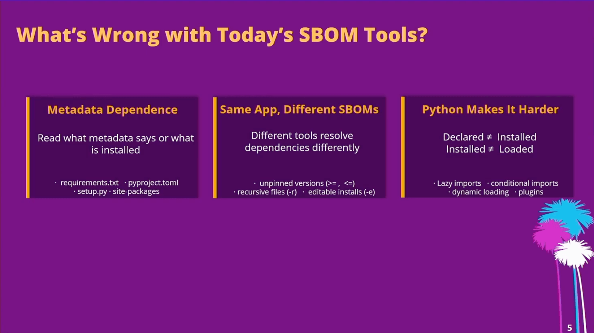
What's wrong with today's SBOM tools?

SBOM issues
* SBOM reads metadata/config and estimates intalled version, not actual version
* Different SBOM tools parse configuration files in different ways
* Python's dynamic nature is a "nightmare from a security perspective"

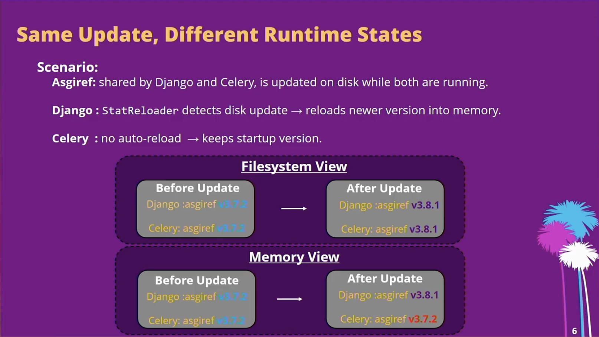
"How can we trust the filesystem?" An example of a package shared by Django and Celery being treated differently by each tool

Solution: We can recover Runtime SBOMs through memory forensics. 

"Memory forensics is the process of capturing and analyzing RAM to recover the system's runtime state at the time of capture." 

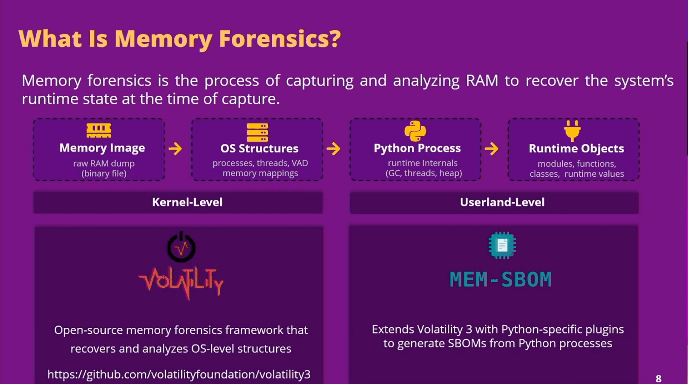
At the kernel-level, popular memory forensics tool [Volatility 3](https://github.com/volatilityfoundation/volatility3) records what is running in operating system memory, including a Python process. Hala and her research partner created another tool on top of Volatility 3 called [MEM-SBOM](https://github.com/HalaAli198/MEM-SBOM) to parse the Python process from memory. 

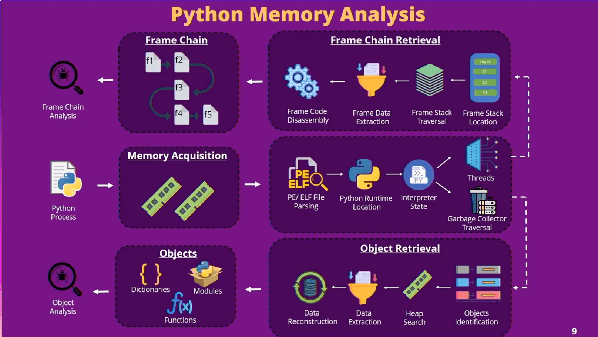
Python memory analysis

Process
* Parse the header of the executable file
* Identify Python runtime entry point
* Access main interpreter
* Access Python process threads and garbage collector
* Access all stacks and all function call chain
* Recover three generations of objects from the garbage collector by parsing a double-linked list 
* Objects, modules, dictionaries, functions

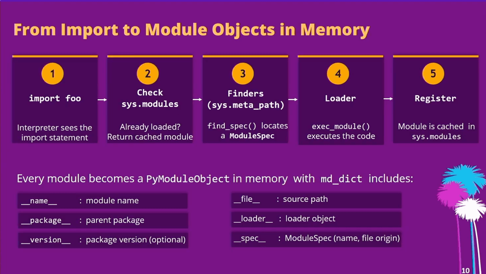
When Python creates a module, it is represented in memory as a Py module object. It has name, package, version (optional), file, loader, spec dunder methods. 

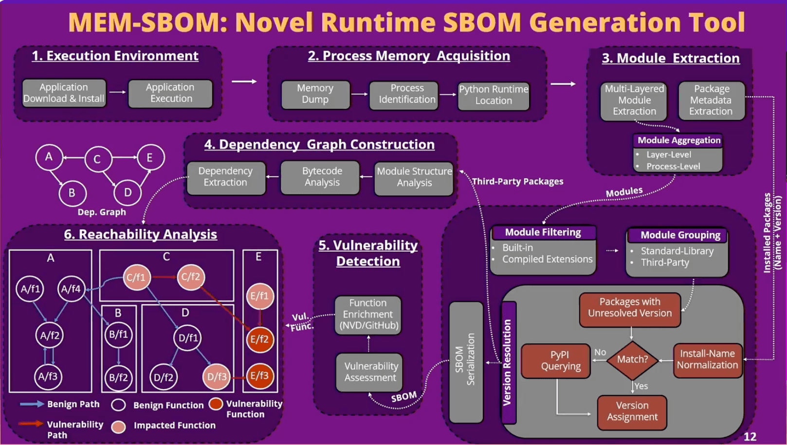

How MEM-SBOM works:
* Identify entrypoint of Python runtime
* There could be a number of processes- parse memory of every process to recover all modules
* Filter out build and standard library modules, focus on app and third-party modules, group them under parent package
* Work around optional version name by using regex to get name and version of installed packages cached in memory by the Python interpreter. Because installed name is different from runtime name, normalize installed name and query PyPI to get runtime name.
* Use [CycloneDX standard](https://cyclonedx.org/) to write the SBOM to a JSON file. SBOMs can be input into vulnerability detection tools such as [Anchore](https://anchore.com/platform/secure/) to provide vulnerabilities and CVEs for your app.
* The entire app is not vulnerable. We need to identify the impacted module in memory. Parse the bytecode of each module and function to identify the transitive relationship/how they rely upon each other. We do not need to update the entire app to fix a vulnerability, only the modules in question that have a code path between them. 

<!--
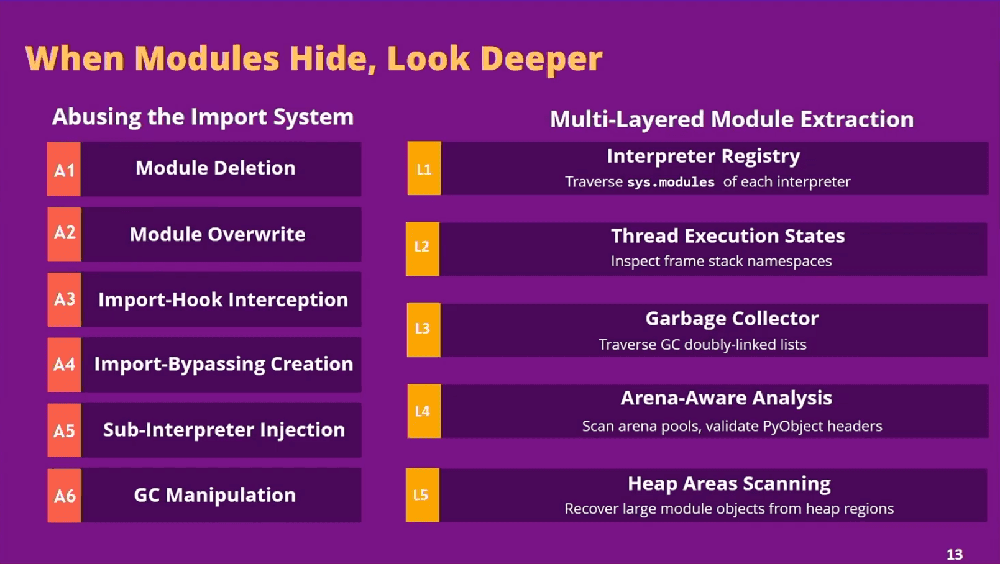
-->

🔝 [**back to top**](#table-of-contents)

### PSF Members Luncheon

Executive Director Deb Nicholson gave a PSF Update. 

At a high-level, PSF health is good, but reconfiguring is going on. 

PyCon US is a huge part of the the PSF's revenue. PyCon US is expensive and struggling. Food and beveraged increased from $400k in Salt Lake City to $500k in Pittsburgh to $600k in Long Beach. As the cost of events goes up, either expenses can be cut or ticket price can be increased. It has also become less appealing to visit the US. PyCon US would normally expect 500-700 more attendees. International attendees tend to plan earlier. Nationals tend to plan last minute. PSF was able to get a hotel bookings penalty from $250,000 down to $150,000. 

PyCon US will not be moved outside of the US. Perhaps VIPs could receive funding to make other events feel first class. The [Python Language Summit](https://ep2026.europython.eu/language-summit/) will take place at EuroPython this year. 

PSF plans to diversity revenue so PyCon US is not the only revenue service. Service-based revenue arond PyPI is a future goal

Downloads, packages, and accounts keeps going up. More malware will happen. PSF is setting up the tech side of the house up for more growth and is fundraising for short-term security and project management roles. 

PSF launched "Community Partners Program" and reopened meetup support. 

DjangoCon US Opportunity Grants budget was cut in half. PSF increased its grants budget from $300k to $450k to $600k, then paused it in 2025. It could re-open in Q4, providing a percentage of requested money. Grant application decision times have been reduced. The process was made less confusing, because applicants with non-profit experience got faster responses, creating inequality. 

Packaging Council was approved by all parties. It is an open field, with no incumbents running. The election will be at the same time as the PSF Board Election. 

Deb would like to coordinate better with the DSF. 

The PSF recently published a [draft strategic plan](https://pyfound.blogspot.com/2026/05/strategic-planning-at-psf.html) to guide the foundation in allocating budget, staff time, and fundraising efforts over the next five years. The community is asked to participate. 

An annual impact report and PSF budget are on the way by end of June. 

🔝 [**back to top**](#table-of-contents)

### Simon Willison Lightning Talk

During the PSF Members Luncheon, Simon Willison was sitting at my table using GLM-5.1 AI model to generate a North Virginia Opossum on an E-scooter for his lightning talk "[The last six months in LLMs in five minutes](https://simonwillison.net/2026/May/19/5-minute-llms/)." My [video](https://youtu.be/maTCM0_EM08 ) of his talk. 

🔝 [**back to top**](#table-of-contents)

### Ned Batchelder Lightning Talk

Ned Batchelder gave a moving lightning talk adapting Eric Holscher's Conference [Pacman Rule](https://www.ericholscher.com/blog/2017/aug/2/pacman-rule-conferences/) from space to time. It is a much watch for inclusion. 

🔝 [**back to top**](#table-of-contents)

### PyLadies Auction

As usual, the PyLadies Auction was a roaring good time! 

This Tim Tam Collection prize brought a smile to my face. Russell Keith-Magee has brought a package of Tim Tams to DjangoCon US many times and taught other attendees how to do the Tim Tam Slam. 

Outstanding PyLadies Awardees! Lynn Root recognizing María José Molina-Contreras, Denny Perez, Fay Shaw, and Hwayoung Cha (not pictured)... these ladies are incredible. 

"It's time"... as Kojo's Python plushie was being auctioned, a pen was added to raise the bids. A sea of people walked up to the stage to add their stuff. 

Stats:
* 39 items sold
* $60,000 raised
* Max bid: $4,000

🔝 [**back to top**](#table-of-contents)

## Sunday

### Marina and Beach

I wanted to see more of the coast, which is a short walk from the Long Beach Convention Center. I walked along Shoreline Village and the Long Beach Shoreline Marina, getting a good view of the Queen Mary and historic Lion Lighthouse (said to be one of the ugliest lighthouses in the world), then down to Alamitos Beach where sunlight glittered across the ocean. I can't wait to explore more of this beach. 

Alamitos Beach

🔝 [**back to top**](#table-of-contents)

### Sunday Sponsor Talks

#### Google

Three essential fronts Google is investing in that are linked to AI:
* Core performance- commitment to free-threaded Python for high throughput, multi-core agent systems and model serving pipelines. Running these workloads is a major concurrency win. 
* Code quality and correctness- adoption of [Pyrefly](https://pyrefly.org/) and appreciation of open source advancements
* Developer efficiency at scale- more iterations, more experiments, delighted with recent advancements such as lazy imports

Google is a major user of Python and close to evolution. If working on performance, scaling, typing challenges, connect. 

🔝 [**back to top**](#table-of-contents)

#### Fastly

Fastly sponsors PSF by providing a content delivery network through the Fast Forward Program:
* PSF has over a million users
* Fastly has supported over 805,000 projects, delivered close to 19 million files and over 2.5 trillion edge requests
* Security and observability tools
* PyPI is serving 80,000 requests per second and transferred 1.92 exabytes of data in 2025

Fastly has a new serverless edge development platform called Fastly Compute build on Webassembly. A [Python SDK](https://github.com/fastly/compute-sdk-python) has been published in collaboration with the PSF. A free tier is available at [https://www.fastly.com/signup](https://www.fastly.com/signup). 

🔝 [**back to top**](#table-of-contents)

### Python Software Foundation Security Engineers Update

Security Developers-in-Residence: Mike Fielder has been working on malware, exploits, supply chain attacks. Seth Larson has been working on software vulnerabilities. 

PyPI Perspective:
* Attacks: from typosquats to packages everyone installs
* Secrets: credentials have become prime targets
* Audits: transparency is essential for trust

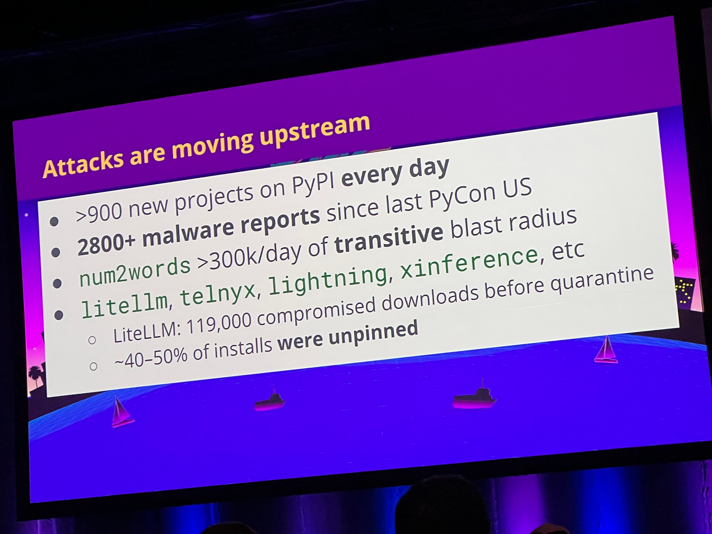
Attacks are moving upstream. Exploits are transitive, projects inherit malware. The numbers are becoming staggering. 

Audit and pin your dependencies.

The Security Team constantly monitors and quarantines with the help of a widening group of researchers in the community. The Security Team, Alpha-Omega, and OpenSSF are in communication to identify emerging threats and collaborate to stop them. This goes beyond fixing to mitigating and coordinating with security teams of other projects to release advisories simultaneously. 

Secrets between ecosystems are a target. SDK monorepos can contain dependencies of multiple languages and secrets to multiple publishing platforms in the CI system. 

Python has been an industry leader in implementing [Trusted Publisher](https://docs.pypi.org/trusted-publishers/) protocol and other ecosystems are adopting it. Any token that survives single use can be stolen and re-used. Trusted Publisher makes the token short-lived and reduces the attack surface. 2 million files have been published with Trusted Publisher. 

Trusted Publisher: 
* Mints a fresh token
* It expires in minutes
* It's cryptographically bound to that repo
* Using with a GitHub Action enables you to secure the path

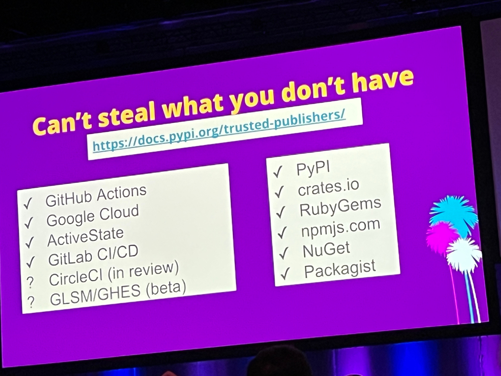
Platforms using Trusted Publisher and ecosystems that have implemented it

We live in a world today where we need to rely on other ecosystems. If you use another ecosystem, talk to them about implementing Trusted Publisher. 

Homework: go home and delete one token from a project. 

"[The Python Package Index has Completed its Second Audit](https://blog.pypi.org/posts/2026-04-16-pypi-completes-second-audit/)." Trail of Bits conducted the audit ([audit report](https://github.com/trailofbits/publications/blob/master/reviews/2026-04-pypi-warehouse-securityreview.pdf)) and wrote code queries to add to the CI/CD to mitigate in the future. The two high severity issues have been fixed. 

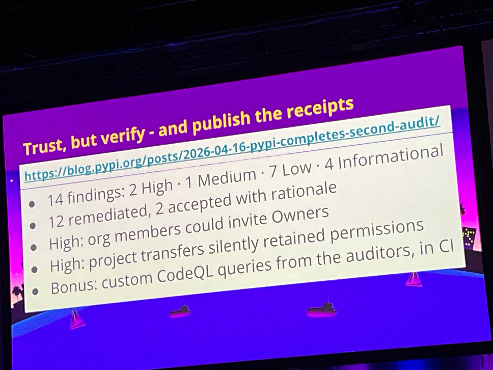
Audit results

<!--
"[The Python Package Index has Completed its Second Audit](https://alpha-omega.dev/blog/the-python-package-index-has-completed-its-second-audit/)" 
-->

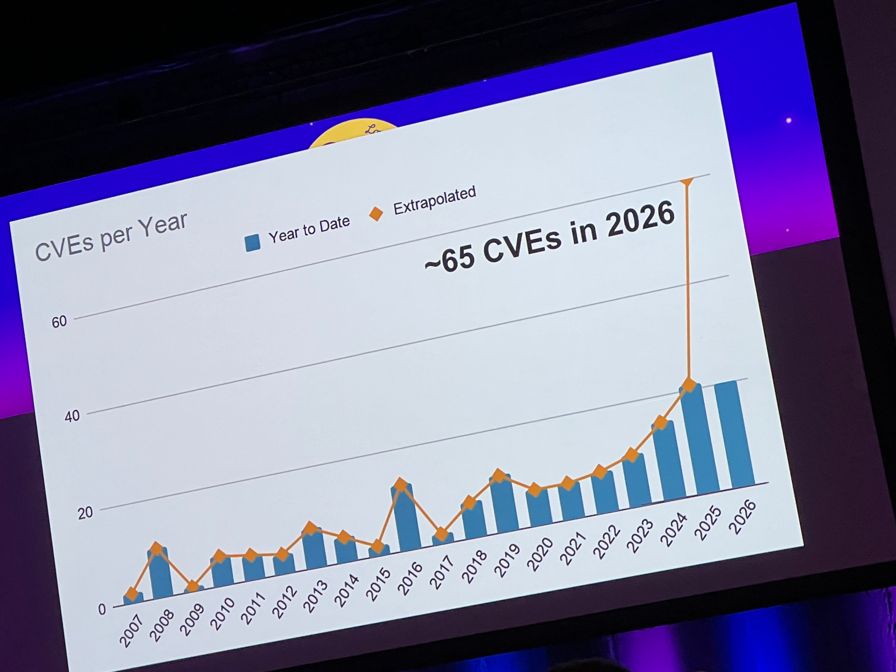
LLMs and traditional security tool are being used to find vulnerabilities. 21 CVEs in 2025, 22 so far in 2026 with 65 expected

7 vulnerabilities were about zip and tar archives (CPython, pip, uv, PyPI). Seth wrote a white paper digging into these: "[Slippery Zips and Sticky Tar Pits: Security and Archives](https://alpha-omega.dev/blog/slippery-zips-and-sticky-tar-pits-security-and-archives-white-paper-by-seth-larson-python-software-foundation/)"

[PEP 811 - Defining Python Security Response Team membership and responsibilities](https://peps.python.org/pep-0811/) gives transparency into Security Response Team governance. 

Nine members were added to Python Security Response Team. 

[PEP 770 – Improving measurability of Python packages with Software Bill-of-Materials](https://peps.python.org/pep-0770/) was authored to create a new standard for using Software Bill-of-Materials (SBOMs) to provide metadata about dependencies. 

Software Bill-of-Materials makes it easy to find vulnerabilities in C, Rust, JavaScript libraries. Hundreds of projects have adopted it (Red Hat, Fedora, pip, pandas, pillow, many others). Seth wrote a blog post giving an update of what the implementation looks like: [PEP 770 Software Bill‑of‑Materials (SBOM) data from PyPI, Fedora, and Red Hat](https://sethmlarson.dev/pep-770-sbom-data-from-pypi-fedora-and-redhat). 

<!--
Security scanning tools will work better and you will know when to upgrade your packages. 
-->

"What good are... advisories and fixes if you don't know what software you are running?"

Seth wrote a white paper about identifying software components not identified in metadata: "[Unmasking Phantom Dependencies with Software Bill-of-Materials as Ecosystem-Neutral Metadata](https://alpha-omega.dev/blog/unmasking-phantom-dependencies-with-software-bill-of-materials-as-ecosystem-neutral-metadata-white-paper-by-seth-larson-python-software-foundation/)"

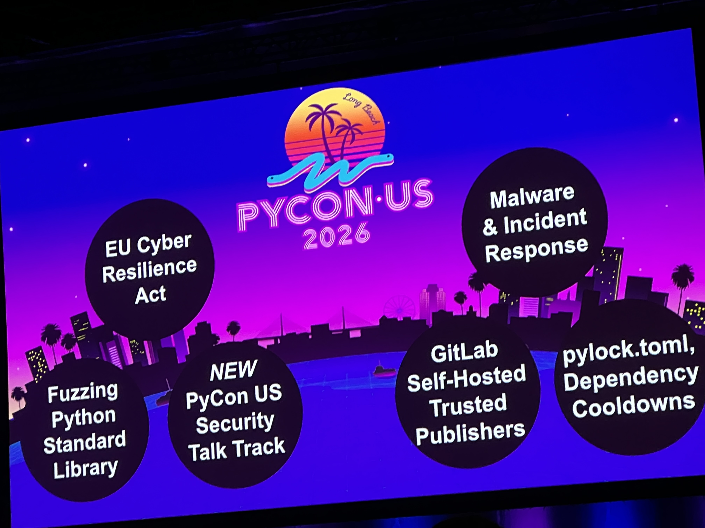
Additional security milestones

Special thanks to security sponsors
* Alpha-Omega
* Anthropic
* Google
* Sovereign Tech Agency

Sources of Python security news;
* [PyPI Blog](https://blog.pypi.org/)
* [PSF Blog](https://pyfound.blogspot.com/)

Security is a journey and everyone has a role to play. Share knowledge and help each other. 

🔝 [**back to top**](#table-of-contents)

### Chatting with Emma

I joined the very long swag fire sale line. Fortunately, Emma Smith happened to be behind me. I used the opportunity to learn more about her experience contributing to CPython and becoming a CPython Core Dev. I was reminded of Savannah Ostrowski's EuroPython 2025 keynote "[You don’t have to be a compiler engineer to work on Python.](https://www.youtube.com/watch?v=WGXXxGLBVF4)" 

<!--
Emma generously offered to mentor me to contribute to CPython. 

https://lwn.net/Articles/1030821/
Dragon book
Internals book
-->

🔝 [**back to top**](#table-of-contents)

### PyLadies Lunch

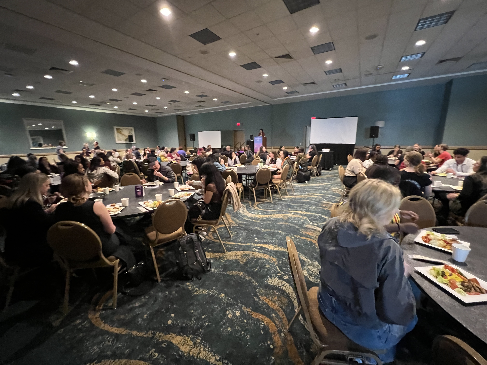
PyLadies Luncheon... a full house. Love to see it. :)

At the PyLadies Lunch, in an effort to stop diminishing our accomplishments, women take turns taking the mic and sharing accomplishments they are proud of from the past year. Although I've attended several times, I've never gotten up to speak. 

Mariatta came over to me and encouraged me to do it. Mariatta is an inspiration to me. I reflected for a couple of minutes, then got up and did it. 

As difficult as it can be to talk about ourselves, Mariatta explained later that we need to do it so that others know the things we have experienced.

Thank you, Mariatta. 

Abigail Mesrenyame Dogbe started [Books for Techies program](https://www.linkedin.com/posts/abigail-mesrenyame-dogbe_booksfortechies-pyconus-share-7454935701198073856-9hfZ/). She shared that Amanda Casari helped her get the initiative off the ground. PyCon US attendees can drop off tech books and flashcards and Abigail will distribute them to kids learning how to code and junior developers in Africa. 

Abigail gave me a Ghanaian milk chocolate bar. I noted that the chocolate open space I'd attended in the past did not happen this year. Abigail made a note to look into it for next year. :) 

Me and Abigail

I also got a bear hug from Carol Willing and a request to catch up soon. :)
  
🔝 [**back to top**](#table-of-contents)

### Learning Computer Science with Python and Music(21)

by Michael Scott Asato Cuthbert (Myke)

On a personal note from Kati: for decades, my mom worked as a music therapist, church organist, school accompanist, and piano teacher. Myke's energy, passion, and creativity unexpectedly touched me in a way that few others have. 

Myke is interested in "how computers could change the arts and humanities and especially music [his] field... history, theory, and composition." 

Standard paradigm: apply CS knowledge to other fields to grow knowledge. 

Myke saw the opposite. Arts and humanities-inspired applications could make knowledge flow in the reverse to CS and programming. 

A Python-based programming class could not only create new insights into music, but teach and reinforce fundamental computer science skills. 

Furthermore, moving beyond the narrow group of apps appearing repeatedly in courses (build a poker bot, design a database) and instead applying computer science to other fields, creates learning opportunities that resonote more closely with the interests of students of races and genders underrepresented, freeing their incredible talent and creativity, and enabling them to achieve an appreciation for and fluency in altorithms and other computer science fundamentals. 

Python has been invaluable for creating a "rapid motion" back-and-forth between abstraction and application. 

To be "still motivated by a problem when you arrive at the solution" is key. 

Key takeaways:
* "Working with music and making music with Python can be absolutely magical"
* "The abstract and the applied have so much to offer each other and can keep going over and over"

Despite a small presence in the standard library, Python has an incredibly rich music ecosystem: librosa, demucs, magenta, spleeter, pedalboard, sounddevice, pyo, PyDub, pretty_midi, Spotipy, Madmom, Audiocraft/MusicGen, musicaiz, riffusion, Muskits, muspy, athenaCL, and many more. 

Simplified representations of music:
* Music as metadata: playlists, extracting lyrics
* Music as audio (think words spoken): making beats, changing effects, frequencies, wav, mp3
* Music as symbolic representation (think words written on a page): notes, scales, xml file

If you focus on audio without symbolic representation, it's comparable to "working with speech in a system that did not have a concept of a string or a character."

Myke has been using Python for 20 years. When he got started, there were no programming tools for working with scores. So, he created [music21](https://music21.org/music21docs/). 
  
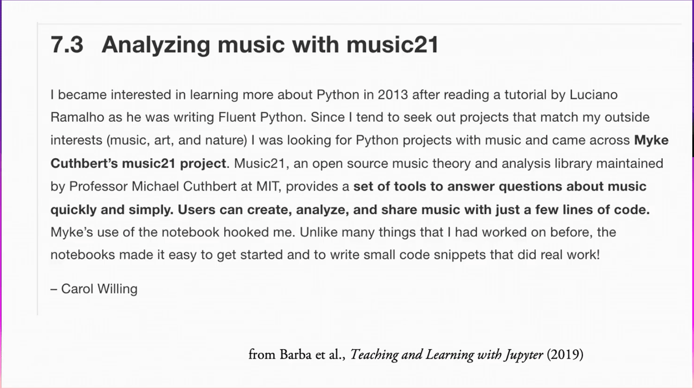

Examples of things you can do with it
* Visualize differences in note/interval use across regions in China
* Compare chord motion commonality in 1950s versus late 20s
* Find hidden quotations in medieval music
* Analyze scores for auto-music synthesis
* Identify pieces mistakenly attributed to Bach
* Check if songs in minor keys use more sad lyrics (no)

[Computational Music Theory and Analysis](https://ocw.mit.edu/courses/21m-383-computational-music-theory-and-analysis-spring-2023/pages/about-the-course-and-music21/)
* Using for loops to label excerpts of Bach
* Using depth-first search (DFS) or breadth-first search (BFS) to search musical scores
* Identity vs. Equality vs. Equivalence in notes
* Melodic minor scale as directed graph
* Ontologies vs. Meronomies

Myke touched on the lack of diversity among music available for doing computational analysis on a large scale. 

Patterns that work for applied projects
* Cut a large task into smaller ones to assign to get great results
* Make software tools "batteries included" so students get "bit by the bug" from day 1
* Code and unlock- have students create their own simple tool, then move on to state of the art tool and see edge cases and efficiencies

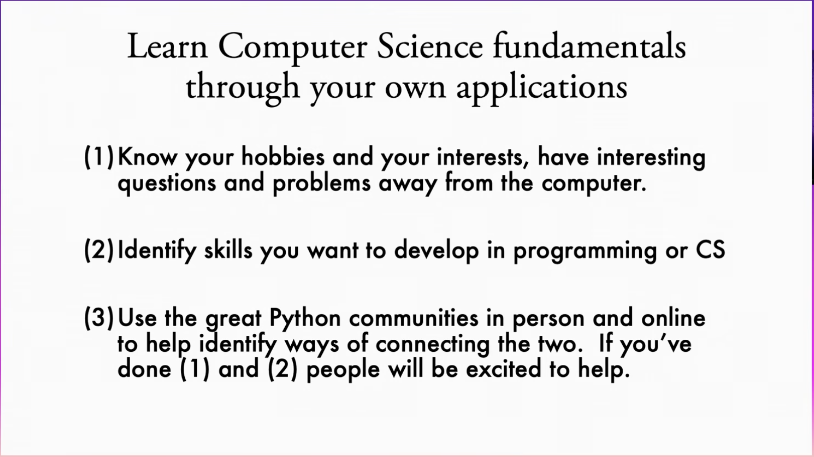
Apply these skill to your own learning

Final note: "Have the courage to embrace applications, knowing that they will reinforce abstract skills and notions and let the streams of nourishing knowledge flow in all directions." 

🔝 [**back to top**](#table-of-contents)

### Why you, as a Python developer, should learn Rust

by Daniel Szoke

The main philosophical difference between Rust and Python: "Rust surfaces many Python runtime errors at compile time." 

Rust has an emphasis on type and memory-safety.

Rust's safety and reliability guarantees:
* Explicit mutability
* Ownership
* Borrowing

In Rust, mutability is opt-in. 

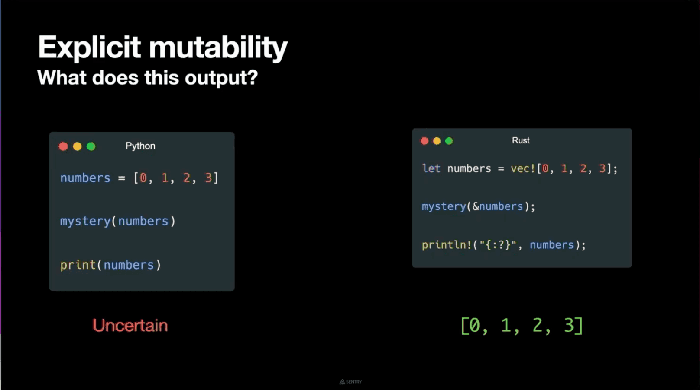
In the Python example on the right, we do not know where the list might be mutated. In the Rust example on the left, numbers is set to a vector. The `&` sign indicates it is being passed as a reference. We know [0, 1, 2, 3] will be printed because numbers vector is immutable. 

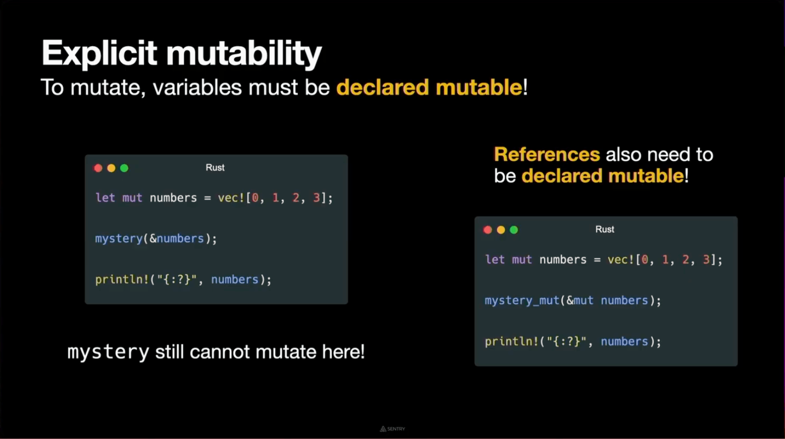
Explicit mutability: in order to mutate, both the variable and reference must be declared as mutable. `&mut` enables the vector to be mutated by the function it is passed to. We do not know what will be printed. 

In this way, Rust isolates the places where data might change.  

"Ownership and borrowing rules ensure memory safety at compile time without garbage collection." 

Unlike C, if you allocate on the heap, Rust does not require you to use malloc and free memory allocation. 

In Rust, if you pass a variable by value to a function, the ownership is transferred to that function. That function now owns the underlying memory allocation. The original variable can go out of scope, and the program will not compile. 

Ownership fix:
* Clone- create a new memory allocation containing the same value and pass it to the function as copy without transferring ownership
* Borrowing- pass by reference, share data in differences places without transferring ownership

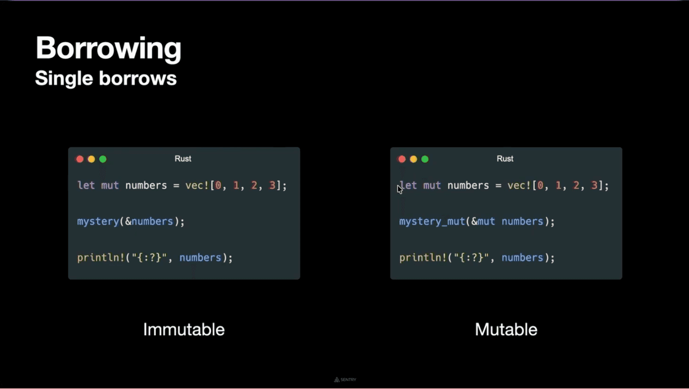
A single immutable and mutable borrow

Borrowing rules:
* Owned data has to outlives borrows, because the original value has to outlive references
* You can borrow immutably or mutably (as long as the variable is defined as such)
* You can have multiple immutable borrows, but not an immutable and mutable borrow at the same time or multiple mutable borrows 

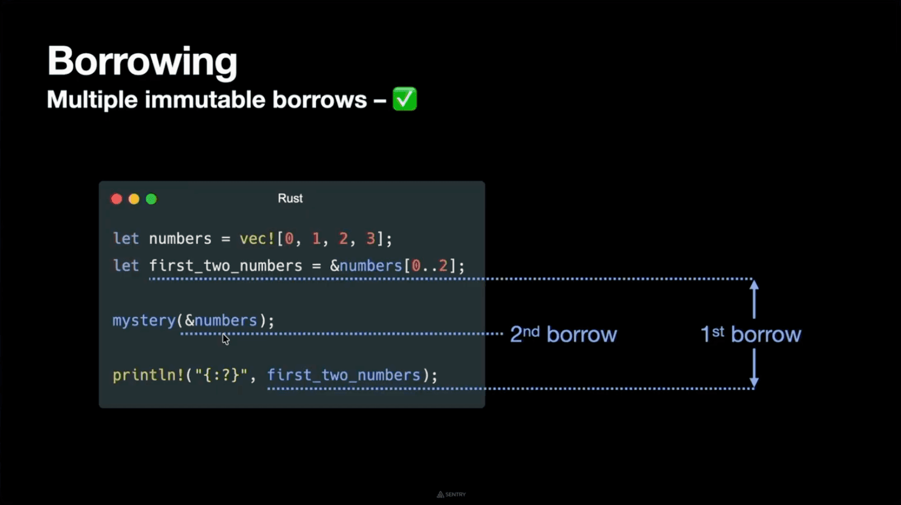
An example of multiple immutable borrows

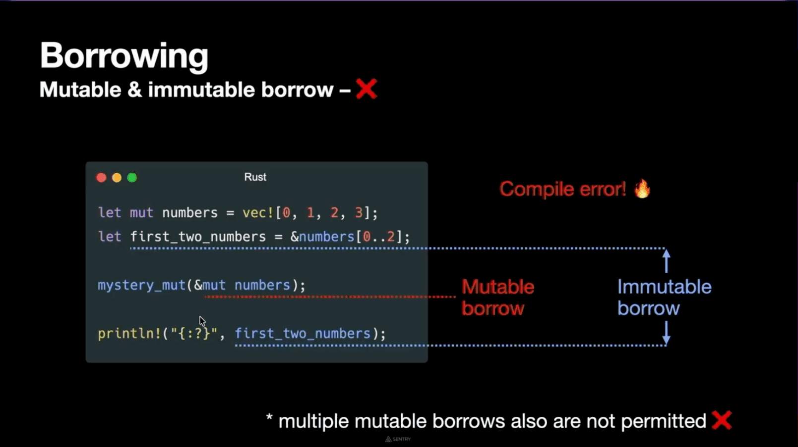
An immutable and mutable borrow or multiple mutable borrows will create a compiler error. "You can have as many immutable borrows as you want or one mutable borrow."

Safety guarantee: "'Fearless concurrency'- if it compiles, it is thread safe!" 

Rust tooling:
* Compiler warnings
* [Clippy linter](https://doc.rust-lang.org/clippy/)
* [Rustfmt](https://github.com/rust-lang/rustfmt)

Rust and Python have advantages and disadvantages. Knowing them both enables you to use the one that best fits the use case. 

Rust enforces safety concepts that also matter in Python. 

Rust forces you to think about how your program could fail and address it. Learning this habit will help you when writing Python code. It is even more important in Python, because you don't have the Rust compiler to catch errors. 

[Rust Book](https://doc.rust-lang.org/book/) is a great resource for those who want to learn. 

<!--
Unique to rust and steepest learning curve. 
There are no memory leaks and the lack of garbage collection creates performance benefits. 

https://doc.rust-lang.org/rust-by-example/std/option.html
https://doc.rust-lang.org/rust-by-example/std/vec.html

Some Rust strengths:
* Good performance
* Reliable code
* Systems programming

Some Python strengths:
* Iterate quickly
* Simple scripting
* Data science

Cost- more maintenance effort, easier to make mistakes. 

null safety
handling all cases
mutability when sharing data
-->

🔝 [**back to top**](#table-of-contents)

### Lazy imports and the art of interpreter procrastination

by Brittany Reynoso

Python import crash course:
* "Python finds the required module by looking at its built modules and the configured directories in sys.path"
* "It loads the file into memory, compiling it if needed.
* "It executes the module, running all of its top level code, creating functions, classes, variables, and also recursively executing other import statements."
* "A single import quickly cascades into a lot of real and possibly expensive code execution."

"Lazy imports is a new feature in 3.15 that allows for the user to defer importing a module until it is actually used." 

"The power of Lazy Imports goes beyond any single module."

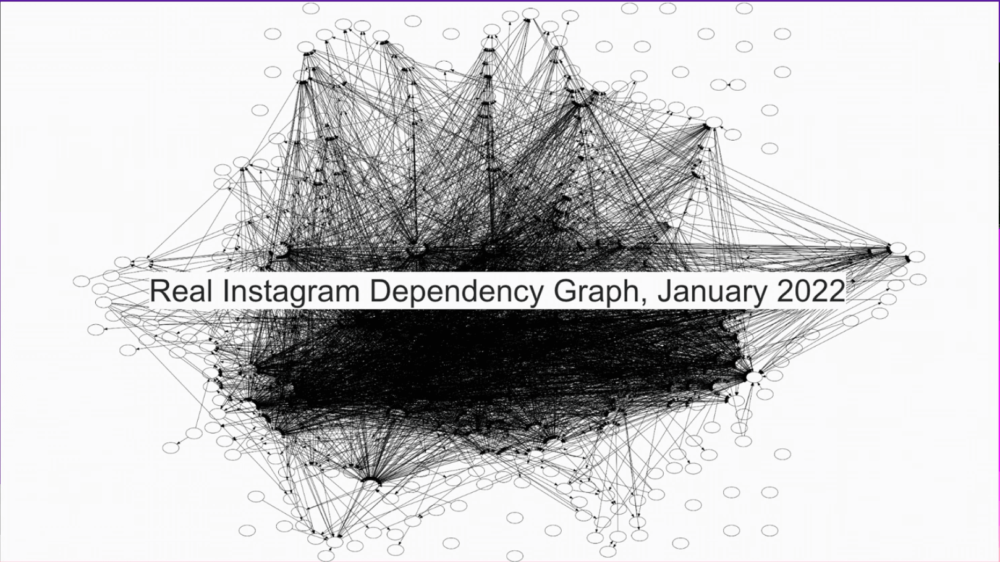
Real Instagram Django dependency graph, January 2022, before lazy imports

Pain points
* Loading over 28,000 modules at startup
* Reloads up to 2 minutes
* Circular dependency nightmare

Lazy Imports at Scale at Meta:
* Load 12x fewer modules
* -70% startup time
* increased throughput for Django servers
* -70% memory for other executables
* OOM (out of memory exception) replaced by stability

The appetite for lazy imports grew, and they were implemented by companies that could maintain a fork. 

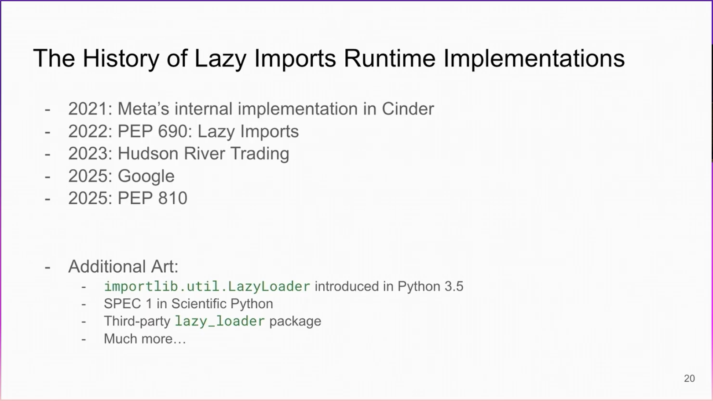
In addition to Meta's aggressive implementation of lazy imports in [Cinder](https://github.com/facebookincubator/cinder), HRT enabled lazy imports across the firm, followed by Google. 

"Lazy imports is a common feature in other programming languages. The demand was there." [Pep 810](https://peps.python.org/pep-0810/) was born. 

Explicit Lazy Imports:
* Local behavior: lazy import is isolated to only import marked with lazy keyword
* Explicit semantics: "binding is created in the importing module immediately, but the target module is not imported until the first time it is used." 
* Control: "only triggered by the importing code itself"
* Granular mechanism: can adopt incrementally

Make an import lazy: `lazy import foo`

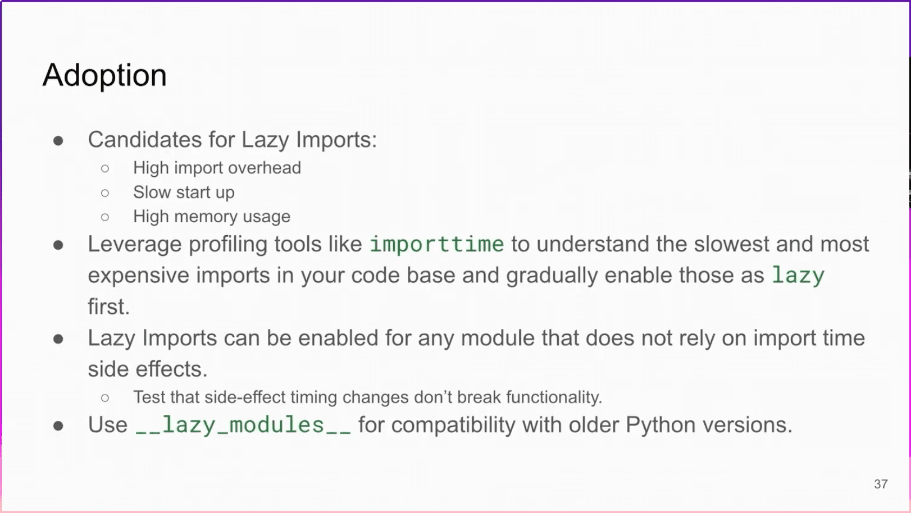
Adoption tips

[Lifeguard for lazy imports](https://github.com/facebook/Lifeguard)

🔝 [**back to top**](#table-of-contents)

### Paolo and Mark

During the closing plenary, I sat at the front with Paolo Melchiorre who gave me some photography tips. Meanwhile, we met Mark Sapiro, GNU Mailman Release Manager and Maintainer. 

🔝 [**back to top**](#table-of-contents)

<!--
    - [Rachel Calhoun and Tim Schilling Keynote](#rachel-calhoun-and-tim-schilling-keynote)

### Rachel Calhoun and Tim Schilling Keynote

🔝 [**back to top**](#table-of-contents)
-->

### Steering Council Panel

The Steering Council members are Barry Warsaw, Donghee Na, Pablo Galindo Salgado, Savannah Ostrowski, and Thomas Wouters. 

Core Team sprints:
* 2025: [hosted in Cambridge by ARM](https://developer.arm.com/community/arm-community-blogs/b/tools-software-ides-blog/posts/cpython-core-dev-sprint-2025-at-arm-cambridge-the-biggest-one-yet)
* 2026: will be hosted in San Francisco by OpenAI

Developers-in-residence and targeted sponsorships:
* Petr Viktorin, Bloomberg
* Serhiy Storchaka, Vercel
* TBD (formerly Łukasz Langa, Meta- this sponsorship is ongoing)

Developers-in-residence are core devs paid to work on CPython. Sponsors do not influence the work being done. With more sponsorship, more developers-in-residence can be added. Shared sponsorship is also possible. 

Summary of Steering Council thoughts during Q&A:

Packaging Council: the Core Team use case does not necessarily extend to packaging. The Packaging Council will have the domain expertise needed to solve tough packaging problems.

Making free-threading the default: [PEP 779](https://peps.python.org/pep-0779/) includes the conditions. Performance, memory usage, documentation, API, library migration status matter. Although the process is going well, more real world experience with free-threading is needed. Maintainers of major packages, especially if building C extensions, should test on standard and free-threading builds and give feedback. This will help the Steering Council and Core Team decide when to safely switch to free-threading by default. In his talk about free-threading, Thomas Wouters predicts it will be after 3.16 and before 3.20.

What does the Steering Council consider when deciding on PEPs: Deep expertise and deep caring about the user experience make the process better. A lack of user impact and evidence of it in the PEP can be a red flag. PEPs can be classified as must have/good to have (look at impact on codebase/community). PEPs proposing new features or significant changes can be classified as enabling new, exciting feature or removing a jagged edge, an easy mistake for people to make. PEP authors typically attend Steering Council Office Hours and talk about the details of their PEP. The Steering Council has tried to incorporate more feedback from impacted community members to avoid blind spots. Steering Council Members consider what they like, don't like, what changes make the PEP palatable, to reach consensus. Discussions can go on for years. Every PEP has a trade off. Is the change worth the cost? Steering Council members sometimes find themselves researching "cool areas" they have not historically worked on. Working Groups such as C-API Working Group can help make sense of Python's moving parts. 

Versioning: after Python 3, a switch to year-based calendar versioning could happen (sidenote: former Django Fellow Carlton Gibson [has proposed](https://buttondown.com/carlton/archive/an-annual-release-cycle-for-django/) an annual release cycle and calendar versioning for Django as well)

Opinions on using Rust for Standard Library modules: Rust is popular. Rust increases the number of people who could contribute, but some people won't want to learn Rust. CPython needs to continue to attract contributors. Adding Rust in CPython is different than starting a new project. There are many things to consider: compiler versions, stable API, pinning rust compiler, build process, platforms that can be supported. Conceptually, Rust makes sense for extension modules isolated from core interpreter. Experimentation needs to take place. How do we support platforms that have bad or no rust support? This is an extremely complex, hard problem. Emma is thinking deeply about it. This will be a multi-year project, even if it doesn't happen. The speed the proposal is moving at is impressive, and there is a lot of optimism. 

Should standard library (aka batteries) shrink, stay stable, or continue expanding: some very old batteries have been removed, but not much has been done. It is a mixed bag. How do you reconcile the slow release of modules versus higher velocity when left out versus the ease of downloading Python and having an amazing suite of functionality? One opinion is that the standard library should not grow much more. Python should only have the batteries that are essential for bootstrapping and interoperability between packages. The overhead of maintaining packages in the standard library into perpetuity is painful and costly. PyPI is an amazing package registry and packages should be hosted there anytime remotely possible.  

Evolving Python's governance: the governance structure should be re-evaluted on an ongoing basis. The team has grown and changed a lot since the initial governance model was put in place, but that doesn't mean it needs to be dramatically changed. Two year terms or term limits are being considered. 

Python 3.15 major features:
* Lazy imports
* frozendict
* All the colors
* Tachyon profiler

[What's New in Python 3.15](https://docs.python.org/3.15/whatsnew/3.15.html)

[CPython Release Schedule](https://devguide.python.org/versions/)

<!--
https://lwn.net/Articles/1039612/

https://peps.python.org/pep-0602/
https://devguide.python.org/versions/

https://thenewstack.io/python-whats-coming-in-2026/
https://peps.python.org/pep-0790/
https://peps.python.org/pep-0745/
https://docs.python.org/3/whatsnew/3.14.html
https://realpython.com/python314-new-features/
-->

🔝 [**back to top**](#table-of-contents)

### Python Software Foundation Update

PSF mission: "To promote, protect and advance the Python programming language, and to support and facilitate the growth of a diverse and international community of Python programmers."

Last year, the PSF was on the cusp of receiving a non-trivial $1.5 million NSF grant for CPython and PyPI security work. The PSF Board voted unanimously against taking the money due to an ambiguous "no DEI" requirement and [the proposal was withdrawn](https://discuss.python.org/t/the-psf-has-withdrawn-a-1-5-million-proposal-to-us-government-grant-program/104620).  

The community came through with a huge outpouring of support that resulted in a year-end fundraising record of $590,591 raised from 5561 donors. 

Major sponsorships:
* Anthropic- $1.5 million in 2025
* CPython developer-in-residence sponsors: Bloomberg, Meta, Vercel
* Alpha-Omega- funds two security-in-residence roles
* Visionary Sponsors: Google, Fastly, Nvidia
* New Visionary Sponsor: Hudson River Trading

Places to find community after PyCon US: 
* Python Discord
* Python Discord en Español
* Your local Python meetup, PyLadies meetup, or PyData meetup
* [PSF Events Page](https://www.python.org/events/)

🔝 [**back to top**](#table-of-contents)

### Closing

PyCon US 2026 fun facts:
* 2003 attendees
* 57.2% first-time attendees
* 151 onsite volunteers
* 148 presenters (keynotes, speakers, tutorials, posters)
* 135 open spaces
* First check-in: May 13 at 7:32:27 PT
* Last t-shirt sold: 31 minutes after the fire sale

Elaine passed the Conference Chair baton to 2027 Chair Jon Banafato. 

🔝 [**back to top**](#table-of-contents)

### Black Python Devs Leadership Summit

K. Jay Miller receiving a much-deserved Community Service Award for his "service to the global Python in improving the community's diversity, inclusion, and equity through founding and sustaining Black Python Devs." 

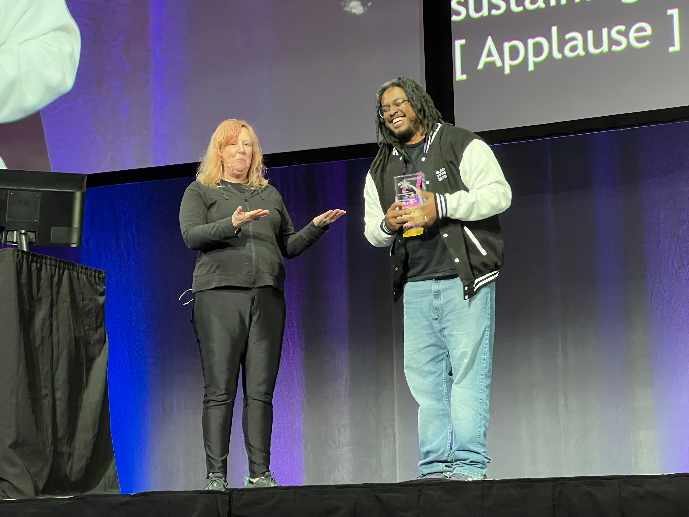
PSF Executive Director Deb Nicholson and K. Jay Miller

He announced the [Black Python Devs Leadership Summit](https://www.pyohio.org/2026/program/black-python-devs-leadership-summit/) happening the day before PyOhio at the same venue. 

For those who cannot attend in person, the event will be livestreamed on the [Black Python Devs YouTube Channel](https://www.youtube.com/@blackpythondevs). 

🔝 [**back to top**](#table-of-contents)

### Ice Cream Selfie

A massive crowd of attendees walked over to [Long Beach Creamery](https://www.longbeachcreamery.com/) for an ice cream selfie. 

It was Mariatta's 41st ice cream selfie over 10 years of public speaking (40+ conferences!). It was an honor to celebrate it with her. 

On the other end of the spectrum, I encouraged an attendee to give his first conference talk and connected with a group of [PyBeach](https://2026.pybeach.org/) organizers in the process. PyBeach is on my bucket list. 

Check out Mariatta's [ice cream selfie video](https://www.linkedin.com/posts/mariatta_icecreamselfie-pyconus-activity-7462130532575911937-oper?utm_source=share&utm_medium=member_desktop&rcm=ACoAAAOxk18BcgN6WcUZfIqPuO1XxHylxwxaOJ4). 

Waffle bowl with Strawberry Mascarpone and Whiskey Vanilla... so yummy!

🔝 [**back to top**](#table-of-contents)

### RevSys After Party

After ice cream, I walked down the block to the [RevSys](https://www.revsys.com/) after-party at [The Stave Bar](https://thestavebar.com/). 

The party was rocking! I had a beautiful and tasty non-alcoholic Ginger Cooler (pictured on the bar): ginger syrup, pineapple juice, fresh lime juice, soda water

The best of times... me with friends Paolo Melchiorre, Jeff Triplett, Velda Kiara, and Frank Wiles

🔝 [**back to top**](#table-of-contents)

### L'Opera

After the RevSys after-party, I had the chance to eat at a restaurant I had wanted to eat at all week. 

I learned of [L'Opera](https://lopera.com/) through Mariatta's [PyCon US 2026 website](https://travel.mariatta.ca/pycon-us-2026/). 

I poked a bit of fun at the restaurant on social media... 

but, I love Italian food and the restaurant had great reviews. It did not disappoint!  

I had the Lombrani, one of their most popular dishes: homemade ravioli stuffed with red wine braised shortrib of beef and ricotta, gorgonzola, green pea and broccolini cream sauce. It was incredible. I want to go back next year! 

As an added bonus, Paul Everitt saw me at the bar and invited me to join the [JetBrains](https://www.jetbrains.com/) Team at their table for some fun conversation! I made some new friends, too. 

Paul was an early Python user featured in the Cult Repo [Python documentary](https://www.youtube.com/watch?v=GfH4QL4VqJ0). 

🔝 [**back to top**](#table-of-contents)

## More Connections Made

My writing has begun to attract a community of fans. During the conference, I had a noticeable uptick in compliments about my blog posts: 
* Eric Matthes saw my recent Southwest Headquarters Tour blog post and thought it sounded like something I would write before he knew it was mine. :)
* Keith Murray revealed that as a Director of Python discord and Python subreddit moderator, he has directly witnessed the positive impact of my writing on underrepresented individuals
* Jeremy Tanner sought me out to thank me for my writing and told me it is a resource shared among his network
* Paul Everitt expressed his appreciation that I am not a "normie"

<!--- 
Steven liu
impact of AI on education
Selfish reasons to have more kids
Moshe z

Phillip

Rob Ludwick

Rob, Catherine, Paul, jon
Paul Hildegard Disney character 
Josh gaac 
Bernie Madison 
-->

I also had the opportunity chat with 
* Python Security Developer-in-Residence Seth Larson about the outstanding Security Track and learned of the sprinting he would do on a Python Security Policy and Threat Model ([issue](https://github.com/python/devguide/issues/1803) and [draft PR](https://github.com/python/devguide/pull/1804))
* Jon Gould about the impact of AI on recruitment (see his lightning talk)
* Paul McGuire about what it was like to work on [Python in a Nutshell](https://learning.oreilly.com/library/view/python-in-a/9781098113544/) with [Alex Martelli](https://en.wikipedia.org/wiki/Alex_Martelli)
* Will Vincent about building in public
* Andy Fundinger about the potential impact of AI on Financial Services development
* Jorge Gimeno about his testing experience, including a recommendation to check out [ISTQB](https://istqb.org/) standards
* Mario Munoz about the structure of his talk [Create a Python Package: From Zero to Hero](https://us.pycon.org/2026/schedule/presentation/99/)
* Sarah Entzminger about her career path into electrical engineering
* Paul Everitt about his [The Shift to Agentic Engineering](https://www.youtube.com/watch?v=n366hY4JZ9U&t=1s) talk at Andrew Ng's AI Dev 2026 Conference and their [Spec Driven Development with Coding Agents](https://www.deeplearning.ai/courses/spec-driven-development-with-coding-agents) collaboration

🔝 [**back to top**](#table-of-contents)

## Swag

Lerner Python shirt, JetBrains Bag, PyCon US conference t-shirt, yet another cute Jane Street shirt, Hudson River Trading socks, Red Hat socks, I <3 Mauritius keychain, Python Morsels sticker, Tic-Tac-Toe Choose Your Own Adventure Zine by Al Sweigart, Bloomberg notebook and pen

🔝 [**back to top**](#table-of-contents)

## Monday

### Engine Failure

I flew out Monday morning. 

Long Beach Airport was like nothing I've ever experienced. I felt like a VIP walking on the tarmac and using a ramp. I loved that there were palm trees all around. "Toto, we aren't in Kansas anymore."

Flight #2946 from Long Beach to Dallas seemed relatively normal until the pilot accidentally said "Mayday Southwest" over the PA. No one seemed to notice, including the flight attendants who were taking orders, but I was pretty sure something bad had to have happened. Eventually, the pilot announced that the #1 engine had failed, and we were diverting to Phoenix. Everyone clapped when we landed and laughed when the flight attendant said "welcome to Phoenix." We were met on the runway by firetrucks who were there to make sure there was no fire in the engine. 

🔝 [**back to top**](#table-of-contents)

### PyCon Lives On

Moments like this seem to break the ice and bring people closer. As my row chatted, I mentioned that I'd just taken a tour of Southwest Headquarters a few weeks earlier. It turned out the guy sitting next to me works in the Southwest Network Operations Center. His team had made one of the dashboards I'd seen on the tour, and he'd also been at PyCon US. It's a small world. 

I showed him my [Southwest Headquarters Tour blog post](https://katherinemichel.github.io/blog/travel/southwest-headquarters-tour-2026.html), and he gave me additional insight into the tech they use. 

He also told me Phoenix is a major "supply" hub, meaning they could find an extra plane and get us up in the air again quickly, which they did. 

🔝 [**back to top**](#table-of-contents)

## Until Next Time

Thank you to everyone who made PyCon US 2026 special. The conference returns to Long Beach May 12-18, 2027. 

See you next year!

Me at a photo-op helm on the Queen Mary 

🔝 [**back to top**](#table-of-contents)
