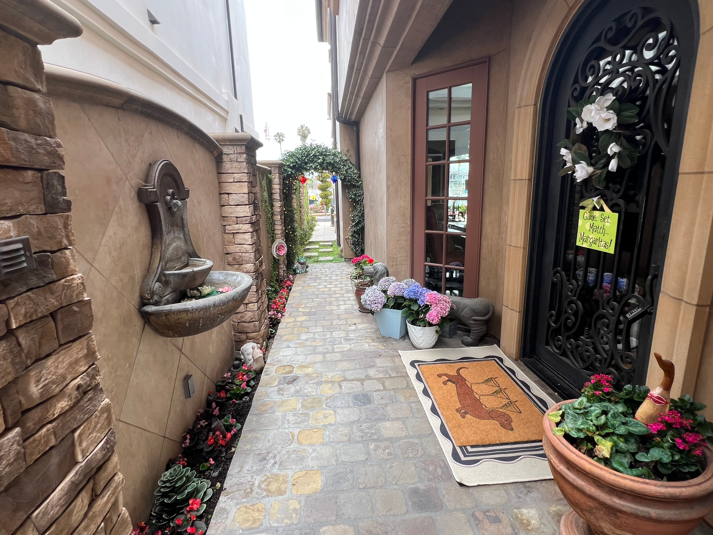
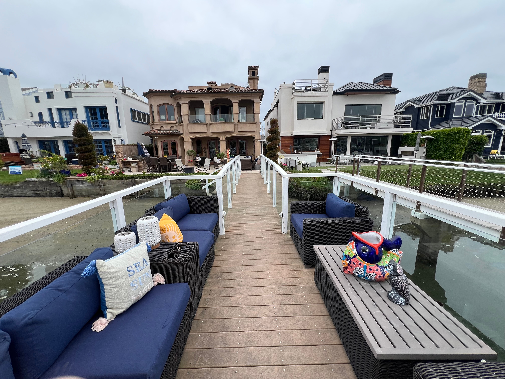
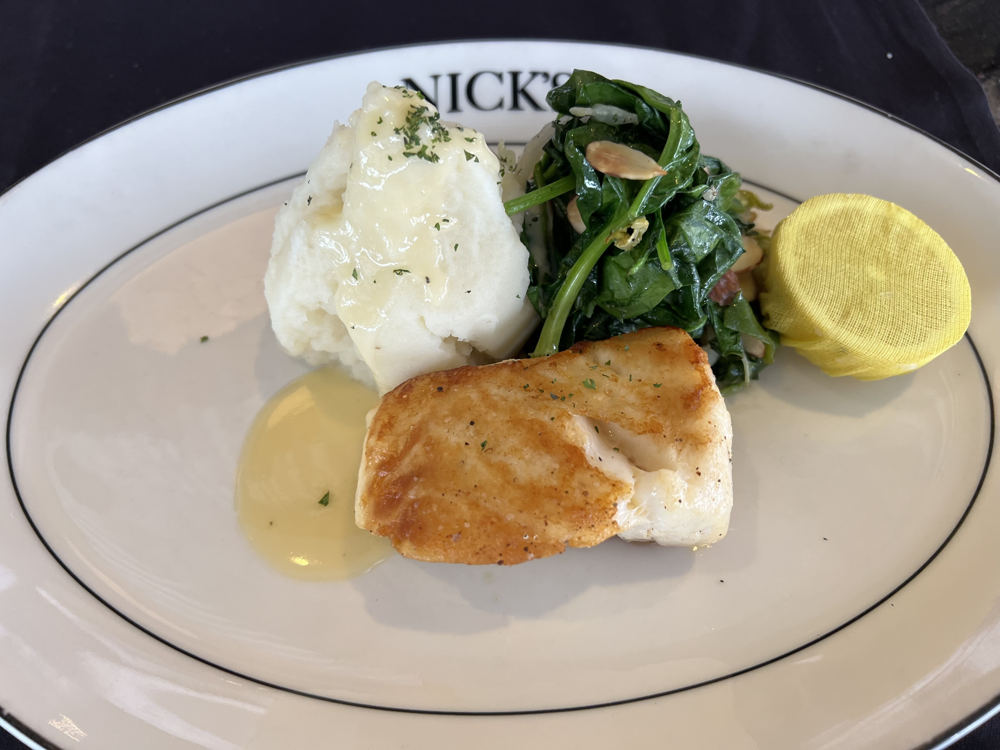
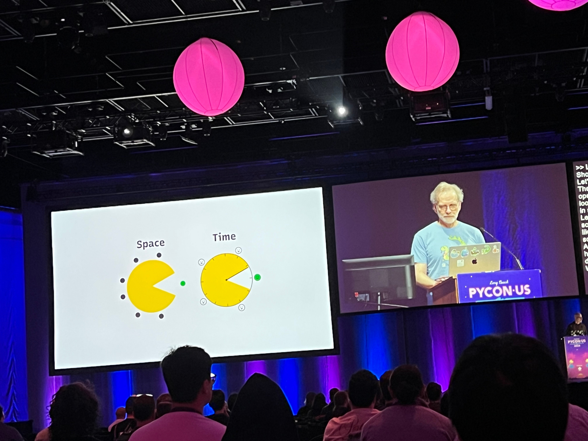
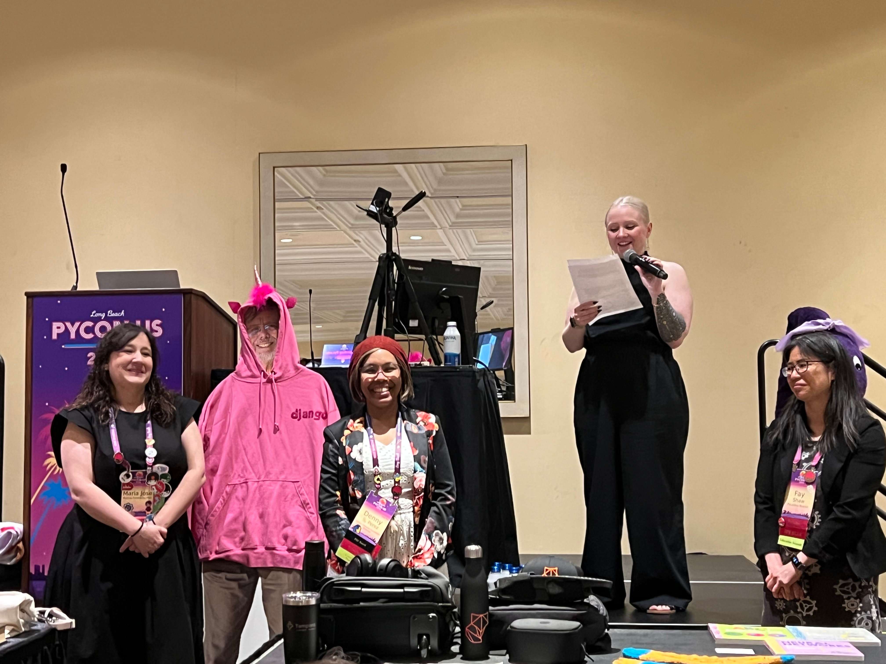
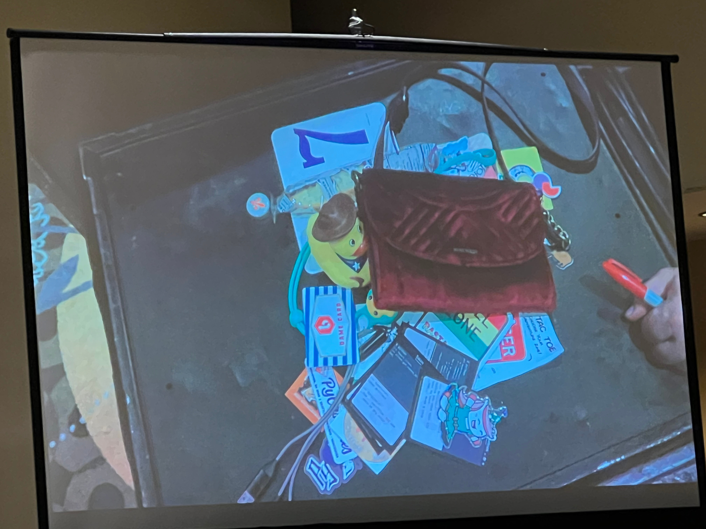
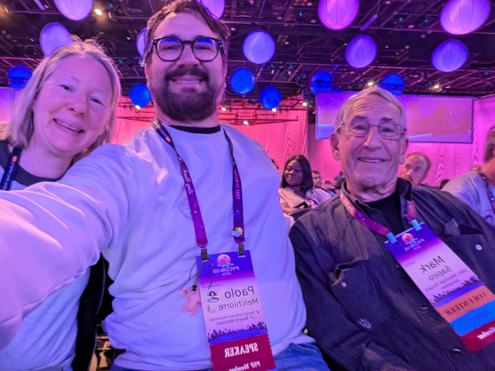
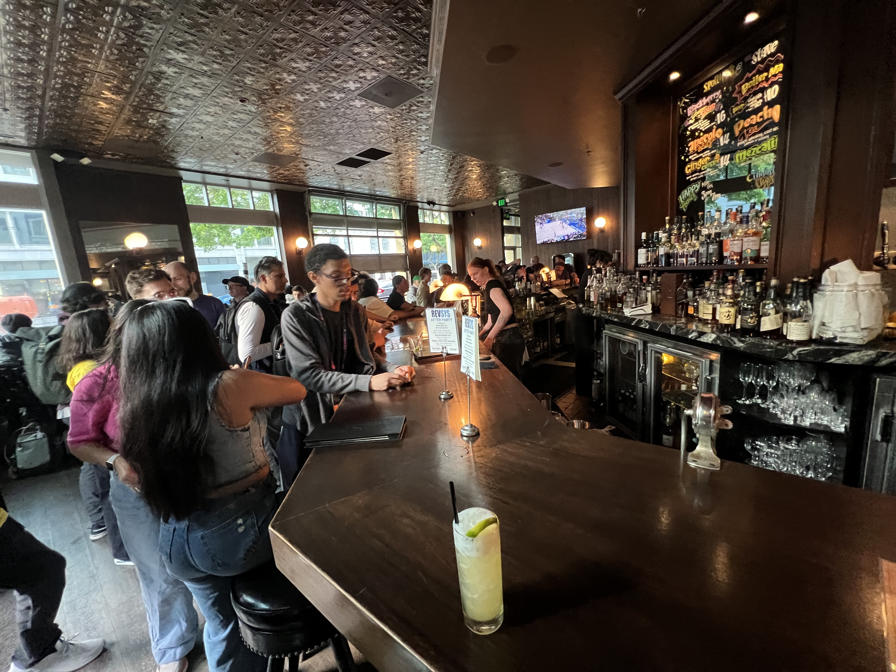
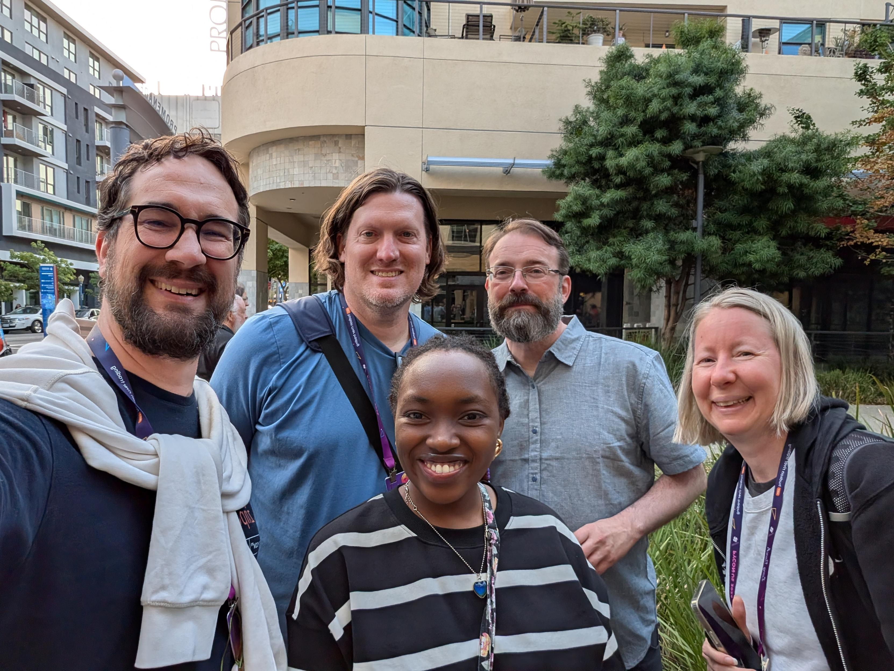
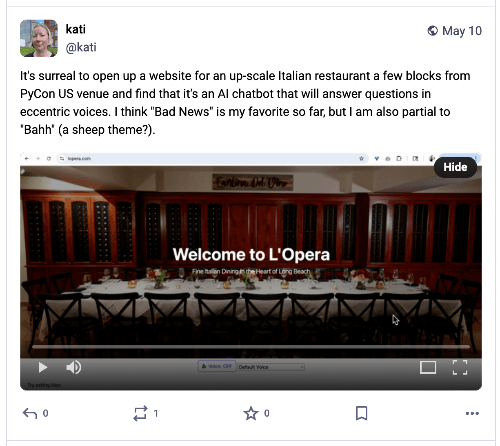

# PyCon US 2026 Recap

Table of Contents
-----------------

- [Intro](#intro)
- [Thursday](#thursday)
    - [Sightseeing](#sightseeing)
    - [Opening Reception at the Expo Hall](#opening-reception-at-the-expo-hall)
- [Friday](#friday)
    - [Welcome](#welcome)
    - [PSF Welcome](#psf-welcome)
    - [Lin Qiao Keynote](#lin-qiao-keynote)
    - [Catch Up With Anthony](#catch-up-with-anthony)
- [Saturday](#saturday)
    - [Pablo Galindo Salgado Keynote](#pablo-galindo-salgado)
    - [PSF Members Luncheon](#psf-members-luncheon)
    - [Ned Lightning Talk](#ned-lightning-talk)
    - [PyLadies Auction](#pyladies-auction)
- [Sunday](#sunday)
    - [Marina and Beach](#marina-and-beach)
    - [Amanda Casari Keynote](#amanda-casari-keynote)
    - [Python Software Foundation Security Engineers Update](#python-software-foundation-security-engineers-update)
    - [Posters](#posters)
    - [PyLadies Lunch](#pyladies-lunch)
    - [Rachel Calhoun and Tim Schilling Keynote](#rachel-calhoun-and-tim-schilling-keynote)
    - [Steering Council Panel](#steering-council-panel)
    - [Python Software Foundation Update](#python-software-foundation-update)
    - [Ice Cream Selfie](#ice-cream-selfie)
    - [RevSys After Party](#revsys-after-party)
    - [L'Opera](#lopera)
- [Monday](#monday)
    - [Engine Failure](#engine-failure)
    - [Connections Made](#connections-made)
- [Until Next Time](#until-next-time)

## Intro

Disclaimer: the content of this post is a reflection of my career journey and not specific to my work at JPMorgan Chase & Co.

<!--
Conference description
-->

<!--
https://us.pycon.org/2026/schedule/talks/
-->

<!--

-->

🔝 [**back to top**](#table-of-contents)

## Thursday

🔝 [**back to top**](#table-of-contents)

### Sightseeing

I spent Thursday sightseeing. I decided to ride the 121 bus along the beach to Belmont Shore, explore the area, then eat at Nick's on Second. 

When I attended PyCon US 2024, I started a tradition. I googled "best restaurant in Pittsburgh" and ate there. It was a wonderful restaurant called Fig & Ash. Now, I do this at every host city. 

Nick's was at or near the top of every list I saw and had rave reviews. I was hoping to eat some excellent fresh seafood, and Nick's filets fish in-house daily. 

The view from the Belmont Pier... Thursday was an overcast day, but the beaches were quiet and meditative. 

I decided to walk over to Naples Island and see what it was about. 

A view of boats in the Alamitos Bay while walking across the 2nd Street Bridge

On Naples Island, I discovered something I'd never seen before, luxury houses with small passages between them leading to boats docked along the Alamitos Bay. A homeowner assured me it was okay to walk down this charming passage. 

A gangway leading down to a semi-private dock. These homeowners are living the dream! 

A gondola ride through Naples Island and visit to nearby Seal Island could be on the itinerary for next year. 

Nick's was a short walk from Naples Island. This Chilean Sea Bass was absolutely delicious! It was exactly what I was hoping for. When I found out the very friendly bartender Garrett was originally from the Dallas-Fortworth area, I had to know more about his story. He visited Long Beach and came back to live, because it was paradise for him. 

After Nick's I was able to make it to the Queen Mary in time for the 1:15 pm Glory Days Tour, recommended by a friend. 

A fantastic view of the Los Angeles River and Long Beach Shoreline Marina from a deck on the Queen Mary

Me at a photo-op helm. The real one is much smaller and on display at the entrance to the engine room. 

<!--
https://en.wikipedia.org/wiki/Naples,_Long_Beach
https://nicksrestaurants.com/nicks/on-2nd/

Books program

Sometimes I like to just walk and see what I find. 
-->

🔝 [**back to top**](#table-of-contents)

### Opening Reception at the Expo Hall

<!---
RHEL Booth

Sam Doran
RHCS
https://www.redhat.com/en/services/training-and-certification
Alternative to idempotency: desired state (runs if needs to make changes, doesn't if it doesn't need to make changes)
Advanced systems troubleshooting 
RHEL Lightspeed
Portal with knowledge-based articles. CLI, backend. 
https://github.com/rhel-lightspeed
Built on Goose
https://goose-docs.ai/
https://github.com/aaif-goose/goose
Ansible for devops 
https://www.ansiblefordevops.com/
Linux for dummies
https://www.amazon.com/Linux-Dummies-9th-Richard-Blum/dp/0470467010
-->

🔝 [**back to top**](#table-of-contents)

## Friday

### Welcome

🔝 [**back to top**](#table-of-contents)

### PSF Welcome

🔝 [**back to top**](#table-of-contents)

### Lin Qiao Keynote

<!--
Keynote — Lin Qiao (Pacific Ballroom - Arena)
-->

🔝 [**back to top**](#table-of-contents)

### Catch Up With Anthony

🔝 [**back to top**](#table-of-contents)

<!--
Break (Expo Hall AB)

Mind the gap! Why static typing requires more than just adding annotations
Jia Chen, Steven Troxler
Room 103ABC
https://typing.python.org/en/latest/

GPU Communications for Python
Benjamin Glick, Michael Yh Wang
Room 104AB
https://en.wikipedia.org/wiki/Graphics_processing_unit
https://en.wikipedia.org/wiki/High-performance_computing
https://docs.nvidia.com/nvshmem/api/api/language_bindings/python/index.html
https://github.com/NVIDIA/nccl/discussions/2006
https://docs.nvidia.com/cuda/cuda-c-programming-guide/
https://dbader.org/blog/writing-a-dsl-with-python
https://numba.pydata.org/
https://developer.nvidia.com/blog/achieve-cutlass-c-performance-with-python-apis-using-cute-dsl/
https://github.com/NVIDIA/numbast
LTO-IR (Link Time Optimization - Intermediate Representation) is a compiler technology, commonly used in LLVM/Clang and CUDA (NVIDIA)

AI
AI-Assisted Contributions and Maintainer Load
Paolo Melchiorre
Grand Ballroom A

PEP 750 - T-strings: safer and smarter string processing
Vinícius Gubiani Ferreira
Room 103ABC
https://peps.python.org/pep-0498/
https://peps.python.org/pep-0750/
https://realpython.com/python-t-strings/

AI
AI-Powered Python Education : Towards Adaptive and Inclusive Learning
Sonny Mupfuni
Grand Ballroom A

How to give your Python code to someone else
Russell Keith-Magee
Grand Ballroom B

How many spoons does your environment cost: Feat. demos breaking and the human element of your broken env
Dawn Wages
Room 104AB

What's so hard about writing a type checker? A tour of ty
Carl Meyer
Room 103ABC
https://github.com/astral-sh/ty
incremental re-checking as you type, control-flow-sensitive type narrowing, gradual typing, and set-theoretic types (unions, intersections, and negations)

Breaking the Speed Limit: Fast Statistical Models with Python 3.14, Numba, and JAX
Wenxin Jiang, Jian Yin
Room 104AB
NumPy, Python 3.14 (with free-threaded or JIT configurations), Numba, and JAX
https://numpy.org/
https://docs.jax.dev/en/latest/notebooks/thinking_in_jax.html
https://numba.pydata.org/

AI
Making African Languages Visible: A Python-Based Guide to Low-Resource Language ID
Gift Ojeabulu
Grand Ballroom A
FastText, MasakhaNER dataset on Huggingface
AfroXLMR, Masakhane Models, and spaCy’s limited-language pipelines
https://fasttext.cc/
https://huggingface.co/datasets/masakhane/masakhaner
https://huggingface.co/Davlan/afro-xlmr-large
https://huggingface.co/masakhane
https://spacy.io/usage/processing-pipelines

Lunch

AI
Running Large Language Models on Laptops: Practical Quantization Techniques in Python
Aayush Kumar JVS
Grand Ballroom A
quantization techniques, QLoRA, bitsandbytes, GGUF, and GGML
https://medium.com/data-science-at-microsoft/exploring-quantization-in-large-language-models-llms-concepts-and-techniques-4e513ebf50ee

The Bakery: How PEP810 sped up my bread operations business
Jacob Coffee
Room 103ABC
https://peps.python.org/pep-0810/

Peeking under the hood of uv run
Zanie Blue
Room 104AB
https://docs.astral.sh/uv/guides/scripts/

Panel: Fostering better collaboration between the scientific Python community and core Python development
Jonathan Dekhtiar, Dawn Wages, Michael Droettboom
Grand Ballroom B

AI
Distributing AI with Python in the Browser: Edge Inference and Flexibility Without Infrastructure
Fabio Pliger
Grand Ballroom A
JavaScript model runners, leveraging WebGPU/WebNN
https://webgpu.org/
https://webmachinelearning.github.io/webnn-intro/
 
A Shiny for Python Cultural Survival Tool: Training Your Slang Translator
Elizabeth Black
Room 103ABC
TF-IDF and cosine similarity, reactive UI

How to port a Python kernel to Pyodide for a blazingly fast in-browser coding experience
Myles Scolnick
Room 104AB
Pyodide, JupyterLite and marimo, WebAssembly
https://pyodide.org/en/stable/
https://github.com/jupyterlite/jupyterlite
https://marimo.io/
https://webassembly.org/

pathlib: why and how to use it
Trey Hunner
Grand Ballroom B
https://docs.python.org/3/library/pathlib.html

From Graveyard to Glory: Production Python in the Browser
Mahmoud Hashemi
Room 104AB
Pyodide, WebAssembly, build pipeline, CDN, PyPI wheels, versioned, cache-busted bundles, SSR and Web Workers, responsive, SEO optimized, orchestrate Svelte and Vite using Comlink for seamless RPC between the JS main thread and the Python worker. Leveraging Pydantic + OpenAPI for TypeScript safety. Realities. 
https://pyodide.org/en/stable/
https://webassembly.org/
https://svelte.dev/
https://vite.dev/
https://github.com/googlechromelabs/comlink
https://en.wikipedia.org/wiki/Remote_procedure_call
https://github.com/pydantic/pydantic
https://www.openapis.org/
https://www.typescriptlang.org/

Beyond the P-Value: A Data Scientist’s Guide to Tier-1 Feature Launches
Jyoti Yadav
Room 103ABC
"Launch Post-Mortem" using a Jupyter Notebook, CausalML and PyMatch
https://github.com/uber/causalml
https://github.com/benmiroglio/pymatch

AI
Free-threaded Python: past, present and future
Thomas Wouters
Grand Ballroom B
Thread safety, data races, and concurrent designs

Break (Expo Hall AB)

AI
What Python Developers Need to Know About Hardware: A Practical Guide to GPU Memory, Kernel Scheduling, and Execution Models
Santosh Appachu Devanira Poovaiah, Vyas Ramasubramani
Grand Ballroom A
How GPU memory is structured, why kernel launches behave differently from Python function calls, how floating-point math on GPUs differs from CPUs, and why the same Python code behaves differently across GPU generations or SDK versions. Real examples in PyTorch and TensorFlow,
https://en.wikipedia.org/wiki/Graphics_processing_unit
https://en.wikipedia.org/wiki/Floating-point_arithmetic
https://pytorch.org/
https://www.tensorflow.org/

Demystifying Python's Generational Garbage Collector
Puneet Khushwani
Room 104AB
https://docs.python.org/3/library/gc.html
from reference counting's limitations to the intricacies of cyclic garbage detection

Lock-Free Multi-Core Performance with Behavior-Oriented Concurrency
Matthew Johnson
Grand Ballroom B
https://microsoft.github.io/bocpy/
https://github.com/microsoft/bocpy

Why Software Engineering Best Practices Fail in Data Engineering
Constance Martineau
Room 103ABC

AI
How to Build Your First Real-Time Voice Agent in Python (Without Losing Your Mind)
Camila Hinojosa Añez, Elizabeth Fuentes
Grand Ballroom A
Python, AWS services (for speech and LLM), and Pipecat
https://github.com/pipecat-ai/pipecat

Debugging Python in Production: Practical Techniques Beyond Print Statements
Anshul Jannumahanti
Room 103ABC
Structured logging, stack trace analysis, runtime inspection, and controlled reproduction of bugs.

Demystifying the GIL
Bruce Eckel
Grand Ballroom B
GIL protects you from basic shared-memory concurrency errors, Python 3.14 

Python and the JVM - A Love Story
Shir Havron
Volunteer
Room 104AB
JVM, Py4J, PySpark
https://en.wikipedia.org/wiki/Java_virtual_machine
https://www.py4j.org/
https://spark.apache.org/docs/latest/api/python/index.html

Lightning Talks
Lightning Talks (Pacific Ballroom - Arena)
-->
 
## Saturday

### Pablo Galindo Salgado Keynote

🔝 [**back to top**](#table-of-contents)

### PSF Members Luncheon

🔝 [**back to top**](#table-of-contents)

### Ned Lightning Talk

🔝 [**back to top**](#table-of-contents)

<!--

-->

### PyLadies Auction

🔝 [**back to top**](#table-of-contents)

<!--
Lightning Talks (Pacific Ballroom - Arena)/Coffee

D&I Panel: Python is for Everyone: Growing the Community Without Limits (Pacific Ballroom - Arena)
Keynote — Pablo Galindo Salgado, En Español (Pacific Ballroom - Arena)

Break (Expo Hall AB)

Security
FastAPI Security Patterns: OAuth 2.0, JWTs, and API Keys Done Right
Ian
Room 103ABC
https://fastapi.tiangolo.com/
https://fastapi.tiangolo.com/tutorial/security/simple-oauth2/
https://fastapi.tiangolo.com/tutorial/security/oauth2-jwt/
https://fastapi.tiangolo.com/reference/security/

Python for Humans - Designing Python Code Like a User Interface
Justin Lee
Grand Ballroom A
Black, ruff, and Pylance

Conquer multithreaded Python with Blanket
Larry Hastings
Grand Ballroom B

Hash me if you can: let's talk about Python dictionaries!
Mia Bajić
Room 104AB

Beyond Optional in Real-World Projects: Missing, None, and Unset
Koudai Aono
Room 104AB
a missing key (the field is absent),
an explicit None (the value is present and intentionally null),
an unset input (the caller didn't specify the field, so you must not touch it).

Security
Anatomy of a Phishing Campaign
Mike Fiedler
Room 103ABC
In July 2025, PyPI users received emails
https://blog.pypi.org/posts/2025-07-28-pypi-phishing-attack/
September 2025 follow-up campaign targeting pypi-mirror.org
https://blog.pypi.org/posts/2025-09-23-plenty-of-phish-in-the-sea/

Switching from Sphinx to Markdown
Kattni
Grand Ballroom B

Don’t Write Polars Code with a Pandas Accent
Joram Mutenge
Grand Ballroom A
https://realpython.com/polars-vs-pandas/

Security
Zero Trust in 200ms: Implementing Identity-Per-Transaction with Python and Serverless
Tristan McKinnon
Room 103ABC
The Identity-Per-Transaction Pattern: Why "rotating keys" is obsolete. We walk through a Python-based identity broker that instantiates a unique, cryptographically scoped IAM credential for every single file transaction—and destroys it milliseconds later.
Streaming De-identification: How to implement a clean room scrubbing layer using Python generators and NLP (Microsoft Presidio) to tokenize PII in-memory before it ever touches your data lake.
Audit-Ready Logging: Techniques for structuring Python's logging module to produce immutable, auditor-friendly JSON trails that prove compliance without leaking sensitive data.

No More Spreadsheets! Building PyLadiesCon Infrastructure with Python and Django
Mariatta
Grand Ballroom A
https://conference.pyladies.com/docs/volunteers/committee_infra/
https://conference.pyladies.com/docs/

The Exceptions We Don't Catch in Technical Conversations
Emin Martinian
Grand Ballroom B

Lunch

The Surprising Effectiveness of Immutable Data Structures
Brett Slatkin
Room 104AB
frozen feature of the dataclasses built-in library, and how it compares to and complements other immutable language features and community packages.
https://realpython.com/python-mutable-vs-immutable-types/
https://docs.python.org/3/tutorial/datastructures.html
https://en.wikipedia.org/wiki/Functional_programming

Security
Rust for CPython: Making Python Safer and More Robust for Everyone
Emma Smith
Room 103ABC
C code suffers from memory and thread unsafety, leading to crashes and potentially exploitable security bugs. 
Rust for CPython project
Android and Chromium have leveraged Rust
https://www.cs.cornell.edu/courses/cs3410/2025sp/notes/memory_safe_langs.html

[Yes, You Can] Test SQL
Paul Zuradzki
Grand Ballroom B
SQL workflows and SQL/data engineers

Create a Python Package: From Zero to Hero
Mario Munoz
Grand Ballroom A

Beyond Rate Limiting: Adaptive Security for Python Web Applications
Aayush Gauba
Grand Ballroom A
Many Python web applications rely on rate limiting, IP blocking, or simple pattern matching, 
Lightweight AI techniques that run directly inside application middleware
Django, Flask, and FastAPI
https://en.wikipedia.org/wiki/Rate_limiting
https://en.wikipedia.org/wiki/IP_address_blocking

Security
Asleep at the Wheel: Getting your SBOMs to pay attention to Python Builds
Sanchit Sahay, Abhishek Reddypalle
Room 103ABC
SBOMit, an OpenSSF project
https://github.com/SBOMit
https://openssf.org/

Using Python Biopharm to Help Cure Cancer
Sushant Singh
Room 104AB
You’ll see how FastAPI and Pydantic enable strongly typed, auditable APIs suitable for regulated environments, and how Neo4j can model biological, manufacturing, and operational relationships as a living graph. On top of this foundation, we built chat-based interfaces that don’t just retrieve documents, but traverse relationships, surface patterns, and explain why something happened — enabling questions like “What changed?”, “Where have we seen this before?”, and “What decisions led us here?”
https://fastapi.tiangolo.com/
https://pydantic.dev/
https://neo4j.com/docs/getting-started/

Where the Sidewalk Ends: Data-Driven Urban Safety
Fay Shaw
Grand Ballroom B
Using MassDOT data and the Walk Score API, I built MOSEY (Move On Safely EverYone) with Streamlit, geopandas, and folium.
https://streamlit.io/
https://geopandas.org/en/stable/
https://python-visualization.github.io/folium/latest/

Tachyon: Python 3.15's sampling profiler is faster than your code
Pablo Galindo Salgado, Laszlo Kiss Kollar
Grand Ballroom A
https://python4data.science/en/latest/performance/tachyon.html
https://hugovk.dev/blog/2026/faster-pillow/

The art of live process manipulation with Python 3.14's zero-overhead debugging interface
Savannah Ostrowski
Grand Ballroom B
Python 3.14
sys.remote_exec() can be combined with debugpy (an implementation of the Debug Adapter Protocol) to provide full IDE debugging experiences for live processes.
https://peps.python.org/pep-0768/

The Terminal is the New Browser: Building Rich TUIs with Textual
Andres Pineda
Room 104AB
'Terminal User Interfaces' (TUIs)
https://textual.textualize.io/

Security
Post-Incident Runtime SBOM Generation from Python Memory
Hala Ali, Andrew Case
Room 103ABC
Across 51 real-world Python applications (web frameworks, CLI tools, ML platforms, schedulers, and visualization tools), we found significant mismatches between what SBOM tools report and what the memory reveals.

Break (Expo Hall AB)

Thinking of Topic Modeling as Search
Kas Stohr
Room 104AB
How to store topic embeddings on popular databases to enable search

Making Python Faster with Free Threading and Mypyc
Jukka Lehtosalo
Grand Ballroom A
Ahead-of-time compilation to C extensions using mypyc.
https://github.com/mypyc/mypyc

Security
GitHub Actions Security in Python Packages
Andrew Nesbitt
Room 103ABC
Trusted publishing to PyPI via OIDC
Why GitHub Actions is a supply chain risk
What's missing compared to pip, npm, and other package managers
Findings from scanning Python package workflows at scale
What we can learn from pip's security model
A checklist for hardening Python package release workflows
How to integrate zizmor into CI pipelines
https://docs.pypi.org/trusted-publishers/
https://docs.pypi.org/trusted-publishers/security-model/
https://github.com/zizmorcore/zizmor

Getting Started with Celery: Building Your First Background Task System in Python
Italo Carvalho Vianelli Ribeiro
Grand Ballroom B
https://docs.celeryq.dev/en/main/getting-started/introduction.html

High-Performance LLM Inference in Pure Python with PyTorch Custom Ops
Yineng Zhang
Grand Ballroom A
large language model (LLM) inference engine written entirely in Python can reach performance comparable to C++-based systems such as TensorRT-LLM. Based on experience maintaining SGLang—an open-source pure-Python inference engine
https://github.com/NVIDIA/TensorRT-LLM
https://github.com/sgl-project/sglang

Security
Breaking Bad (Packages): Why Traditional Vulnerability Tracking Fails Supply Chain Attacks
Shelby Cunningham, Madison Ficorilli
Room 103ABC
what is the best way to track malicious supply chain compromises

Upgrading Python CLIs: From Scripts to Interactive Tools
Avik Basu
Grand Ballroom B
First, we'll use Typer to replace verbose argparse code with clean, type-safe configuration management. Next, we'll add Rich for progress bars, tables, and styled output. Lastly, we will introduce some interactive elements with Textual, e.g. dashboards, filtering, and real-time updates. 
Typer, Rich, Textual
https://typer.tiangolo.com/
https://github.com/textualize/rich
https://textual.textualize.io/

When KPIs Go Weird: Anomaly Detection with Python
Juliana Ferreira Alves
Room 104AB
pandas, scikit-learn, and PyOD
https://github.com/yzhao062/pyod

Lightning Talks
Lightning Talks (Pacific Ballroom - Arena)
-->

## Sunday

### Marina and Beach

I wanted to see more of the coast, which is a short walk from the Long Beach Convention Center. I walked along the marina, getting a good view of the Queen Mary and historic Lion Lighthouse (said to be the ugliest lighthouses in the world), then down to Alamitos Beach where sunlight glittered across the ocean.  

Alamitos Beach

🔝 [**back to top**](#table-of-contents)

### Amanda Casari Keynote

🔝 [**back to top**](#table-of-contents)

### Python Software Foundation Security Engineers Update

🔝 [**back to top**](#table-of-contents)

### Posters

🔝 [**back to top**](#table-of-contents)

### PyLadies Lunch

At the PyLadies Lunch, women take turns taking the mic and sharing accomplishments they are proud of from the past year. Although I've attended several times, I've never gotten up to speak. 

My friend Mariatta came over to me and encouraged me to do it. Mariatta is inspiration to me. I reflected for a couple of minutes, then got up and did it. 

As difficult as it can be to talk about ourselves, Mariatta explained later that we need to do it so that others know the things we have experienced.

Thank you, Mariatta. 

🔝 [**back to top**](#table-of-contents)

### Rachel Calhoun and Tim Schilling Keynote

I sat at the front with Paolo who gave me some photography tips. Meanwhile, we met Mark Sapiro, GNU Mailman Release Manager and Maintainer. 

🔝 [**back to top**](#table-of-contents)

### Steering Council Panel

<!--
Barry Warsaw, Donghee Na,  Pablo Galindo Salgado, Savannah Ostrowski, Thomas Wouters

https://thenewstack.io/python-whats-coming-in-2026/
https://peps.python.org/pep-0790/
https://docs.python.org/3.15/whatsnew/3.15.html
https://peps.python.org/pep-0745/
https://docs.python.org/3/whatsnew/3.14.html
https://realpython.com/python314-new-features/
-->

🔝 [**back to top**](#table-of-contents)

### Python Software Foundation Update

🔝 [**back to top**](#table-of-contents)

### Ice Cream Selfie

A massive crowd of attendees walked over to [Long Beach Creamery](https://www.longbeachcreamery.com/) for an ice cream selfie. 

Waffle bowl with Whiskey Vanilla and Strawberry Mascarpone

<!--
PyBeach, on my bucket list
-->

🔝 [**back to top**](#table-of-contents)

### RevSys After Party

I walked down the block to the RevSys after-party at The Stave Bar. 

This party is rocking! I had a beautiful and tasty non-alcoholic Ginger Cooler (pictured on the bar): ginger syrup, pineapple juice, fresh lime juice, soda water

The best of times... me with friends Paolo, Jeff, Velda, and Frank

<!--
Keith comments
-->

🔝 [**back to top**](#table-of-contents)

### L'Opera

After the RevSys after-party, I had the chance to eat at a restaurant I had wanted to eat at all week. 

I learned of [L'Opera](https://lopera.com/) through Mariatta's [PyCon US 2026 website](https://travel.mariatta.ca/pycon-us-2026/). 

I poked a bit of fun at the restaurant on social media... 

But, I love Italian food and the restaurant had great reviews. It did not disappoint!  

I had the Lombrani, one of their most popular dishes: homemade ravioli stuffed with red wine braised shortrib of beef and ricotta, gorgonzola, green pea and broccolini cream sauce. It was incredible. I want to go back next year! 

As an added bonus, Paul Everitt saw me at the bar and invited me to join the JetBrains Team at their table for some fun conversation! 

🔝 [**back to top**](#table-of-contents)

    
<!--
Keynote — amanda casari (Pacific Ballroom - Arena)
PSF - Update from our Security Engineers (Pacific Ballroom - Arena)

Job Fair & Community Showcase (Hall AB) Starts at 9:30
Posters (Hall AB)

Learning Computer Science with Python and Music(21)
Michael Scott Asato Cuthbert
Room 103ABC
https://github.com/cuthbertlab/music21

From notebooks to scripts: turning one-off analysis into reusable Python code
Rafael Mendes de Jesus
Room 104AB

A bridge over (not) troubled waters: Collecting marine data from your couch
Sarah Kaiser
Grand Ballroom A
Collecting telemetry on boats, a specialized marine data collection platform (Signal K), and an MQTT bridge to bring it all into our smart home dashboards on Home Assistant.
https://signalk.org/
https://www.home-assistant.io/

Brains and Explosions: A Simple VDB Writer for Python
Joachim Pfefferkorn
Grand Ballroom B
Neurovolume: a low-dependency, Python library for writing VDBs. This talk spans Zig/Python interoperability, satellite data, big spinning magnets, dead salmon, and Blender plugins.
VDB is a volumetric data format.
https://github.com/joachimbbp/neurovolume

Memory management in CPython, fast or slow?
Mark Shannon
Grand Ballroom B

Why you, as a Python developer, should learn Rust
Daniel Szoke
Room 104AB
Null safety, explicit mutability, and the ownership and borrowing system
Compiler, linter, and formatter
Discussing the main philosophical differences between Rust and Python

Leading Without Permission: Building Digital Diaspora as an Afro-Latina Woman in Tech
Veronica Rodriguez Viveros
Room 103ABC

Running Every Street in Paris with Python and PostGIS
Vinayak Mehta
Grand Ballroom A
OpenStreetMap, process GPS tracking data from running activities, and build a system to track progress
Geospatial data using Python libraries like osmnx, shapely, geopandas, and storing it for efficient querying in Postgres and PostGIS.

Understanding Python's logging: Combine components like Lego blocks!
nikkie
Room 104AB

From Messy Clinical Data to Interoperable FHIR: A Python-First Mapping and Validation Pipeline
Lisa Smith
Grand Ballroom A
The focus is on architecture and design decisions rather than standards theory. 

Taking Generators Too Far: Writing a PDF from Scratch in Python
Arie Bovenberg
Grand Ballroom B
We'll use generators all the way down—streaming every byte without ever assembling the full document in memory. 

Fall In Love With CSS
Piper Thunstrom
Room 103ABC

Keynote — Rachell Calhoun & Tim Schilling (Pacific Ballroom - Arena)
Steering Council Panel (Pacific Ballroom - Arena)
Python Software Foundation Update (Pacific Ballroom - Arena)

Closing (Pacific Ballroom - Arena)
-->

## Monday

🔝 [**back to top**](#table-of-contents)

### Engine Failure

🔝 [**back to top**](#table-of-contents)

### Connections Made

🔝 [**back to top**](#table-of-contents)

## Until Next Time

🔝 [**back to top**](#table-of-contents)
