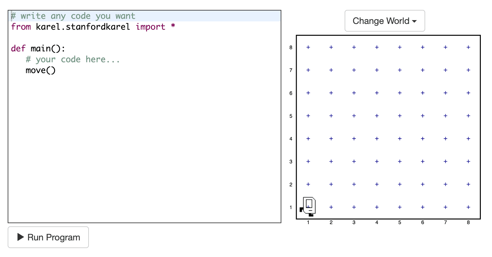
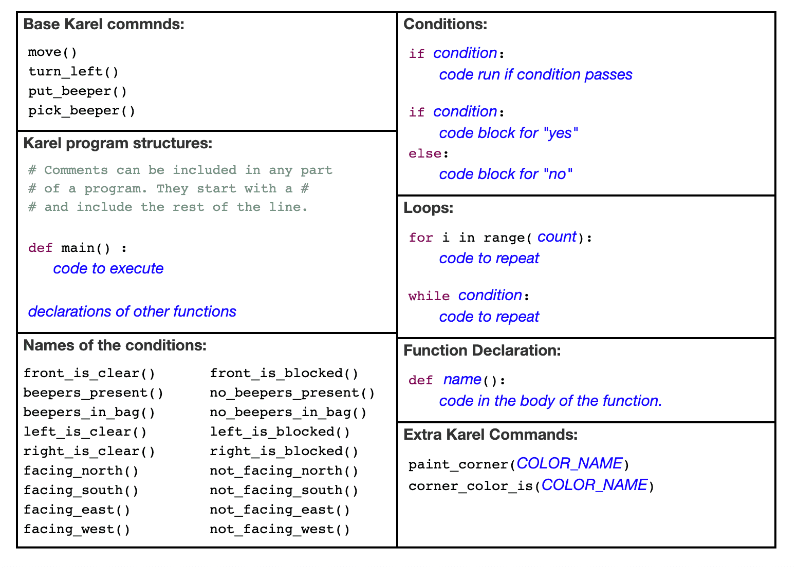
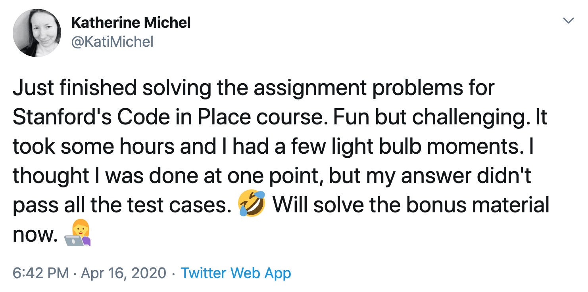
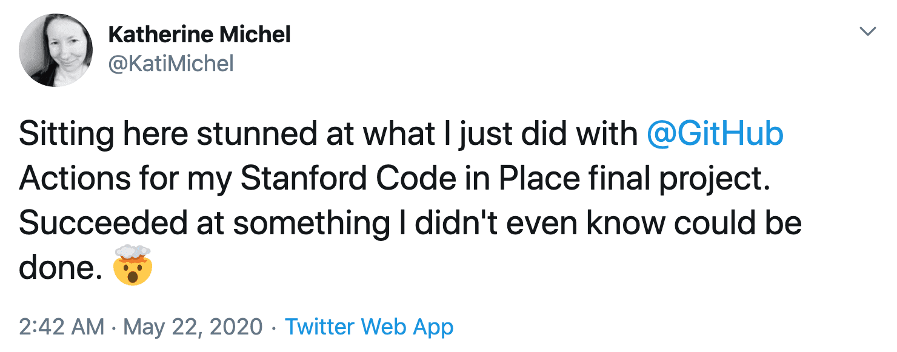
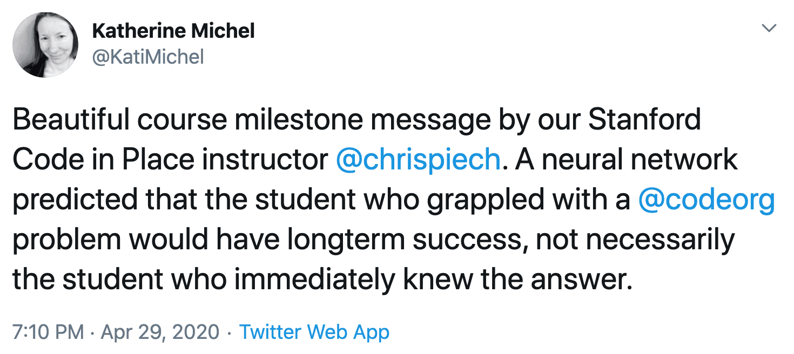
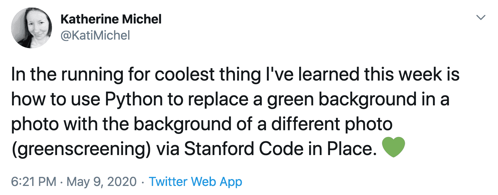

# Reflections on Stanford Code in Place

## About Stanford Code in Place

In late March, while I was looking through my Twitter news feed, I came across a [tweet](https://x.com/chrispiech/status/1244692768431038473) about a one-time [Python](https://www.python.org/) programming course called Stanford Code in Place. 

[Mehran Sahami](http://robotics.stanford.edu/users/sahami/bio.html) and [Chris Piech](https://stanford.edu/~cpiech/bio/index.html) teach Stanford's introductory Python course CS106A. Because of shelter-in-place, they decided to open the course to the public. They would teach the traditional CS106A version and public Code in Place version simultaneously.

## Application and Acceptance

Sensing an opportunity to unlock some invaluable new knowledge through what would undoubtedly be a high quality course, I jumped at the chance to apply. 

The application consisted of a few personal questions and a few "Karel the Robot" exercises.

[Karel the Robot](https://en.wikipedia.org/wiki/Karel_(programming_language)) is a powerful, toy-like programming environment created by former Stanford instructor [Richard E. Pattis](https://en.wikipedia.org/wiki/Richard_E._Pattis). 

Caption: "Karel World"

I immediately liked Karel the Robot. Karel piqued my interest, challenged me, and left me wanting to go further in my learning.

I completed the application and soon received an acceptance email. 80,000 prospective students had started an application, 8,000 students were admitted, and 800 section leaders accepted. 

Although the Code in Place instructors strongly believe in open education, this was the first initiative of its kind and run by volunteers. With students split into groups of 10 and each group supported by a section leader, the number of students admitted was limited.

## What I Got Out of the Course

I was excited to be able to participate and was intent to make the most of the experience and build on it after the course ended. 

As a release manager of an open-source Django library named [Pinax](https://github.com/pinax), Python was not new to me. However, there were specific things I wanted to get out of Code in Place and I can wholeheartedly say that I did: 

* A more intuitive understanding of control flow, algorithms, and program structure
* Reinforcement of my Python fundamentals knowledge

There were also a few unexpected bonuses that I got out of the course:

* Had fun making things, including using tools I had already wanted to explore
* Got to know a few Python libraries better, including SimpleImage, [Pillow](https://pillow.readthedocs.io/en/stable/), and [Tkinter](https://docs.python.org/3/library/tkinter.html)
* Learned how to make a project demo video
* Got to know a number of fascinating and inspiring people

## Lectures and Assignments

The main part of the course lasted for 5 weeks. 

New lecture videos were released every Monday, Wednesday, and Friday. In these lectures, Mehran and Chris taught Python fundamentals in such a way that they built on each other and aligned with our coursework. 

There were three regular assignments due approximately every week and a half, and a final project that we had an additional one to two weeks to work on.

## Sections

My section leader was Matt, a Stanford CS alum, and our section met every Thursday via Zoom. 

When our first section took place, I was surprised to see that nearly all of the students were women, primarily in my same age group, with the exception of one man. I didn't expect that kind of gender and age representation and thought it was great. 

During each section, we went over key points from that week's lectures, worked through programming challenges, and talked about any questions we had. Our section leader Matt was very knowledgeable and helpful. 

## Assignments and Final Project

### Assignment 1: Karel the Robot

Our first assignment consisted of Karel the Robot problems. 

We were encouraged to install and use [PyCharm IDE](https://www.jetbrains.com/pycharm/), if possible. An online IDE was available for those who needed it.

It's fairly easy to get started using Karel the Robot. On the surface, Karel seems simple to use. There are only a few built-in commands available for giving Karel instructions for completing seemingly straightforward tasks in Karel World. 

Caption: Karel Reference

However, in order to "solve" a Karel challenge, your code must be adequately abstract! 

For example, I thought I had "solved" the first Karel challenge when it passed the first test case, only to amusingly (and frustratingly, at the time!) realize that there were other, more extreme test cases my solution had not yet passed. To succeed in passing all of them, you needed to use decomposition, good control flow, and creative problem solving.

Caption: Example test cases... Karel should be able to climb up and down mountains of any size, not just one size!

Our instructor Chris alluded to the hidden cleverness of Karel when he told us that some of the most difficult programming problems he had ever encountered had been in Karel World.

Caption: A tweet about my progress. Creating new neural pathways, I hope!

### Assignment 2: Simple Python

In the second week, we moved on from Karel the Robot, which was similar to Python, to Python itself. Our assignment involved solving several challenges in Python. This felt like the easiest week for me.

By now, we had covered Python control flow, variables, expressions, functions, and parameters, and would soon move on to lists and dictionaries. 

Not long after assignment 2 was due, we had the option to complete a diagnostic test consisting of several programming problems. To complete the diagnostic test, we typed the code as we thought it should be to solve the problems, without being able to debug. Interesting!

### Assignment 3: Images

On the same day that assignment 2 was due, we began studying images.

For the images assignment, we used a module called SimpleImage that was created by Stanford teacher [Nick Parlante](https://cs.stanford.edu/people/nick/). Built on top of Python's full-featured [Pillow](https://pillow.readthedocs.io/en/stable/) library for manipulating images, SimpleImage provides a smaller selection of functionality, such as the ability to open and display an image and access and change its RGB pixel values.

Our assignment problems included creating a special Code in Place image filter, creating a mirror image, and creating an [Andy Warhol](https://en.wikipedia.org/wiki/Andy_Warhol)-esque artwork of the same image repeated multiple times, but with a different, brightly colored filter applied to each.

Caption: Simba, the Code in Place Dog

Caption: Simba, as a Warhol-esque "Painting"

After studying images, we studied animation using [Tkinter](https://docs.python.org/3/library/tkinter.html), text processing, and data.

### Final Project

The course went by so quickly that before I knew it, it was time to do our final projects. 

Although there were two standard Code in Place final project ideas students could use, we could make anything we wanted. I wanted to use the final project as an opportunity to challenge myself to do something new. 

For quite a while, I had wanted to make a Twitter bot, possibly powered by GitHub Actions. I happen to love photos, so I immediately looked at some photo service APIs. At Unsplash, I came across a pet photo collection. It reminded me of Simba, the adorable Code in Place dog, and how we had applied image filter algorithms to photos of Simba. 

So, I created a "Simba Friends" Twitter bot powered by a Python program I wrote that randomly downloads a photo from the Unsplash pet photo collection, randomly applies an image filter algorithm to it, and tweets it.

Caption: Tweeting my surprise that my final project had worked as a proof of concept

Our final projects are listed on the Code in Place final projects site. My project is lucky [#13](https://compedu.stanford.edu/codeinplace/public/projectlist.html). :)

You can also learn more about my final project in its [GitHub repo](https://github.com/KatherineMichel/stanford-code-in-place-final-project).

## A Few of My Thoughts and Opinions About the Course

### Inclusion

Beginning with the first introductory lecture, I had a sense that the Code in Place staff were genuinely nice people who wanted to create a kind, welcoming, non-judgmental atmosphere that was all about the best interest of individuals and their learning.

It was great to see that there were women in my section with non-traditional backgrounds who were insatiably curious about programming and highly motivated to succeed at it. Because of my familiarity with the Python ecosystem, I was able to provide some special support and advice to those who wanted to learn more, such as directing them to two of my favorite Python books: "[Automate the Boring Stuff with Python](https://automatetheboringstuff.com/)" by Al Sweigart and "[Python Crash Course](https://ehmatthes.github.io/pcc/)" by Eric Matthes.

Our teacher Chris, who uses machine learning to study how students learn, posted a course midpoint message that I did not at all expect. A neural network was trained on data collected about how students had solved a programming challenge on www.code.org. The neural network became very good at predicting outcomes. When it predicted who was most likely to have longterm success, it was not the person who had immediately known the answer, but instead, a person who had grappled with the problem a.k.a. had grit. Members of my section, myself included, found it inspiring. :)

I also appreciated that we were told that our final projects could be as humble or as big as we wanted. 

Having personally experienced the mixed messages women in particular face about skills and achievement, it's refreshing to be in a mental space where students are all given permission to do their best, wherever they are on their journey, without being stuck in the psychological trap women are often perpetually caught in of being either not good enough or too good, instead of simply being.

My only quibble, and it's a very small one, about inclusion during the course was the use of "guys" a few times during lectures to refer to students of all genders. I'm 100% sure it was not at all intended to create a feeling of exclusion and it's something I occassionally do by accident. My friend Lacey created a website called [Hey Guys](https://heyguys.cc/) that has a list of alternatives. I'm personally a fan of "y'all." :)

### My Favorite Lecture

Out of all of the Code in Place lectures, my favorite was the decomposition lecture. I felt that decomposition is a major key and the tips Chris gave us were excellent. I also really enjoyed the functions lectures.

### Final Project and Demo Video

Instead of submitting the code we wrote for our final project, we were asked to submit a short video demonstrating how our program worked. 

I'm glad to have been forced to learn how to make a demo video, lol. It's a skill I could have indefinitely put off learning, but now that I know how to do it and how easy and useful it is, I intend to make more demo videos like this in the future.

I really liked the idea of creating a working program based on my own creativity and presenting it. 

### Finishing Strong

Like many people, I've signed up for MOOCs (Massive Open Online Courses) in the past and not completed them. 

However, even though Code in Place was not for a grade, it was a priority to me personally to complete all of the work expected of me. I watched every lecture, attended every section, and submitted every required assignment. 

I was motivated by a few things:

* Only a small percentage of people had been accepted into the course; by not finishing, I would have taken a spot away from someone else who might have
* I had a high level of confidence in the quality of the course
* I felt an informal sense of accountability to my section leader and members of my section
* I knew that by not finishing strong, I would have been hurting myself most of all by missing an opportunity

I appreciated the flexibility of the course though. I fell behind one week, due to a broken computer. My section leader encouraged us to show up to our sections, even if we were less prepared than we wanted to be. Showing up and taking part helped me keep on track and I was able to fully catch up later that weekend.

### What Does Baseball Have to Do With Programming?!

Toward the end of the course, members of my section had a conversation about the Code in Place curriculum. Different people had different ideas about what should or shouldn't have been included. Obviously, there is a limit to how much content can be taught in a five week timeframe and choices have to be made. 

The debate reminded me of the "baseball" analogy I first heard of through the outstanding [teaching philosophy](https://www.fast.ai/2016/10/08/teaching-philosophy/) of Jeremy Howard and Rachel Thomas of Fast AI. In their philosophy, Jeremy and Rachel contrast learning math with learning baseball. A math student could spend years studying the dry, theoretical details of the subject, before getting to the "fun" stuff of putting it to real, practical use, if he or she makes it that far. On the other hand, a "student" of baseball perhaps stumbles across an informal baseball game in progress, immediately begins to get a sense of how the entire game works, and perhaps picks up the bat and excitedly joins the game in progress.

Yes, there were some important concepts that weren't included in Code in Place, but I don't think that was the most important thing. I think Code in Place did a good job of teaching important fundamentals while also providing "fun" projects that could give students the sense of excitement of joining a game, and perhaps get them indefinitely hooked on learning and making things beyond Code in Place.

Caption: One of the fun things we learned how to do

## What's Next

In the past few months, I've also overseen an epic new [Pinax](https://github.com/pinax) release that drops support for Python 2.7 and it's nearly finished. Meanwhile, I am making good on my vow to build on what I learned through Code in Place by taking part in 100 Days of Code. I am making fun, new things regularly now, including another bot, inspired by my Code in Place final project, that is creating some experimental image artwork that I'd like to curate into a small exhibit. I will be writing new blog posts to share what I learn.

## Contact Me

Have questions or comments? I can be reached at kthrnmichel@gmail.com or on Twitter [@KatiMichel](https://x.com/KatiMichel).
